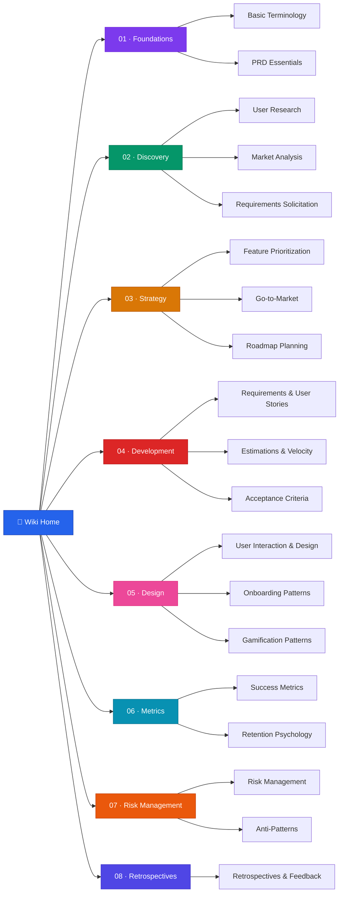

# 📘 Product Management, Development & Strategy Wiki

> **A personal knowledge base for product management best practices, development methodologies, and strategic frameworks.**

---

## About This Wiki

This repository is my **Everything Product** Knowledge Base. It includes research, development, product management and strategy. It consolidates best practices, how-to's, ideas, lessons, tips and tricks learned from hands-on experience, industry research, and various certifications and courses.

The wiki is structured as a progressive journey — from foundational terminology through discovery, strategy, development, design, metrics, risk management, and retrospectives.

---

## Wiki Structure



---

## Quick Navigation

|   #   | Section                                                 | Description                                    | Pages |
| :---: | :------------------------------------------------------ | :--------------------------------------------- | :---- |
|  01   | [**Foundations**](wiki/01-foundations/index.md)         | Core terminology and document standards        | 2     |
|  02   | [**Discovery**](wiki/02-discovery/index.md)             | User research, market analysis, requirements   | 3     |
|  03   | [**Strategy**](wiki/03-strategy/index.md)               | Prioritization, GTM, roadmaps                  | 3     |
|  04   | [**Development**](wiki/04-development/index.md)         | Requirements, estimations, acceptance criteria | 3     |
|  05   | [**Design**](wiki/05-design/index.md)                   | UX/UI, onboarding, gamification patterns       | 3     |
|  06   | [**Metrics**](wiki/06-metrics/index.md)                 | Success metrics, retention psychology          | 2     |
|  07   | [**Risk Management**](wiki/07-risk-management/index.md) | Risk frameworks and anti-patterns              | 2     |
|  08   | [**Retrospectives**](wiki/08-retrospectives/index.md)   | Feedback loops and retrospectives              | 1     |

---

## Repository Structure

```
product_management_development_wiki/
├── README.md                    # This file
├── wiki/                        # 📘 Primary wiki content (8 sections, 19 pages)
├── docs/                        # 📂 Source materials (gitignored)
│   ├── legacy_notion_files/     #    Original Notion exports
│   └── research/                #    Deep research documents
├── agents.md                    # 🤖 Agent configuration for wiki maintenance
└── skills.md                    # 🛠️ Skills reference for wiki tasks
```

---

## Content Maturity Legend

| Icon  | Status          | Description                           |
| :---: | :-------------- | :------------------------------------ |
|   🟢   | **Complete**    | Fully written and reviewed            |
|   🟡   | **In Progress** | Content present but needs enhancement |
|   ⚪   | **Scaffold**    | Structure created, content pending    |

---

## Sources & Inspiration

- [Software Product Management Specialization](https://www.coursera.org/specializations/product-management) — Coursera
- Industry research and case studies (see individual pages)
- Personal experience and professional practice

---
  
Curated with love for building stuff - DimKouts ;)