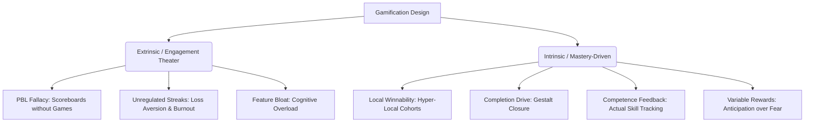

# Gamification in Product Design: Research-Backed Patterns for Sustainable Retention

This document synthesizes empirical research and product case studies analyzing what makes gamification succeed or fail in modern mobile and web applications. It outlines how traditional mechanics like Points, Badges, and Leaderboards (PBL) often lead to product failure, and how to design sustainable retention systems using intrinsic psychological drives.

> [!NOTE]
> For detailed companion analyses on product design and behavioral psychology, see:
> * **Retention Architecture** (The Craving Machine, The Infinite Game, and The Invisible Scoreboard): [retention_architecture_psychology.md](file:///c:/Users/Mitsos_PC/Desktop/The%20One%20Folder/Programming/Projects/product_management_development_wiki/docs/research/retention_architecture_psychology.md)
> * **Onboarding UX Patterns** (Value Delivery, Personalization, and Conversion): [onboarding_design_patterns.md](file:///c:/Users/Mitsos_PC/Desktop/The%20One%20Folder/Programming/Projects/product_management_development_wiki/docs/research/onboarding_design_patterns.md)

---

## Executive Summary

Most product teams treat gamification as a set of features to be layered on top of an application (e.g., points, badges, and streaks). However, research and historical product data demonstrate that when gamification relies purely on extrinsic motivators or creates artificial anxiety (loss aversion), it leads to **cognitive overload, user burnout, and quality degradation**. 

To build long-term engagement, apps must transition from **"Engagement Theater"** to **"Intrinsic Motivation"** by focusing on:
1. **Winnability** (hyper-local micro-competitions).
2. **Cognitive Balance** (respecting the S-curve of feature richness).
3. **User Agency** (healthy streaks).
4. **Anticipation** (variable reward magnitude).
5. **Closure** (completion drive).
6. **Competence Feedback** (mastery over empty badges).

---

## The 7 Gamification Design Patterns

### 1. The PBL Fallacy vs. Transactional Points & Rewards
* **The Concept**: Reaching for scoreboard metrics (PBL) as the default gamification strategy.
* **Why it Fails**: PBL is the scoreboard of a game, not the game itself. Building a scoreboard without a game creates extrinsic motivation that actively damages user behavior. It causes users to chase the reward metric instead of the core value of the app.
* **The Complementary Practice (Transactional Rewards)**: Points and rewards *can* be highly effective when they are tied directly to core transactions or value-adding milestones, rather than empty app actions. Rewarding everyday engagement (logging in or hitting key milestones) works when it drives users closer to a tangible, high-value reward.
* **Case Studies**:
  * **Starbucks Rewards (Good)**: Starbucks sells more coffee through rewards than ads. Users earn "stars" for each purchase. Because users are one reward away from a free drink, they come back again and again. Winning equals dopamine, and small wins create habits. This works because the points are tied to real monetary/product transactions, not vanity behavior metrics.
  * **LinkedIn (2024) (Bad)**: Quietly retired its *Community Top Voice* gold badges. Internal data showed that badge-motivated users produced quantity over quality, spamming posts to chase the badge rather than sharing genuine expertise.
  * **Foursquare (2014) (Bad)**: Scrapped its famous mayorships and badge system. The gamification successfully drove check-ins, but failed to drive the discovery and search behaviors that the core business model actually needed.
  * **Google News (Bad)**: Defunct badge system killed for the exact same reason—driving clickbait interactions rather than authentic news consumption.

### 2. Winnable Hyper-Local & Tiered Leaderboards
* **The Concept**: Engineering the size and scope of competitions to make them highly winnable, rather than inflating empty global leaderboards.
* **Why it Works**: Winnability is the strongest predictor of competitive motivation (confirmed by a 2022 *Science Direct* study). Global leaderboards discourage 99% of users who feel they can never reach the top. Segmented, local, or cohort-based leaderboards keep goals realistic and motivating.
* **The Complementary Practice (Tiered Skill-Matching)**: Matching users with similar skill levels or activity rates keeps the competition exciting yet achievable. Providing clear, real-time progress updates tells users when they are close to moving up a rank, maintaining momentum.
* **Case Studies (Good)**:
  * **Strava**: Serves 180 million users with a highly engaged community. Instead of global leaderboards, Strava uses **Segments** (user-defined stretches of road/trail). Run it, and your time is placed on a local leaderboard sorted by age and gender cohort. This makes the competition winnable. They compound this with **Kudos** (micro-social acknowledgment), which a 2022 study confirmed directly increases future run frequency. Strava users average **1 hour of real-world activity for every 2 minutes spent in the app**.
  * **Fitbit**: Drives activity through friendly competition. By utilizing tiered matchmaking and showing progress updates (notifying users when they are close to passing a peer or ranking up), Fitbit maintains active engagement without causing the discouragement of global leaderboards.

### 3. The S-Curve of Feature Richness
* **The Concept**: Gamification effectiveness follows an S-shaped curve where adding features improves engagement only up to a point, after which adding more features reverses engagement.
* **Why it Fails**: Excessive gamification layers (streaks + points + badges + challenges + leaderboards) lead to cognitive overload disguised as engagement. Users spend their energy managing the "game layer" rather than the actual task.
* **Case Study (Bad)**:
  * **Habitica**: A productivity app that turns daily tasks into quests, habits into character stats, and task failures into HP damage. A peer-reviewed study published in *Frontiers in Psychology* (2025) found that **100% of participants experienced counterproductive effects**. The game layer became so overwhelming that actual productivity got buried under game management.

### 4. The Streak Trap & Progress Bars
* **The Concept**: The psychological fatigue caused by continuous daily streaks that rely on loss aversion.
* **Why it Fails**: Streaks gradually shift from motivational ("I want to do this") to obligational ("I can't miss today") the longer they run (*Decision Lab* research). When a user inevitably breaks a long streak, they experience the "abstinence violation effect," which frequently leads to them abandoning the app entirely.
* **The Complementary Practice (Visual Progress Motivation)**: When combined with visible progress bars and clear milestones, streaks trigger positive goal-gradient motivation. Users are far more likely to complete a task when they see how close they are to finishing. Wrapping the streak in user agency mitigates loss-aversion fatigue.
* **Case Studies**:
  * **Duolingo (Good/Mitigated)**: Encourages users to log in daily using a streak and progress bar system. Users stay motivated to hit their next milestone because their progress is highly visible. To prevent the loss-aversion crash, Duolingo wraps streaks in user **agency**: users choose their daily goal level, can buy or earn "streak freezes" to pause the pressure, and maintain control.
  * **Snapchat (Bad)**: A 2023 Belgian study of 2,500 adolescents found that streak frequency correlates directly with FOMO (Fear of Missing Out), problematic smartphone use, and reduced self-control. This has led to heavy regulatory backlash, including a 2024 litigation by the Nevada Attorney General and targeting by the EU Digital Fairness Act (legislative proposal in late 2026).

### 5. Variable Reward Magnitude & Unexpected Rewards
* **The Concept**: Designing reward cycles around anticipation (what is coming next) rather than predictability or loss aversion.
* **Why it Works**: Predictability is boring; if users know exactly what is coming, they lose interest. The gap between knowing a reward is coming and not knowing how large or what it will be releases dopamine during the *anticipation* phase.
* **The Complementary Practice (Surprise Moderation)**: Unexpected rewards or mystery chests keep users hooked. However, surprise bonuses must be used sparingly; if they happen too frequently, users adjust their expectations and feel entitled to them, ruining the effect.
* **Case Studies (Good)**:
  * **Gameblazers**: A fantasy card game designed with a highly optimized pack opening flow. It splits the dopamine cycle into three distinct stages:
    1. *Anticipation*: Tapping the pack (unknown contents).
    2. *Reveal*: Cards flip one at a time, resetting the anticipation cycle (turning one dopamine event into five).
    3. *Celebration*: Rare hits trigger responsive screen glows and haptics, encouraging the next loop.
  * **Pokémon Go (Mystery Boxes)**: Uses mystery boxes and unexpected, seasonal wild encounters to keep players searching. The uncertainty of what the box contains creates excitement and urgency, prompting users to open the app to discover what they won.

### 6. Completion Drive & Time-Bound Challenges (Gestalt Closure & Urgency)
* **The Concept**: Leveraging the Gestalt principle of closure—the brain's hardwired tendency to perceive incomplete visual patterns as loops that must be closed—paired with time-bound windows to create urgency.
* **Why it Works**: Visualizing progress as a near-complete shape (e.g., a 90% closed circle) creates an open loop in the user's mind. Adding a 7, 14, or 30-day window to challenges introduces healthy urgency, providing a clear goal and a sense of achievement when they push through to completion.
* **Case Studies (Good)**:
  * **Apple Watch**: The Activity Ring system (Move, Exercise, Stand) drove a **49.5% behavior change in a study of 160,000 people**. The visual drive to "close the rings" has led to real-world outcomes: users who regularly close their rings are 48% less likely to report poor sleep quality. This is intrinsic gamification that produces positive life outcomes instead of empty engagement theater.
  * **Time-Bound App Challenges**: Offering users structured, limited-time challenges (e.g., a 14-day fitness challenge or a 30-day savings challenge) forces users to commit. The defined end-date creates urgency and focus, keeping users engaged through the entire habit-forming period.

### 7. Competence vs. Badge Theater
* **The Concept**: Designing feedback loops that signal real mastery and skill development rather than empty app usage metrics.
* **Why it Works**: A 2024 *Springer Nature* meta-analysis found that while gamification increases feelings of autonomy and relatedness, it has **minimal impact on competence** (the psychological need most critical to long-term intrinsic motivation). Apps must build mechanics that show users they are getting better at the actual skill.
* **Case Studies (Good)**:
  * **Peloton**: Users who utilize Peloton's output and social features work out 15% more frequently. Instead of arbitrary points, Peloton provides real-time competence feedback (output metrics, auto-flagging personal records). The "100-ride badge" is motivating because it represents 100 actual workouts—an undeniable indicator of physical skill development.
  * **Chess.com**: Leverages ELO rating changes to show chess mastery.
  * **Garmin**: Uses physical bio-metrics like "Training Readiness" and "Body Battery" to map real fitness competence.

---

## Summary of Good vs. Bad Gamification Examples

| App             | Mechanic                                  | Classification             | Why it Works / Fails                                                                                                       |
| :-------------- | :---------------------------------------- | :------------------------- | :------------------------------------------------------------------------------------------------------------------------- |
| **LinkedIn**    | Community Top Voice Badges                | 🔴 Bad (PBL Theater)        | Created quantity-over-quality spam; users chased badges instead of sharing actual expertise.                               |
| **Foursquare**  | Mayorships & Badges                       | 🔴 Bad (PBL Theater)        | Drove check-in volume but failed to encourage discovery search behaviors.                                                  |
| **Habitica**    | High Feature Richness (Quests, HP, Stats) | 🔴 Bad (S-Curve Peak)       | Caused cognitive overload; managing the game took precedence over actual productivity.                                     |
| **Snapchat**    | Rigid Streaks                             | 🔴 Bad (Streak Trap)        | Created high FOMO, anxiety, and compulsive usage; faced legal/regulatory backlash.                                         |
| **Strava**      | Hyper-Local Segments & Kudos              | 🟢 Good (Winnability)       | Competitions feel achievable because they are local and cohort-specific. Micro-social feedback reinforces positive habits. |
| **Duolingo**    | Flexibly Managed Streaks & Progress       | 🟢 Good (User Agency)       | Empowers users with choice (goal adjustments, streak freezes) to prevent loss-aversion burnout.                            |
| **Gameblazers** | 3-Stage Card Pack Reveals                 | 🟢 Good (Anticipation Loop) | Leverages variable reward magnitudes and multi-step reveals to create excitement.                                          |
| **Apple Watch** | Three Activity Rings                      | 🟢 Good (Gestalt Closure)   | Taps into the completion drive to complete shapes, leading to real-world behavioral changes.                               |
| **Peloton**     | ELO / Real-time Output Metrics            | 🟢 Good (Competence)        | Ties badges and feedback to actual milestones and skill improvement rather than cheap engagement.                          |
| **Starbucks**   | Stars & Free Drink Rewards                | 🟢 Good (Transactional)    | Ties points directly to real-world purchase transactions, driving repeat sales and routine habits.                         |
| **Fitbit**      | Tiered Leaderboards & Progress Updates    | 🟢 Good (Winnability)       | Promotes friendly competition matched by skill levels, with rank-up notifications that keep the goal achievable.           |
| **Pokémon Go**  | Mystery Boxes & Surprise Spawns           | 🟢 Good (Variable Reward)   | Uses unexpected, seasonal rewards to maintain excitement; must be used sparingly to avoid expectation fatigue.             |

---

## Actionable Guidelines for App Developers (Mobile & Web)

### 1. The Winnability Audit (For Leaderboards & Competitions)
* **Never** build a single, global leaderboard for all users.
* **Segment** leaderboards by location, age, sign-up cohort, or skill level.
* Ensure a user is placed in a cohort where reaching the top 3 is mathematically achievable within a reasonable window of effort.
* *Pro Tip*: Provide real-time rank-up updates (e.g., "You are 20 points away from Rank 3") to maintain competition momentum and urgency.

### 2. The S-Curve Check (For Feature Bloat)
Before shipping a new gamified feature, ask:
* Does this feature reduce the friction of the core action, or does it add a new rule/metric the user has to study?
* *Checklist*: If your app contains a streak, points, level-ups, AND a leaderboard all at once, conduct user testing to ensure users aren't experiencing cognitive overload.

### 3. The Streak Safeguard (For Loss Aversion)
If your app uses streaks:
* **Add Streak Freezes**: Allow users to earn or purchase "passes" for days they cannot engage.
* **Goal Flexibility**: Let users adjust their daily target difficulty depending on their schedule.
* **Regulatory Compliance**: Design streaks with transparent, non-addictive pause options to align with upcoming standards like the EU Digital Fairness Act (2026).

### 4. Gestalt Closure & Urgency (For Progress & Challenges)
* Represent progress visually as incomplete geometric paths or circles (e.g., circular progress bars) rather than just numbers (e.g., "Step 4 of 5").
* Focus on closing loops to tap into the human completion drive.
* *Urgency & Challenges*: Implement time-bound challenges with a 7, 14, or 30-day window to motivate task completion and build initial routines.

### 5. Design for Competence, Not Badges
* Tie every achievement or badge to a tangible metric of improvement in the user's real life (e.g., "100 hours practiced", "10 miles run", "15 projects completed").
* Avoid badges that reward passive usage, such as "Opened the app 5 days in a row" without performing a core action. Show the user their growth trajectory.

### 6. Balance Variable & Unexpected Rewards
* Inject surprise bonuses (like mystery chests or random point boosts) to break predictability and keep the app experience fresh.
* **Limit Frequency**: Use surprise rewards sparingly. If they occur regularly, they become predictable expectations, causing users to feel cheated when they don't receive them.

---

## Sources

* **Video Title**: *I Studied 500+ Gamified Apps (Here's What Actually Works)*
* **URL**: https://www.youtube.com/watch?v=LXX_qOA5D8E
* **Video Title**: *7 App Gamification Strategies To Boost Retention & Revenue 🎮*
* **URL**: https://www.youtube.com/watch?v=BJEHnGYj_8E
