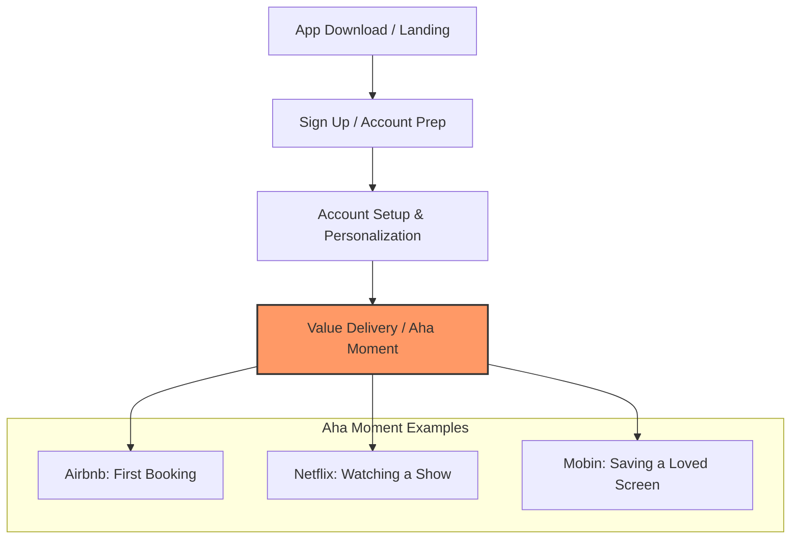

# Onboarding UX Patterns: Strategies for Value Delivery, Personalization, and Conversion

This research document analyzes the UX design principles and behavioral patterns that drive high-converting, engaging onboarding experiences in modern mobile and web applications. It challenges the conventional wisdom of "keeping it short" and outlines how successful products leverage personalization, outcome selling, delight, and contextual guidance to lead users to their "Aha Moment."

> [!NOTE]
> For a detailed analysis of how to stack long-term engagement using variable rewards and identity loops, see the companion documents:
> * [gamification_design_patterns.md](file:///c:/Users/Mitsos_PC/Desktop/The%20One%20Folder/Programming/Projects/new_app_project/docs/research/gamification_design_patterns.md)
> * [retention_architecture_psychology.md](file:///c:/Users/Mitsos_PC/Desktop/The%20One%20Folder/Programming/Projects/new_app_project/docs/research/retention_architecture_psychology.md)

---

## Executive Summary

Standard product advice suggests minimizing friction by making onboarding as short as possible. However, data from over 1,400 apps shows that **the average app has 25 onboarding screens**. 

Furthermore, many of the most successful applications feature extremely long onboarding flows:
* **Duolingo**: ~60 screens before account creation.
* **Bitepal**: 61 screens before paywall.
* **Finance Apps**: Have the longest onboarding flows on average (accounting for 7 out of the 10 longest onboarding apps), driven by compliance, personalization, and setup requirements.
* **AI Apps**: Represent the shortest category (average of 3 screens), letting users immediately interact with the product.

The success of an onboarding flow is not determined by its brevity, but by its ability to guide the user to the **"Aha Moment"**—the precise instant they experience the core value of the product.

---

## The Onboarding Framework

The optimal onboarding journey follows a simple three-step progression:
1. **Sign Up**: The initial registration or access point.
2. **Account Setup / Personalization**: Collecting user preferences, goals, and context.
3. **The Aha Moment**: Delivering the core product value.

If the setup phase is dry, long, or confusing, users will churn before reaching step 3. The patterns below describe how top apps make the setup phase highly converting, interactive, and rewarding.

---

## The 7 Onboarding UX Patterns

### 1. Selling the Outcome (vs. Listing Features)
* **The Concept**: Pitching the final result or benefit the user will achieve, rather than listing features or describing technical implementation.
* **Why it Works**: Users are motivated by their own transformation or goals. Highlighting what they will *become* or *accomplish* builds emotional investment.
* **Case Studies**:
  * **Timo**: The welcome screen showcases the product in action on both mobile and desktop, immediately demonstrating the integrated workflow.
  * **Front / Bumps**: Uses high-fidelity animations upon opening. The user instantly understands the app's function without reading a single word.
  * **Superhuman**: Replaces a standard registration form with a persuasive pitch, placing recognizable partner logos on the side as social proof.

### 2. Try-Before-Buy (Pre-Registration Value Delivery)
* **The Concept**: Allowing the user to engage with the core product loop and experience value *before* asking them to create an account or sign up.
* **Why it Works**: By reducing the friction to zero, you build trust and let the product speak for itself. The signup prompt becomes a logical step to save progress rather than a barrier to entry.
* **Case Studies**:
  * **Alma**: Lets users try out the primary search and matching experience before creating an account.
  * **Duolingo**: Guides users through a complete interactive language lesson (taking them up to 60 screens deep) before prompting them to sign up. By the time they see the signup screen, they have already felt the satisfaction of winning a lesson.
  * **AI Products (ChatGPT, Claude)**: Use the first prompt as the onboarding. The user types a question and gets immediate value without signup or setup getting in the way.

### 3. Contextual Education & Guided Actions (vs. Pop-up Banners)
* **The Concept**: Guiding users through actions in real-time, in the flow of using the app, rather than showing static guided tours, tooltips, or pop-up banners.
* **Why it Works**: Pop-ups disrupt focus and are routinely dismissed without being read. Contextual nudges and interactive checklists reduce cognitive load and teach through action.
* **Case Studies**:
  * **Cake Equity**: Approaching dry, complex subjects like company equity by reassuring the user at each step, using real-time tooltips to explain the impact of decisions, and checking off password requirements dynamically as the user types.
  * **To-Do Apps**: Avoid empty dashboards by prepopulating the workspace with a interactive checklist of tasks (e.g., "Add your first task", "Complete this task"), teaching the interface through natural interaction.
  * **Mural**: Replaced standard pop-ups and welcome banners with a persistent 6-step checklist on the dashboard. This simple shift drove a **10% relative increase in one-week retention**.

### 4. Multi-Intent & Conversational Personalization
* **The Concept**: Asking questions conversational-style and allowing users to select multiple options/goals rather than forcing them into rigid, single-choice flows.
* **Why it Works**: Users often have complex, overlapping needs. Allowing multiple selections makes the onboarding feel tailored and prevents user frustration. Conversational copy reduces form fatigue.
* **Case Studies**:
  * **Headspace**: Discovered users came with multiple goals (e.g., sleep, anxiety, focus). By allowing users to select multiple pain points instead of a single goal, they saw a **10% increase in free trial conversions**.
  * **Focus Flight**: Lets users choose their preferred map style during onboarding, making the app feel customized to their taste before they start using it.
  * **Dollar Shave Club**: Rewrote their quiz copy to sound like a conversation with a human. This copy tweak alone led to a **5% increase in paid subscriptions**.

### 5. Visualizing Personalized Outcomes
* **The Concept**: Presenting the user with a customized plan, schedule, or projection based on their quiz answers prior to the paywall or home screen.
* **Why it Works**: Proves that the app actively listened to the user's input. It builds anticipation by showing a tangible roadmap to success.
* **Case Studies**:
  * **Endel**: Gathers quiz answers and immediately renders a personalized soundscape graph. Even before playing the audio, the user feels the system is customized and ready to work.
  * **Bitepal**: Builds a personalized plan and highlights the exact date the user will hit their weight target, creating a concrete milestone.
  * **Speak (Language Learning)**: Asks goals and language choice, then shows a screen stating: *"In 2 months, you'll be able to communicate while traveling in France,"* backed by a simple graph showing why speaking (the app's primary method) beats reading.
  * **Brilliant**: Populates the user's dashboard only with courses recommended from their quiz answers immediately upon completing onboarding.

### 6. Conversational & Tailored Paywalls
* **The Concept**: Aligning paywalls directly with the user's stated goals and personalizing the offer to match their profile.
* **Why it Works**: Shows the direct link between paying and achieving the personalized outcome. High-quality interactions and social proof at the paywall reduce purchase anxiety.
* **Case Studies**:
  * **Grammarly**: Recommends tailored pricing plans based on the user's specific writing goals (e.g., student vs. professional). This targeted pricing increased plan upgrades by **nearly 20%**.
  * **Focus Flight**: Integrates physical haptics and themed UI. The paywall is shaped like a flight ticket, and the phone vibrates as it "prints out," adding sensory delight to a transaction screen.
  * **Beside / Blinkist**: Pairs the personalized quiz results with a urgent, one-time offer to drive purchase momentum.
  * **Timo**: Inserts a full screen of structured customer reviews and social proof immediately before presenting the paywall.

### 7. Interactive Delighters for Long Flows
* **The Concept**: Incorporating rich animations, gamified loading sequences, and engaging characters to keep users entertained through long setup questionnaires.
* **Why it Works**: The psychological perception of time decreases when an experience is fun. Delightful animations transform a boring form into an interactive experience.
* **Case Studies**:
  * **Bitepal**: Guides users through 61 screens using a lovable pet raccoon character that users name during onboarding. The animations and pet progression keep the user engaged.
  * **Bumps**: Employs highly creative, smooth animations and transitions, particularly on dry screens like loading states and SMS verification code entry.

---

## Permissions & Flow Optimizations

### 1. Pre-Permission Priming (The Soft Ask)
* **The Concept**: Showing a custom screen explaining *why* a permission (notifications, camera, health data) is needed before triggering the native system dialog.
* **Why it Works**: System dialogs are binary and cannot explain context. A custom priming screen increases user confidence and acceptance rates.
* **Case Studies**:
  * **Brilliant**: Explains that notifications are used to help build a daily learning habit.
  * **Centr**: Displays a visual preview (mockup) of the exact positive notification message the user will receive before showing the system prompt.

### 2. Multi-Page Form Splitting (Chunking)
* **The Concept**: Breaking a long registration form into multiple single-input screens rather than hosting a long, scrollable form.
* **Why it Works**: Reduces cognitive load per screen. Progressing through quick, single-input screens builds momentum.
* **Case Studies**:
  * **Houzz (House)**: Split its long signup form into multiple sequential screens and recorded a **15% increase in total signups**.

### 3. Web vs. Mobile Constraints
* Web onboarding flows are, on average, **21% shorter than iOS flows**.
* This is driven by platform mechanics: mobile apps must incorporate native screens for permissions (notifications, location, tracking) and in-app purchase paywalls.

### 4. Cultural User Interface Preferences
* **Eastern Markets**: Users generally prefer information-dense, highly packed interfaces that convey maximum efficiency.
* **Western Markets**: Users generally prefer clean, minimalist, low-clutter designs. 
* *Key Takeaway*: Onboarding design cannot be blindly copied across global markets; it must adapt to cultural UX expectations.

---

## Onboarding Case Studies: Good vs. Bad Examples

| App / Product | Primary Onboarding Strategy | Classification | Impact & Metric | Why it Works / Fails |
| :--- | :--- | :--- | :--- | :--- |
| **Duolingo** | Try-before-buy / Long gamified lesson | 🟢 **Good (Value-First)** | 60+ screens prior to signup | Users experience the feeling of success (winning a lesson) before being forced to create an account. |
| **Mural** | Persistent contextual dashboard checklists | 🟢 **Good (Contextual)** | 📈 **10% increase in 1-week retention** | Replaced annoying welcome pop-ups with an actionable, dismissible checklist. |
| **Headspace** | Multi-intent selection quiz | 🟢 **Good (Flexible)** | 📈 **10% increase in free trial conversion** | Let users select multiple goals, matching their actual multi-dimensional mental wellness needs. |
| **Grammarly** | Quiz-based tailored pricing packages | 🟢 **Good (Personalized)** | 📈 **~20% increase in premium upgrades** | Connected pricing options directly to the user's specific goals. |
| **Houzz** | Multi-page form chunking | 🟢 **Good (Psychological)** | 📈 **15% increase in signups** | Split a single dense signup sheet into bite-sized single-question screens to build momentum. |
| **Dollar Shave Club** | Conversational copy quiz | 🟢 **Good (Copywriting)** | 📈 **5% increase in subscriptions** | Rewrote standard quiz inputs into a friendly, conversational dialog. |
| **Focus Flight** | Gamified/Haptic ticket paywall | 🟢 **Good (Delight)** | High checkout delight | Turn the transaction screen into a sensory experience (vibration, ticket print-out). |
| **AI Apps (e.g. Claude)** | Zero-friction entry / Prompt field | 🟢 **Good (Speed)** | Direct value delivery | Bypasses all setup to let the user get value in a single action. |
| **Typical AI Apps (7%)** | Private/No-quiz entry | 🔴 **Bad (Missed Personalization)** | Lower personalization value | AI tools often fail to ask user context upfront, missing opportunities to customize the early workspace. |

---

## Actionable Guidelines for App Developers

### 1. Identify and Track the "Aha Moment"
* Audit your product: What is the exact action that proves the app's value to the user?
* Align your onboarding to push the user toward this action as quickly and clearly as possible.
* Remove any steps that do not directly contribute to the user hitting this moment.

### 2. Sell the Outcomes on Setup Screens
* Do not write screen headers describing features (e.g., *"Our Calorie Tracker"*).
* Write headlines focusing on the user's outcome (e.g., *"Reach Your Ideal Weight"*).
* Show, don't tell: use high-fidelity animation, mockups, or videos of the app interface.

### 3. Shift from Pop-Ups to Action Checklists
* Turn off auto-triggering welcome tours and introductory modals.
* Create a persistent onboarding checklist on the user's home screen.
* Ensure checklist items are interactive (clicking them starts the task) and reward completion with visual feedback.

### 4. Implement Pre-Permission Priming
* Never trigger native permission dialogs (e.g., notifications) on app launch without context.
* Create a full-screen or modal prime explaining:
  1. What permission you are requesting.
  2. The specific benefit the user gets by allowing it.
  3. A preview of the value (e.g., a mockup notification).

### 5. Personalize the Paywall
* If your app includes a quiz, pass those variables to your paywall screen.
* Recommend a specific plan based on their answers, and explicitly state *why* it matches their goals (e.g., *"Recommended for Professional Writers"*).

---

## Sources & Context
* **Video Title**: *I Studied 1,460 Onboarding Flows. Here's What I Found.*
* **URL**: [YouTube Video Link](https://www.youtube.com/watch?v=Qsq-Sj_rojU)
* **Date of Analysis**: June 16, 2026
