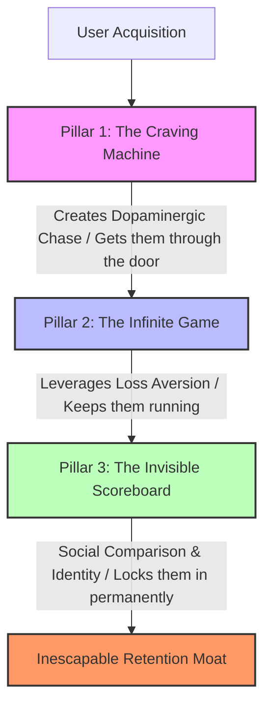

# Retention Architecture: The Three Psychological Pillars of Addictive Apps

This research document analyzes the behavioral psychology frameworks driving high-retention products. While traditional gamification relies on aesthetic decorations (badges, basic streaks, leaderboards), high-performance products (hitting up to **90% annual subscriber retention**) utilize a deep retention architecture. 

This framework, popularized by product strategist Tim (SIPs App), relies on three stacked psychological mechanisms that turn app interaction into a core user identity.

> [!NOTE]
> For detailed companion analyses on product design and behavioral psychology, see:
> * **Gamification Design Patterns** (Sustainable Retention vs. PBL Fallacies): [gamification_design_patterns.md](file:///c:/Users/Mitsos_PC/Desktop/The%20One%20Folder/Programming/Projects/new_app_project/docs/research/gamification_design_patterns.md)
> * **Onboarding UX Patterns** (Value Delivery, Personalization, and Conversion): [onboarding_design_patterns.md](file:///c:/Users/Mitsos_PC/Desktop/The%20One%20Folder/Programming/Projects/new_app_project/docs/research/onboarding_design_patterns.md)

---

## The Stacking Effect: How Retention Architecture Works

The three pillars of retention architecture do not operate in isolation. They form a psychological funnel that progressively locks in user behavior.



* **Pillar 1: The Craving Machine** gets users through the door by keeping their brains in a constant chase state.
* **Pillar 2: The Infinite Game** keeps them running by ensuring they never experience a "done" state, utilizing loss aversion to make quitting painful.
* **Pillar 3: The Invisible Scoreboard** makes them never want to be seen standing still. It binds the first two mechanisms to the user's social identity, making quitting publicly visible and socially unacceptable.

---

## Pillar 1: The Craving Machine (Variable Ratio Reinforcement)

### The Scientific Core
In the 1930s, behavioral psychologist B.F. Skinner placed animals in boxes (Skinner Boxes) and delivered food pellets on unpredictable schedules (variable ratio reinforcement). He discovered that this unpredictability produced the most compulsive, obsessive behaviors. The animals kept pressing the lever not out of hunger, but out of a state of **craving**.

> [!IMPORTANT]
> **Variable Ratio Reinforcement is not about pleasure; it is about craving.**
> Dopamine is released in the *chase* of a reward, not in its consumption. Predictable rewards (e.g., getting the exact same points every time you complete a task) fail to maintain this chase state. Variable rewards keep the brain guessing, activating dopamine pathways identical to those triggered by slot machines and gambling.

### Case Studies & App Examples

#### 1. Finch (Virtual Self-Care Pet) — 🟢 Good (Gentle Craving)
Finch helps users build healthy real-life habits (journaling, breathing exercises) by tying them to a virtual bird pet. 
* **The Variable Loop**: Users choose a travel destination for their bird. Each location has 15–20 unique discoveries that the bird can bring back.
* **Unpredictability**: Some days the bird finds rare items; other days, it brings back nothing special. The user cannot predict the outcome.
* **Personality Evolution**: The bird develops six personality traits (e.g., confidence, curiosity, resilience) and unique likes/dislikes based on how the user responds to its adventures. The app explicitly notes that the bird is "creating its own personality," keeping the user in a constant state of curiosity and checking back to see what the bird is becoming.

#### 2. League of Legends (Matchmaking) — 🟢 Good (Algorithmic Craving)
The game utilizes a hidden Matchmaking Rating (MMR) system. 
* **The Variable Loop**: As players win, their MMR rises and they face harder opponents; as they lose, MMR drops and matches become easier.
* **Controlled Ratio**: The algorithm continuously calibrates matches to keep players near a **50% win rate**. This creates a cycle where players crush some games, get crushed in others, climb points, and then drop points. 
* **The Chase**: The unpredictability of the match quality and ranking outcome keeps 130+ million monthly active players pressing the matchmaking "lever."

#### 3. Duolingo — 🟡 Predictable/Basic
Duolingo awards a flat, predictable amount of XP after each lesson. While satisfying, it lacks the dopaminergic pull of variable ratio reinforcement. It acts more like a vending machine than a craving machine.

#### 4. Pokémon Go — 🟢 Good (Unexpected Variable Rewards)
Pokémon Go keeps users hooked by avoiding predictable reward loops.
* **The Variable Loop**: Tapping wild encounters or opening "Mystery Boxes" rewards users with randomized spawns, item quantities, and item rarities.
* **The Chase**: Because outcomes are completely variable, users experience anticipation before every action. However, surprise rewards are metered carefully (using daily limits and timers) so that they remain unexpected rather than becoming routine expectations.

---

## Pillar 2: The Infinite Game (Loss Aversion & Compounding Value)

### The Scientific Core
This pillar relies on **Loss Aversion** (Kahneman & Tversky), which proves that humans experience the psychological pain of losing something roughly **twice as intensely** as the pleasure of gaining an equivalent item.

```
                  Psychological Impact
                  ▲
                  │       (Pleasure of Gain)
                  │          ┌─────┐
                  │          │ +1x │
                  │          └─────┘
 ─────────────────┼─────────────────►
  Gain of Value   │   Loss of Value
                  │          ┌─────┐
                  │          │     │
                  │          │ -2x │
                  │          │     │
                  │          └─────┘
                  ▼      (Pain of Loss)
```

By refusing to create **terminal achievement states** ("done" states), and building compounding reward structures, apps transform engagement from a series of minor tasks into a high-stakes preservation loop.

### Case Studies & App Examples

#### 1. Peloton (Workout Progress) — 🟢 Good (Infinite Metrics)
Peloton hits a **90% annual subscriber retention rate**. 
* **No Cap on Milestones**: Instead of topping out at a maximum level, Peloton tracks metrics that never end: total classes completed, total miles run, total watts output.
* **Loss Aversion at Scale**: A user who has accumulated 500 completed classes is highly disincentivized to cancel their subscription. Stopping means freezing a monumental, highly visible fitness record that they have spent years building.

#### 2. Freecash (Diamond Streaks) — 🟢 Good (Compounding Streaks)
Designed by SIPs App, this system elevates standard daily streaks.
* **Compounding Milestones**: Users do not just count days; hitting specific milestones (e.g., 7 days, 42 days) unlocks "Diamonds."
* **High-Stakes Loss**: If a user misses a single day, they risk losing the diamonds they have accumulated. Streak freezes cannot be bought easily; they must be earned through prior active engagement. This shifts the streak from a simple counter into a valuable asset.

#### 3. League of Legends (Rank Resets) — 🟢 Good (Periodic Resets)
At the end of each season, players' ranks are reset (e.g., dropping Platinum players back to Gold). 
* **Balanced Reset**: While rank resets force players to re-engage and climb again, the system preserves their earned status indicators (honor levels, cosmetic skins). This prevents user burnout while entirely eliminating terminal "done" states.

#### 4. Duolingo — 🟡 Predictable/Basic
Duolingo streaks are a single, fragile thread. If a user breaks a 100-day streak, the number simply resets to 0. Although streak freezes exist, losing the streak entirely often triggers the **abstinence violation effect**, causing users to abandon the app in frustration rather than restart.

#### 5. Roblox (Virtual Currency & Economic Sunk Cost) — 🟢 Good (Compounding Value)
Roblox has built an inescapable retention moat through its virtual currency ecosystem, Robux.
* **Compounding Economic Value**: Users earn or purchase Robux and spend it on virtual items, custom games, and avatars. The currency turns the platform into a persistent ecosystem that users are highly disincentivized to leave.
* **The Sunk Cost Loop**: The more currency, referrals, and virtual assets a user accumulates through check-ins and platform actions, the more heavily invested they feel. Leaving the platform means abandoning a personal, functioning economic portfolio.

#### 6. Real Short (The Anti-Calculator & Sunk Cost) — 🔴 Aggressive (Pricing Abstraction)
Real Short uses an aggressive pricing design to intentionally hide actual costs and leverage the sunk cost fallacy.
* **The Anti-Calculator UI**: Every pricing interface element is engineered to prevent rational spending calculations:
  * *Variable Episode Pricing*: Each episode costs between 42 and 66 coins (rather than a flat rate), preventing users from tracking total costs in their head.
  * *Awkward Exchange Ratios*: Coin bundles are priced in awkward ratios (e.g., 500 coins for $4.99, 1,100 coins for $9.99), blocking quick mental conversions under resolved cliffhangers.
  * *Obfuscated Totals*: The app hides spending data—there is no monthly dollar dashboard or running coin total per series.
* **The Sunk Cost Escalation**: Prices increase the deeper a user gets into a show. Since the user has already invested time and coins, walking away feels like a loss, triggering the sunk cost fallacy. Users easily spend $40+ in trivial microtransactions for a single series (3x a monthly Netflix subscription) without realizing it.

### Currency Abstraction and the Ethical Line
Currency abstraction is the practice of replacing real-world money with virtual credits, tokens, or usage units (e.g., Roblox Robux, Vercel compute units, OpenAI API tokens, AWS instance hours). 
* **The Psychology**: Human brains process abstracted units differently than concrete money. Abstracted currency reduces the immediate psychological pain of spending, making transactions feel lighter and less significant than raw dollar amounts.
* **The Ethical Line**:
  * **Ethical Abstraction**: Keeps exchange ratios simple, provides a clear USD equivalent during purchase, and maintains transparent dashboards showing total usage and spent value (e.g., cloud platforms, API providers).
  * **The Anti-Calculator (Dark Pattern)**: Intentionally hides running totals, uses complex and fluctuating ratios to prevent cost comparisons, and inflates pricing dynamically to exploit the user's emotional investment.

---


## Pillar 3: The Invisible Scoreboard (Social Comparison & Identity)

### The Scientific Core
Based on **Social Comparison Theory** (Festinger, 1954), humans have an innate drive to evaluate their personal progress by comparing themselves to peers. 

When progression metrics are made socially visible, personal goals transform into **status symbols**. Engagement shifts from a private hobby to a public **identity**. 

> [!WARNING]
> ** quiting privately is easy; quitting publicly is painful.**
> If a user's progress is private, they can quit the craving machine and break their streak without social consequence. But once their tier, streak, or rank is displayed on an invisible scoreboard visible to their social circle, quitting is no longer just stopping an app—it is a public admission of failure or inactivity.

### Case Studies & App Examples

#### 1. Strava (Route Segments) — 🟢 Good (Status & Cohorts)
Strava enables users to compare running and cycling times on specific segments (user-created routes).
* **The Scoreboard Power**: In 2025 and early 2026, Strava had to delete **3.9 million activity logs** because users were uploading e-bike rides disguised as regular bicycle rides.
* **Identity Over Rewards**: There was no prize money or physical reward. Users compromised their integrity solely to protect or elevate their ranking on a local leaderboard. The social status was the reward.

#### 2. Peloton (Parasocial & Community Loops) — 🟢 Good (Human Moat)
Peloton pairs automated gamification with authentic human connection.
* **Parasocial Bonds**: Instructors (e.g., Cody Rigsby, Ali Love) become celebrity figures. Users join live classes to feel connected to them.
* **The Callout**: When an instructor calls out a user by name in front of thousands of live riders ("You're doing great, Tim at position #42!"), it turns an automated leaderboard into an unforgettable, high-status emotional event. AI can write workout routines, but it cannot replicate this human moat.

---

## Retention Architecture Matrix

| App / Feature         | Pillar 1: Craving Machine                      | Pillar 2: Infinite Game                           | Pillar 3: Invisible Scoreboard                       | Retention Performance                                    | Verdict / Analysis                                                                                                     |
| :-------------------- | :--------------------------------------------- | :------------------------------------------------ | :--------------------------------------------------- | :------------------------------------------------------- | :--------------------------------------------------------------------------------------------------------------------- |
| **Finch**             | 🟢 **High** (Random discoveries & bird traits)  | 🟡 **Medium** (Standard pet growth)                | 🔴 **Low** (Mainly private self-care)                 | High Day 30; Lower long-term social stickiness           | Extremely wholesome and gentle; could benefit from light social sharing or cooperative elements.                       |
| **League of Legends** | 🟢 **High** (MMR calibrations / 50% win rate)   | 🟢 **High** (Seasonal ladder resets)               | 🟢 **High** (Public competitive rank tiers)           | Exceptional (130M+ monthly actives)                      | Highly addictive. Resets keep it infinite, MMR keeps it variable, rank icons act as status symbols.                    |
| **Peloton**           | 🟡 **Medium** (Varied workout playlists)        | 🟢 **High** (No metric caps / Lifetime stats)      | 🟢 **High** (Live leaderboard / Instructor shoutouts) | **Elite (~90% annual subscriber retention)**             | Outstanding integration of community and infinite progression. The human connection locks the gamification in place.   |
| **Strava**            | 🟡 **Medium** (Random kudos & routes)           | 🟢 **High** (Accumulated lifetime miles)           | 🟢 **High** (Segment leaderboards / Club feeds)       | High long-term retention                                 | Social comparison is so powerful that users resort to cheating (e.g., e-bike uploads) to maintain status.              |
| **Freecash**          | 🟢 **High** (Variable offer payouts)            | 🟢 **High** (Escalating Diamond Streaks)           | 🟡 **Medium** (Earnings leaderboard)                  | High Day 30+ retention                                   | Diamond streaks convert loss aversion from an abstract number to a high-stakes asset.                                  |
| **Duolingo**          | 🔴 **Low** (Predictable XP gains)               | 🟡 **Medium** (Single-thread streak + freeze)      | 🟡 **Medium** (Passive global league cohorts)         | Moderate (~5-7% after 30 days for typical gamified apps) | Represents "PBL Decoration." Predictable rewards and brittle streaks fail to maximize long-term psychological lock-in. |
| **Pokémon Go**        | 🟢 **High** (Random encounters & mystery boxes) | 🟡 **Medium** (Standard leveling & dex completion) | 🟡 **Medium** (Gym control & local raids)             | High long-term retention                                 | High-impact use of unexpected rewards to drive urgency and checking behavior.                                          |
| **Roblox**            | 🟡 **Medium** (Game-specific drop rates)        | 🟢 **High** (Virtual currency / Robux ecosystem)   | 🟢 **High** (Avatar status & community presence)      | Elite retention                                          | The Robux currency creates a compounding, user-owned economy that functions as a powerful sunk cost.                   |
| **Real Short**        | 🟢 **High** (Cliffhangers & ads)                | 🟢 **High** (Coin wallets & sunk cost)             | 🔴 **Low** (Private consumption)                      | High conversion; variable retention                      | Uses aggressive currency abstraction and zero-decision players to extract high yield from short sessions.              |

---

## Actionable Guidelines for App Developers

### 1. Architecting the Craving Machine
* **The 80/20 Rule of Rewards**: Keep 80% of your progression system predictable and transparent (e.g., complete a lesson, get 10 points). Make 20% highly variable and unexpected (e.g., random double-point chests, mystery rewards, surprise milestones).
* **Track a Singular Complex Metric**: Instead of scattering 20 different badges, track one centralized profile system that users obsess over (e.g., a "Personality Profile" that evolves based on behavior, or a dynamic "Skill Index").
* **Unexpected Surprise Rewards**: Inject unexpected rewards (like mystery boxes) to drive checking behaviors and curiosity. Keep these surprise rewards metered (using daily or weekly limits) so they remain truly unexpected.

### 2. Structuring the Infinite Game
* **Kill the "Done" State**: Audit your application for terminal points. If a user can reach a state of "100% completion," they will immediately look to exit. Ensure milestones always expand (e.g., "100 Club," "500 Club," "1000 Club").
* **Transition to Compounding Streaks**: Replace simple daily counters with tiered progression streaks. Let streaks unlock specific resources (like diamonds, tokens, or profile modifiers) that users accumulate. Make the penalty of breaking the streak a loss of these accumulated resources, forcing users to earn freezes through high engagement.
* **Use Soft Resets**: If your system has levels, reset ranks periodically (monthly or seasonally) to clean the competitive slate, but always allow users to retain cosmetic rewards, lifetime stats, and badges as proof of their historical status.
* **Build a Currency Ecosystem**: Establish virtual currencies that can be earned through everyday actions, check-ins, referrals, or achievements, and spent on meaningful assets. This creates an economic ecosystem that acts as a compounding sunk cost.
* **Maintain Ethical Currency Abstraction**: If utilizing virtual tokens or usage-based compute/API units:
  * Keep exchange ratios clean and consistent (e.g., 100 coins = $1.00) to allow easy mental calculations.
  * Provide transparent running totals and dollar equivalents (e.g., "You have spent $5.40 this month") so users can make rational financial decisions.
  * Avoid variable or dynamic pricing structures designed to inflate costs the deeper a user commits to a flow.

### 3. Activating the Invisible Scoreboard
* **Elevate Personal Metrics into Status Indicators**: Enable users to showcase their milestones in public spaces (public profiles, community feeds, or shared links).
* **Establish Cohorts over Global Leaderboards**: Do not pit new users against power users on a global scoreboard. Group users into smaller, highly winnable local cohorts or temporary weekly leagues.
* **Integrate a Human Element**: Automated systems become dry over time. Embed social mechanics like cooperative challenges, peer-to-peer micro-social validation (e.g., Strava Kudos), or live community forums.

---

## Sources & Context
* **Video Title**: *How To Scientifically Design Addictive Apps*
* **Channel/Host**: Tim (SIPs App)
* **URL**: [YouTube Video Link](https://www.youtube.com/watch?v=yBpv5rZoBjA&t=118s)
* **Video Title**: *7 App Gamification Strategies To Boost Retention & Revenue 🎮*
* **Channel/Host**: Zoe (AppsFlyer)
* **URL**: [YouTube Video Link](https://www.youtube.com/watch?v=BJEHnGYj_8E)
* **Video Title**: *How Candy Crush Playbook Beats Netflix* (Real Short Breakdown)
* **Channel/Host**: Tim (ZipSap)
* **URL**: https://www.youtube.com/watch?v=LXX_qOA5D8E
* **Date of Analysis**: June 16, 2026
