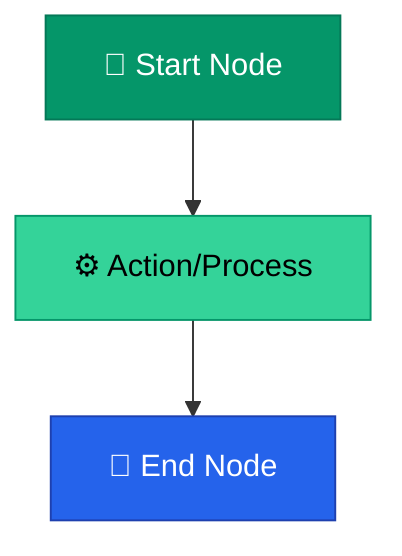

# 🛠️ Wiki Maintenance Skills & Templates

> **A practical reference guide containing templates, styles, and checklists for updating or expanding the wiki.**

---

## Table of Contents

- [Template: Standard Wiki Page](#template-standard-wiki-page)
- [Common Operations](#common-operations)
- [Mermaid Diagram Best Practices](#mermaid-diagram-best-practices)
- [Quality Checklist](#quality-checklist)

---

## Template: Standard Wiki Page

When creating a new content page, copy the template below. Ensure all placeholders (`[...]`) are filled out.

````markdown
# Page Title

> **A strong, concise quote or one-sentence summary that captures the essence of this topic.**

---

## Table of Contents

- [First Section](#first-section)
- [Second Section](#second-section)
- [Third Section](#third-section)

---

## First Section

Introductory paragraph introducing the core concept.

### Subsection Title

Detailed explanation, tables, or lists. Use callout boxes when highlighting key takeaways:

> [!NOTE]
> Add important notes or guidelines here.

---

## Second Section

Use Mermaid diagrams to visualize concepts where processes, workflows, or hierarchies are discussed.



---

## Related Pages

- → [Related Page Name](related-page-file.md) — Brief description of connection
- → [Another Related Page](../another-folder/file.md) — Brief description of connection

---

## Sources & References

- Source Name/Certification Course Name (e.g., Coursera SPM)
- Original file reference: `docs/legacy_notion_files/Source-File`

---

*[← Back to Section Index](index.md) · [← Back to Wiki Home](../index.md)*
````

---

## Common Operations

### 1. Adding a New Page
Follow these steps when adding a new page:
1. **Locate the target directory** (e.g., `wiki/03-strategy/`).
2. **Create the file** with a kebab-case name: `wiki/03-strategy/new-topic.md`.
3. **Draft the content** using the template above.
4. **Update the Section Index** (`wiki/03-strategy/index.md`):
   - Add the new page to the Mermaid flow diagram at the top.
   - Add a row for the new page in the Table of Contents table.
5. **Add Cross-Links**: Find at least 1-2 existing pages in other sections that relate to this new page, and add mutual links in the "Related Pages" section of each.

### 2. Creating a New Section
If a new top-level knowledge category is introduced:
1. **Create the directory** with a numbered prefix (e.g., `wiki/09-operations/`).
2. **Create `index.md`** in the new directory. Model it after existing section indexes, including:
   - A Mermaid navigation flowchart.
   - A table of pages.
   - Cross-references to other sections.
3. **Update the Main Wiki Index** (`wiki/index.md`):
   - Add the new section to the master Mermaid flowchart.
   - Add the section to the Quick-links table.
4. **Update `README.md`**:
   - Add the section to the Mermaid overview diagram.
   - Add the section to the Quick Navigation table.

### 3. Migrating Content from `docs/`
When consuming raw documentation from `docs/`:
1. Find the target wiki page or create a new one.
2. Read the source documentation in `docs/legacy_notion_files/` or `docs/research/`.
3. Extract core structures, stripping out HTML components like `<aside>` or custom `<p>` layouts.
4. Convert Notion callouts to GitHub-style alerts:
   - `<aside>` ➔ `> [!NOTE]` (Information)
   - Custom yellow callout ➔ `> [!WARNING]` (Risk / Watch-out)
   - Custom light-green/blue callout ➔ `> [!TIP]` (Best practices)
5. Generate a Mermaid diagram summarizing any process or hierarchy mentioned in the text.
6. Verify and compile the "Sources & References" footer, pointing to the original files.

---

## Mermaid Diagram Best Practices

To maintain visual consistency across all wiki diagrams, adhere to these guidelines:

### 1. Style Definitions
Always style your Mermaid nodes using the project's standard color theme. Apply standard colors as classes or inline styles at the bottom of the code block.

| Category | Primary Hex Code (Header/Main Node) | Secondary Hex Code (Sub-nodes) | Text Color |
| :--- | :--- | :--- | :--- |
| **01 · Foundations** | `#7c3aed` (Purple) | `#c084fc` (Light Purple) | `#fff` / `#000` |
| **02 · Discovery** | `#059669` (Green) | `#34d399` / `#6ee7b7` (Mint) | `#fff` / `#000` |
| **03 · Strategy** | `#d97706` (Amber) | `#fbbf24` (Yellow) | `#fff` / `#000` |
| **04 · Development** | `#dc2626` (Red) | `#f87171` (Light Red) | `#fff` / `#000` |
| **05 · Design** | `#ec4899` (Pink) | `#f472b6` (Light Pink) | `#fff` / `#000` |
| **06 · Metrics** | `#0891b2` (Cyan) | `#22d3ee` (Light Cyan) | `#fff` / `#000` |
| **07 · Risk Management** | `#ea580c` (Orange) | `#fb923c` (Light Orange) | `#fff` / `#000` |
| **08 · Retrospectives** | `#4f46e5` (Indigo) | `#818cf8` (Light Indigo) | `#fff` / `#000` |
| **Global/Controls** | `#2563eb` (Blue) | `#60a5fa` (Light Blue) | `#fff` / `#000` |

### 2. Node Formatting
- Keep node labels short (under 4 words). Use `\n` to break lines.
- Add emojis at the beginning of main nodes to make them visually engaging (e.g., `Start["🏁 Start"]`).
- Avoid using parentheses or special characters inside node IDs; if necessary, enclose the text in double quotes: `ID["Node Text (with details)"]`.

---

## Quality Checklist

Before completing any wiki update, verify the following:

- [ ] **Path Consistency**: All file names are lowercase and kebab-case.
- [ ] **Cross-links**: All cross-links are relative and do not contain absolute workspace paths.
- [ ] **Back-navigation**: The page ends with back-links to both the section index and the wiki home.
- [ ] **Aesthetics**: Markdown contains clear sections, lists/tables, and at least one styled Mermaid diagram (if applicable).
- [ ] **Source Integrity**: References to `docs/` or external courses are documented in the footer.
- [ ] **No Placeholders**: There are no empty `TBD` pages; at a minimum, they contain structured outlines and guidelines for future expansion.
