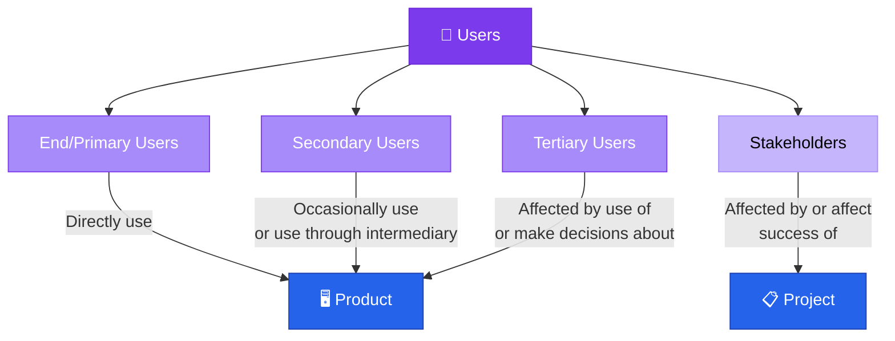
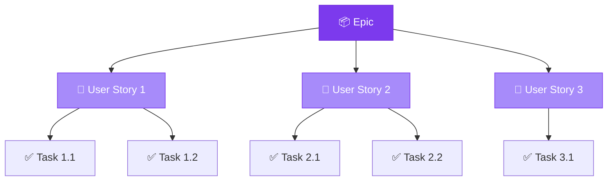

# Basic Terminology

> A shared vocabulary is the foundation of effective product management.

---

## Table of Contents

- [User Definitions](#user-definitions)
- [Core Concepts](#core-concepts)
- [Estimation & Planning Terms](#estimation--planning-terms)
- [Agile Terminology](#agile-terminology)

---

## User Definitions

Understanding the different types of users is critical for requirements gathering and product design.

| User Type | Definition | Example |
|:----------|:-----------|:--------|
| **End/Primary** | Anyone who directly uses the product | App users, website visitors |
| **Secondary** | Occasionally uses the product or through an intermediary | Managers reviewing reports generated by a tool |
| **Tertiary** | Affected by the use of the product or makes decisions about it | Executives, regulators, compliance officers |
| **Stakeholder** | Anyone affected by or who has an effect on the success of the project | Investors, team leads, partner organizations |

---

## Core Concepts

### User Interface
Anything that the user will be interacting with — screens, controls, input fields, and output displays.

### Epic
A large, high-level user story that can be broken down into smaller user stories. Epics represent significant features or capabilities.

### User Story
A simple way to express requirements, following the format:

> **As a** *[type of user]*, **I want** *[an action]*, **so that** *[a benefit/value]*.

---

## Estimation & Planning Terms

| Term | Definition | Key Property |
|:-----|:-----------|:-------------|
| **Task Estimate** | An approximation of how long a task will take, made by the developers who expect to work on it | **Non-negotiable** — based on previous work, not a commitment |
| **Target** | A deadline to be met, usually set externally to the development team | **Non-negotiable** — other parties may depend on these dates |
| **Commitment** | A real, enforced agreement outlining exactly what work will be completed at what time | **Negotiated** — between client and development team |
| **Story Point** | A unit of measure to estimate relative effort or complexity of a user story | **Consensus-driven** — reflects scope and difficulty, not time |

> [!IMPORTANT]
> **Estimates ≠ Commitments.** Estimates are approximations based on experience. Commitments are negotiated agreements. Confusing them is a common source of project friction.

---

## Agile Terminology

> [!NOTE]
> This section will be expanded in future iterations to cover sprint, kanban, scrum ceremonies, and other agile framework terms.

---

## Related Pages

- → [Product Document Essentials](product-document-essentials.md) — How these terms appear in PRDs
- → [Requirements & User Stories](../04-development/requirements-user-stories.md) — Deep dive into writing effective stories
- → [Estimations & Velocity](../04-development/estimations-velocity.md) — Story points and velocity in practice

---

## Sources & References

- Software Product Management Specialization — Coursera
- Legacy notes: `docs/legacy_notion_files/Basic Terminology`

---

*[← Back to Section Index](index.md) · [← Back to Wiki Home](../index.md)*
