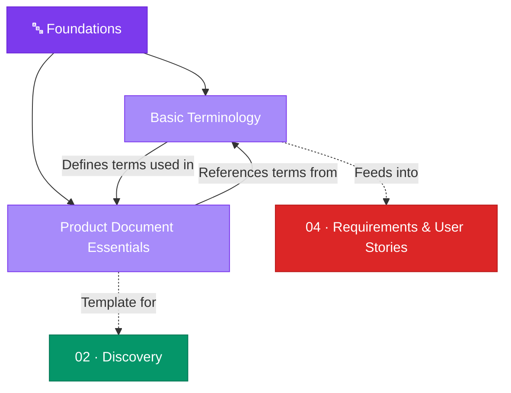

# 🔤 01 · Foundations

> **Establish a common language before building anything.**

This section covers the essential terminology and document standards that underpin all product management work. Every team member — from product managers to engineers to stakeholders — should share a common vocabulary.

---

## Section Overview

---

## Pages in This Section

| Page | Status | Description |
|:-----|:------:|:------------|
| [Basic Terminology](basic-terminology.md) | 🟢 | Core glossary — users, stakeholders, epics, stories, estimates, commitments |
| [Product Document Essentials](product-document-essentials.md) | 🟢 | The 14-section PRD structure and cheatsheet |

---

## Key Concepts at a Glance

- **Users**: End (primary), secondary, and tertiary user classifications
- **Epics & Stories**: Hierarchical requirement decomposition
- **Estimates vs. Commitments**: Critical distinction between approximation and promise
- **PRD**: The foundational document that aligns stakeholders on what to build

---

## Related Sections

- → [02 · Discovery](../02-discovery/index.md) — Apply terminology to user and market research
- → [04 · Development](../04-development/index.md) — Use terms in requirements and story writing

---

*[← Back to Wiki Home](../index.md)*
