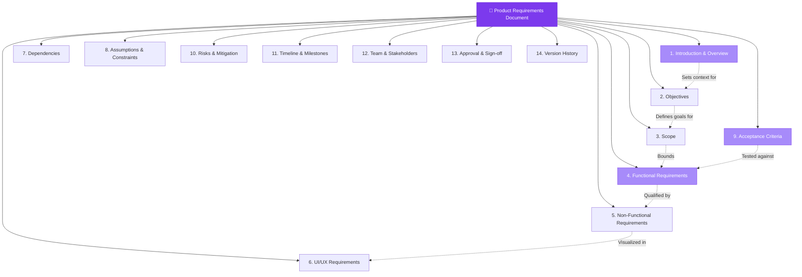

# Product Document Essentials & Cheatsheet

> A well-structured PRD aligns every stakeholder on **what** to build, **why**, and **how success is measured**.

---

## Table of Contents

- [What is a PRD?](#what-is-a-prd)
- [PRD Structure Overview](#prd-structure-overview)
- [Section-by-Section Guide](#section-by-section-guide)
- [PRD Quality Checklist](#prd-quality-checklist)

---

## What is a PRD?

A **Product Requirements Document (PRD)** is the foundational document that captures the purpose, features, functionality, and behavior of a product or feature. It serves as the single source of truth for engineering, design, QA, and business stakeholders.

---

## PRD Structure Overview

---

## Section-by-Section Guide

### 1. Introduction & Overview
- Briefly describe the purpose of the software product
- Provide an overview of intended users and stakeholders
- Provide an overview of intended market (TAM, SAM, etc.)

### 2. Objectives
- Clearly state the goals and objectives of the product
- Define what problems the product aims to solve

### 3. Scope
- Define the boundaries of the project
- Specify what features will be included **and excluded**

### 4. Functional Requirements
- Detail specific features and functionalities
- Use [user stories](../04-development/requirements-user-stories.md) or use cases
- Prioritize features based on importance

### 5. Non-Functional Requirements
- Performance, scalability, security, and regulatory compliance
- Usability, accessibility, and localization needs

### 6. UI/UX Requirements
- Describe the look and feel of the software
- Include wireframes, mockups, or prototypes
- See [User Interaction & Design](../05-design/user-interaction-design.md)

### 7. Dependencies
- Identify external systems, APIs, or libraries
- Outline integration points with other systems

### 8. Assumptions & Constraints
- Document assumptions made during requirement gathering
- List constraints: budget, timeline, resources

### 9. Acceptance Criteria
- Define conditions for each requirement to be considered fulfilled
- Provide clear criteria for testing and validation
- See [Acceptance Criteria](../04-development/acceptance-criteria.md)

### 10. Risks & Mitigation Strategies
- Identify potential risks to the project's success
- Propose strategies to mitigate or manage these risks
- See [Risk Management](../07-risk-management/risk-management.md)

### 11. Timeline & Milestones
- Outline project timeline including key milestones
- Specify dependencies affecting the schedule
- See [Roadmap Planning](../03-strategy/roadmap-planning.md)

### 12. Team & Stakeholder Information
- List key stakeholders involved in the project
- Specify roles and responsibilities

### 13. Approval & Sign-off
- Define the review and approval process
- Include space for stakeholder acknowledgement

### 14. Version History
- Maintain a record of changes over time
- Include dates and descriptions of revisions

---

## PRD Quality Checklist

| ✅ | Check |
|:--:|:------|
| ☐ | Problem statement is clearly defined |
| ☐ | Target users and personas are identified |
| ☐ | Success metrics are measurable and time-bound |
| ☐ | Scope includes explicit exclusions |
| ☐ | Functional requirements use user story format |
| ☐ | Non-functional requirements specify measurable thresholds |
| ☐ | Dependencies are identified with fallback plans |
| ☐ | Risks are assessed with mitigation strategies |
| ☐ | Acceptance criteria follow Given-When-Then format |
| ☐ | Timeline includes buffer for unknowns |
| ☐ | All stakeholders have reviewed and signed off |

---

## Related Pages

- → [Basic Terminology](basic-terminology.md) — Terms used throughout PRDs
- → [Requirements & User Stories](../04-development/requirements-user-stories.md) — Writing effective functional requirements
- → [Acceptance Criteria](../04-development/acceptance-criteria.md) — Defining testable completion criteria
- → [Risk Management](../07-risk-management/risk-management.md) — Risk frameworks for PRDs

---

## Sources & References

- Software Product Management Specialization — Coursera
- Legacy notes: `docs/legacy_notion_files/Product Document Essentials & Cheatsheet`

---

*[← Back to Section Index](index.md) · [← Back to Wiki Home](../index.md)*
