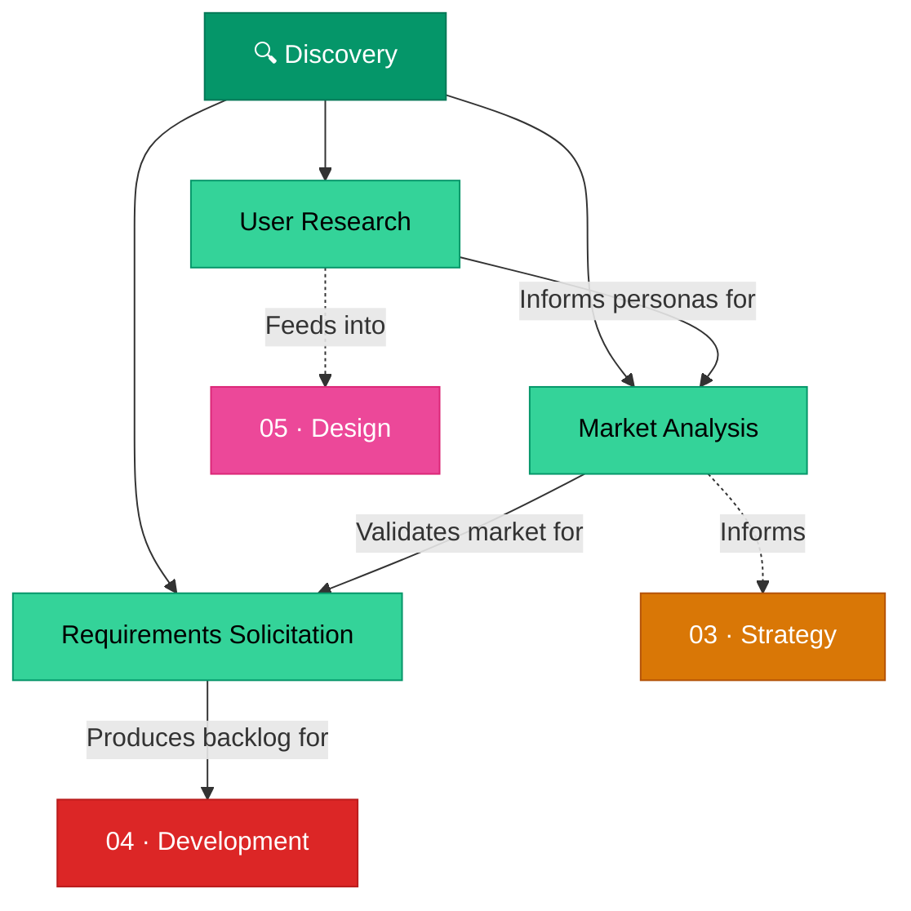

# 🔍 02 · Discovery

> **Understand users, markets, and needs before writing a single line of code.**

Product discovery is the critical phase where assumptions are replaced with evidence. This section covers the research methods, market analysis frameworks, and requirement-gathering techniques that ensure you're building the right product.

---

## Section Overview

---

## Pages in This Section

| Page | Status | Description |
|:-----|:------:|:------------|
| [User Research](user-research.md) | ⚪ | Personas, segmentation, research methods, and prioritization |
| [Market Analysis](market-analysis.md) | ⚪ | TAM/SAM/SOM, competitive analysis, market trends |
| [Requirements Solicitation](requirements-solicitation.md) | ⚪ | Elicitation techniques, product backlog, storymaps, quality assessments |

---

## Key Concepts at a Glance

- **Persona Development**: Demographic, psychographic, and behavioral user profiling
- **TAM/SAM/SOM**: Market sizing hierarchy from total opportunity to obtainable share
- **Competitive Analysis**: Systematic evaluation of competitor products and positioning
- **Elicitation**: Techniques for extracting genuine user needs vs. stated wants

---

## Related Sections

- ← [01 · Foundations](../01-foundations/index.md) — Terminology used throughout discovery
- → [03 · Strategy](../03-strategy/index.md) — Translate discoveries into strategic priorities
- → [05 · Design](../05-design/index.md) — Apply user research to interaction design

---

*[← Back to Wiki Home](../index.md)*
