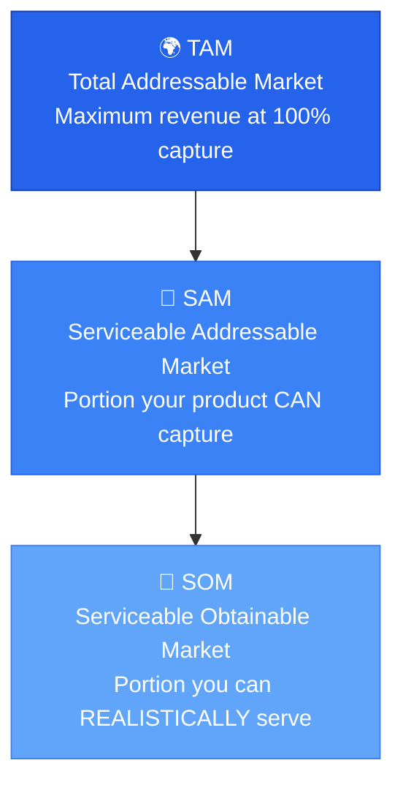
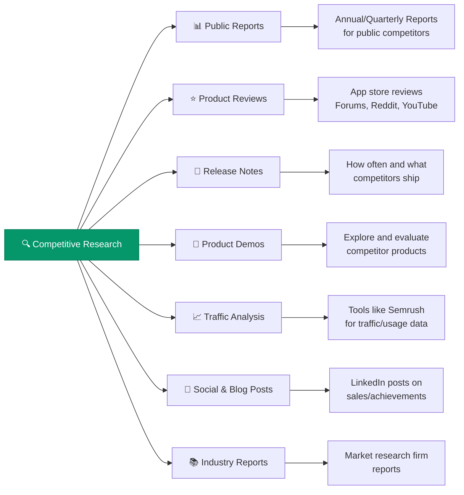

# Market Analysis

> **Understand the market and create a strategy for a specific group of users.**

---

## Table of Contents

- [Market Analysis Framework](#market-analysis-framework)
- [Market Segmentation (TAM/SAM/SOM)](#market-segmentation-tamsam-som)
- [Competitive Analysis](#competitive-analysis)
- [Market Differentiation](#market-differentiation)

---

## Market Analysis Framework

A thorough market analysis answers five fundamental questions:

| Dimension | Question |
|:----------|:---------|
| **Market Size** | How many potential customers exist in the target market? |
| **Market Growth** | Is the target market growing or declining, and at what rate? |
| **Competitive Landscape** | Who else is serving this market and how? |
| **Customer Needs** | What are the needs, wants, and behaviors of target customers? |
| **Market Trends** | What current and emerging trends are shaping the market? |

---

## Market Segmentation (TAM/SAM/SOM)

| Segment | Definition | Purpose |
|:--------|:-----------|:--------|
| **TAM** | Total potential market size — maximum revenue if you captured 100% | Sets the ceiling; attracts investors |
| **SAM** | Portion of TAM that your product/service **can** capture | Realistic addressable opportunity |
| **SOM** | Portion of SAM you can serve with **current** offerings | Near-term revenue target |

> [!TIP]
> Use **bottom-up analysis** (actual customer data × average revenue) for SOM, and **top-down analysis** (industry reports × market share estimates) for TAM. The gap between top-down TAM and bottom-up SOM reveals your growth opportunity.

---

## Competitive Analysis

### Research Sources

### Competitive Analysis Checklist

| ✅ | Research Area |
|:--:|:-------------|
| ☐ | Annual/quarterly reports (public competitors) |
| ☐ | App store reviews and user forum sentiment |
| ☐ | Competitor release notes — shipping frequency and improvements |
| ☐ | Product demos or video walkthroughs |
| ☐ | Traffic analysis (Semrush, SimilarWeb) |
| ☐ | Competitor blog and LinkedIn content |
| ☐ | Industry reports from market research firms |

---

## Market Differentiation

### Positioning Questions

- Where do we need to improve — what is our differentiation?
- How does our brand position compare to competitors?

| Positioning | Characteristics |
|:------------|:---------------|
| **Luxury Brand** | Premium pricing, exclusive features, superior experience |
| **Value Brand** | Competitive pricing, essential features, broad accessibility |

### Trend Analysis

> [!WARNING]
> Distinguish between **hype** (a new technology trend that may not have lasting value) and **necessity** (regulatory changes or market events that require adaptation).

---

## Related Pages

- → [User Research](user-research.md) — Personas and segments to validate against market data
- → [Feature Prioritization](../03-strategy/feature-prioritization.md) — Use market data to prioritize
- → [Go-to-Market](../03-strategy/go-to-market.md) — Turn market analysis into a launch strategy
- → [Success Metrics](../06-metrics/success-metrics.md) — Metrics to track market performance

---

## Sources & References

- Legacy notes: `docs/legacy_notion_files/Product Development and Strategy Wiki` (Market section)

---

*[← Back to Section Index](index.md) · [← Back to Wiki Home](../index.md)*
