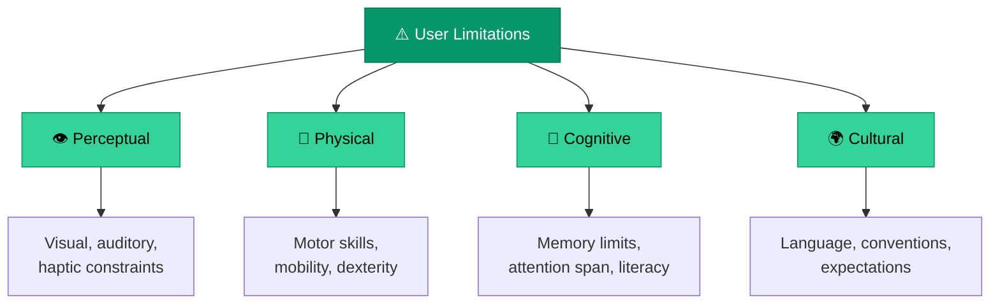
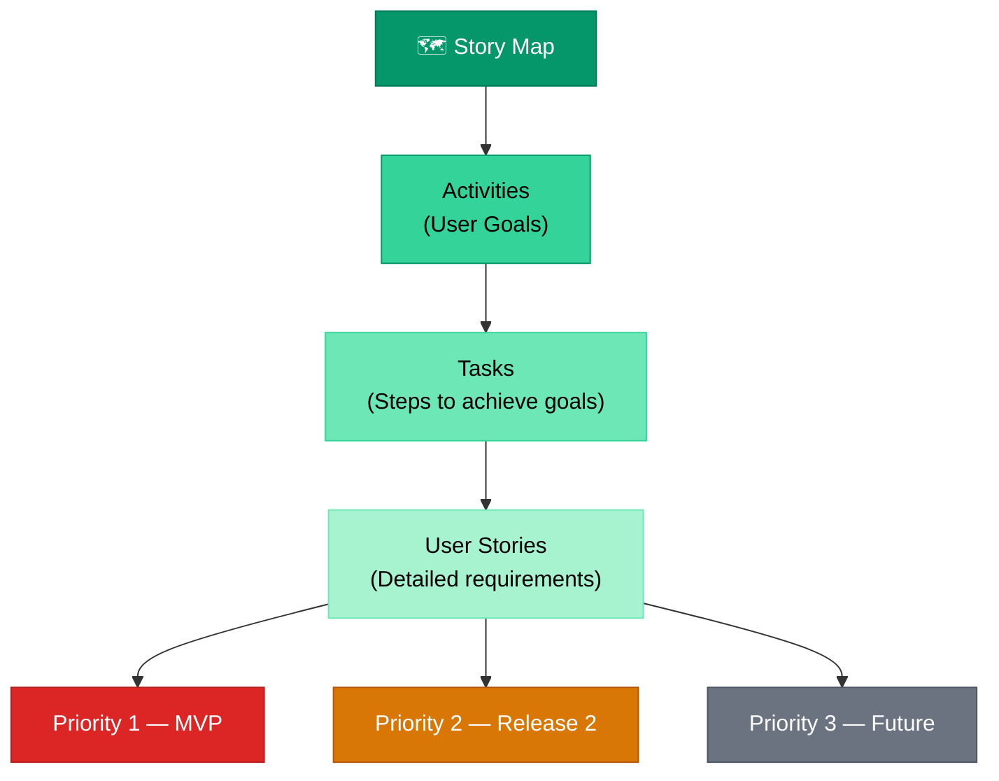

# Requirements Solicitation

> **Effective products start with the right questions, not the right answers.**

---

## Table of Contents

- [Elicitation Techniques](#elicitation-techniques)
- [Product Backlog](#product-backlog)
- [Story Maps](#story-maps)
- [Quality Assessments](#quality-assessments)

---

## Elicitation Techniques

Requirements elicitation is the process of gathering needs from users, stakeholders, and existing systems. The key challenge is bridging the gap between what users **say** they want and what they **actually need**.

### User Limitation Awareness

When gathering requirements, account for user limitations:

### Involving Clients

> [!NOTE]
> This section will be expanded in future iterations to cover specific client involvement techniques: workshops, JAD sessions, observation studies, and document analysis.

---

## Product Backlog

The product backlog is a prioritized list of features, enhancements, and fixes that define the product roadmap at the tactical level.

### Backlog Prioritization

> [!NOTE]
> This section will be expanded to cover prioritization methods including MoSCoW, Kano Model, and weighted scoring. See also [Feature Prioritization](../03-strategy/feature-prioritization.md).

---

## Story Maps

Story maps organize requirements into a visual hierarchy that shows the complete user experience.

> [!NOTE]
> This section will be expanded with practical story mapping templates and workshop facilitation guides.

---

## Quality Assessments

> [!NOTE]
> This section will be expanded to cover requirements quality checks, traceability matrices, and validation techniques.

---

## Related Pages

- → [User Research](user-research.md) — Research methods that feed into requirements
- → [Requirements & User Stories](../04-development/requirements-user-stories.md) — Writing and structuring requirements
- → [Feature Prioritization](../03-strategy/feature-prioritization.md) — Prioritizing the backlog
- → [Acceptance Criteria](../04-development/acceptance-criteria.md) — Verifying requirements are met

---

## Sources & References

- Software Product Management Specialization — Coursera
- Legacy notes: `docs/legacy_notion_files/Requirements Solicitation`

---

*[← Back to Section Index](index.md) · [← Back to Wiki Home](../index.md)*
