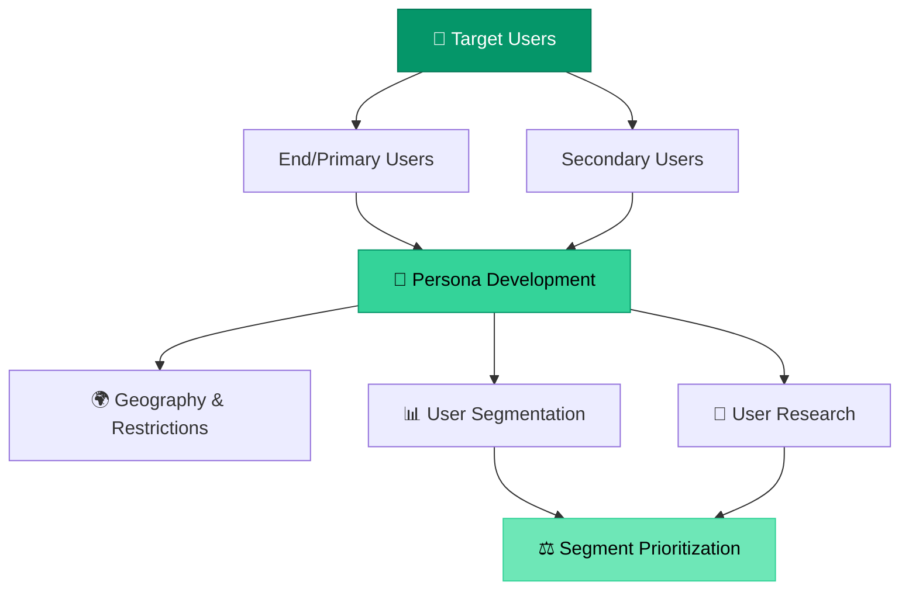
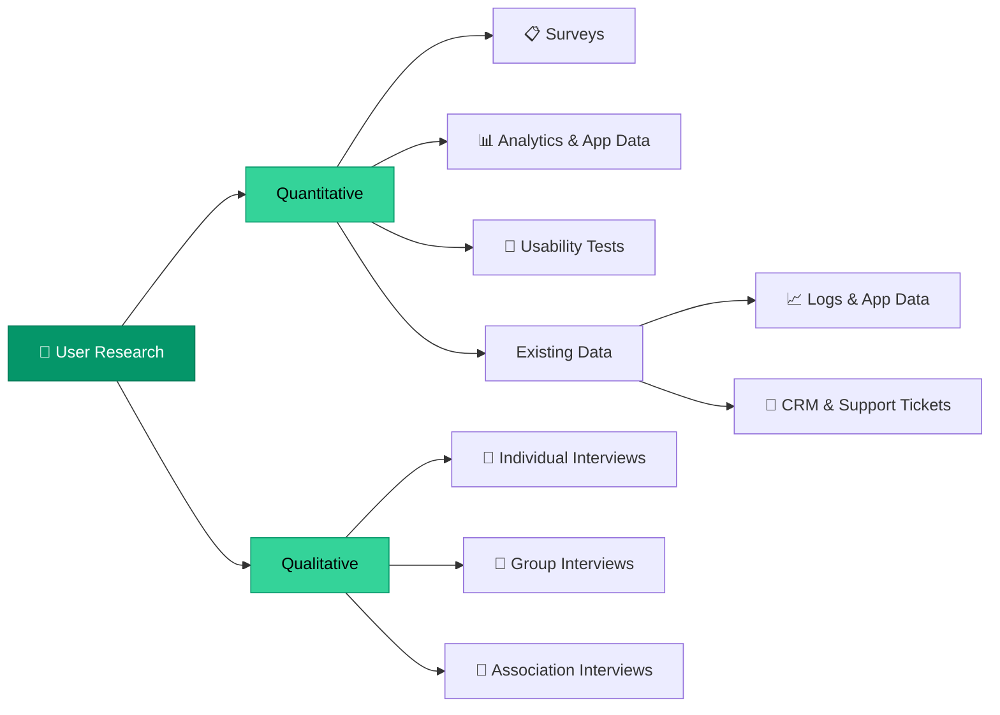

# User Research

> **Understand the users of the product/feature — who they are, what they need, and how to reach them.**

---

## Table of Contents

- [Define Users](#define-users)
- [Persona Development](#persona-development)
- [User Research Methods](#user-research-methods)
- [User Segment Prioritization](#user-segment-prioritization)

---

## Define Users

Before building any product or feature, clearly define who will use it:

- **End-Users**: Are there primary and secondary users?
- **Personas**: Who are the users and what characterizes them?
- **User Journey**: How do users discover, adopt, and use the product?

---

## Persona Development

### Geographical Characteristics & Restrictions

- Where is this product launched?
- Are there legal restrictions (e.g., GDPR, regulatory requirements)?
- Cultural considerations for different markets

### User Segmentation

| Dimension | Questions to Answer |
|:----------|:-------------------|
| **Demographics** | Age, gender, other demographic characteristics |
| **Psychographics** | Interests (sports, dietary preferences, pet ownership, family status) |
| **Accessibility** | Technology access, disabilities, tech literacy, platform preference |
| **Influence** | Peer pressure, celebrity endorsements, community trends |

> [!TIP]
> Build a **User Segmentation Matrix** that cross-references demographics with psychographics to identify your most valuable micro-segments.

---

## User Research Methods

### Quantitative Methods
- **Surveys**: Contact surveys for broad reach
- **Analytics**: Logs, app data, behavioral metrics
- **CRM Data**: Customer support tickets, user feedback

### Qualitative Methods
- **Individual Interviews**: One-on-one deep dives
- **Group Interviews**: Focus groups for shared experiences
- **Association Interviews**: Industry-specific group feedback
- **Usability Testing**: Observing real users with the product

---

## User Segment Prioritization

Rank your user segments to focus resources on the highest-value groups:

| Factor | Description | Weight |
|:-------|:-----------|:------:|
| **Market Size** | Total potential users in this segment | High |
| **Frequency** | How often this segment uses the product | High |
| **Spend** | Willingness and ability to pay | Medium |
| **Goals & Motivations** | Urgency and alignment with product value | High |

> [!NOTE]
> Combine segment prioritization with [Market Analysis](market-analysis.md) data to validate segment sizes and competitive positioning.

---

## Related Pages

- → [Market Analysis](market-analysis.md) — Market sizing for validated segments
- → [Requirements Solicitation](requirements-solicitation.md) — Gather requirements from prioritized segments
- → [User Interaction & Design](../05-design/user-interaction-design.md) — Design for your target users
- → [Basic Terminology](../01-foundations/basic-terminology.md) — User type definitions

---

## Sources & References

- Legacy notes: `docs/legacy_notion_files/Product Development and Strategy Wiki` (Users section)

---

*[← Back to Section Index](index.md) · [← Back to Wiki Home](../index.md)*
