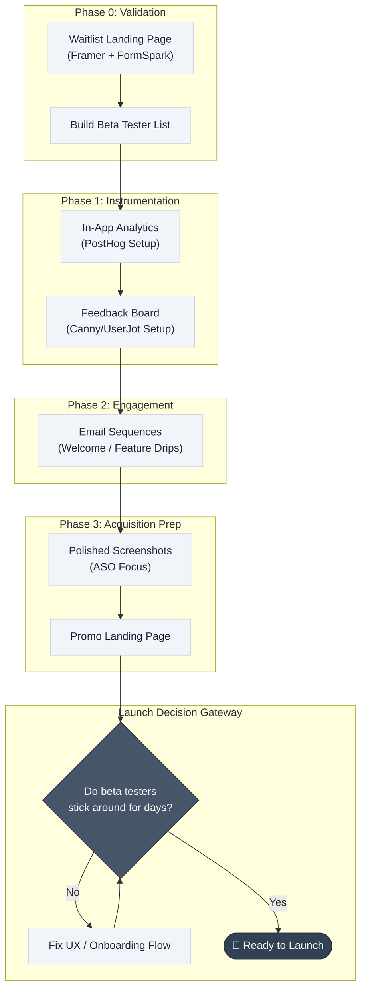

# App Launch Checklist

> **"A successful launch is not a single day; it is a system of preparation that begins before the first line of code is written."**

---

## Table of Contents

- [Phase 0: Pre-Build & Waitlist](#phase-0-pre-build--waitlist)
- [Phase 1: Instrumentation (Analytics & Feedback)](#phase-1-instrumentation-analytics--feedback)
- [Phase 2: Drip Engagement Systems](#phase-2-drip-engagement-systems)
- [Phase 3: Acquisition Assets](#phase-3-acquisition-assets)
- [Timing - When is it Time to Launch?](#timing---when-is-it-time-to-launch)
- [Execution Playbook: Low-Key vs. High-Impact](#execution-playbook-low-key-vs-high-impact)
- [App Launch Pipeline Flow](#app-launch-pipeline-flow)

---

## Phase 0: Pre-Build & Waitlist

The preparation for launch begins before development starts. 
* **Waitlist Landing Page**: Build a simple, clean, single-page landing page showcasing one high-fidelity app mockup/screenshot and an email collection box.
* **Purpose**:
  * Gauges target market interest.
  * Captures initial cohort of high-intent beta testers.
  * Provides a distribution springboard on launch day.
* **Tooling**: Built in minutes using a Framer template, integrated with FormSpark for email collection.

---

## Phase 1: Instrumentation (Analytics & Feedback)

Launching without data collection tools is "building on hard mode." Implement telemetry early to prevent flying blind.

### 1. In-App Product Analytics
* **Purpose**: To observe where users drop off and identify drop-off barriers early in the launch cycle.
* **Best Practice**: Set up analytics before onboarding beta testers. It requires minimal time (~30 minutes) but provides invaluable cohort retention data later.
* **Tooling**: PostHog.

### 2. Public Feedback Board
* **Purpose**: Allows users to log feature requests, report bugs, and upvote suggestions.
* **Why it Works**: Product builders frequently fail to predict what features users actually value. Upvoting surfaces high-demand requests (e.g., the lists feature in Ellie), which directly informs prioritization.
* **Tooling**: Canny (supports seamless web/iOS login using existing app accounts) or UserJot.

> [!TIP]
> Implementing a feedback board is one of the strongest retention signals. Resolving user requests directly decreases user churn and builds community loyalty.

---

## Phase 2: Drip Engagement Systems

Drip email sequences improve retention and reduce churn in the first critical weeks.

* **Triggered Welcome**: Automated onboarding email sent instantly upon registration.
* **Feature Nurturing Drips**: Send a series of short educational emails (e.g., 5 emails over 14 days) outlining lesser-known app features. This maintains top-of-mind awareness and drives discovery.
* **Inactivity Sequences**: Automate check-in sequences when a user is inactive (e.g., 7 days of zero app activity) to solicit direct feedback on their friction points.
* **Tooling**: Loops.

---

## Phase 3: Acquisition Assets

High-converting assets ensure the product captures traffic when launched.

### 1. App Store Optimization (ASO)
* **Apple's Organic Boost**: Apple rewards new listings with search visibility preference during the first few days to two weeks. 
* **Visual Screenshots**: Devote **3 to 4 days** strictly to screenshots. They are the primary element users evaluate before downloading.
* **Metadata**: Take title, subtitle, descriptions, and tag fields seriously. Research keywords to maximize visibility. (See [App Store Optimization](app-store-optimization.md)).

### 2. Promotional Landing Page
* **Purpose**: Focuses on showcasing core features, values, and testimonials, converting web traffic into app store installations.
* **Tooling**: Framer.

---

## Timing - When is it Time to Launch?

Do not launch purely based on calendar deadlines. Evaluate user behavior:

* **Day-1 Retention Check**: If beta users register and drop off immediately, do not scale acquisition. Iterate on core flows first.
* **Multi-day Stickiness**: Proceed to launch when analytics show beta cohorts are returning to the app over consecutive days. Use this qualitative signal to make the go-live decision.

---

## Execution Playbook: Low-Key vs. High-Impact

Choose the launch strategy that matches your product, comfort level, and target market.

### A. Low-Key Launch
Recommended for indie developers or niche products.
1. **Announcements**: Write social threads (Twitter/X, LinkedIn) and create introductory videos (YouTube).
2. **Direct Outreach**: Email the waitlist built during Phase 0.
3. **Outcome**: Gradual, controlled user feedback from warm traffic.

### B. High-Impact Launch
Recommended for products seeking rapid growth.
1. **Anticipation**: Share teasers on social channels in the week leading up.
2. **Coordinated Product Hunt**: Launch and request peer support to capture top-page rankings.
3. **Community Outreach**: Post valuable, non-spam content highlighting the launch in relevant forums (Reddit, Hacker News, developer networks).

---

## App Launch Pipeline Flow

This flowchart outlines the progression from pre-build validation to full launch execution:

---

## Related Pages

- ← [Go-to-Market Strategy](go-to-market.md) - Strategy blueprint for launching products
- ← [App Store Optimization](app-store-optimization.md) - Keyword and metadata optimization guide
- → [Onboarding Patterns](../05-design/onboarding-patterns.md) - First user experience optimizations
- → [Success Metrics](../06-metrics/success-metrics.md) - Tracking post-launch KPIs

---

## Sources & References

* Research Document: [App Launch Framework Research](../../docs/research/app_launch_framework.md)
* Video Resource: *My Launch Checklist for New Apps* (2026)
* Tool Integrations: Framer, PostHog, Canny, Loops, FormSpark

---

*[← Back to Section Index](index.md) · [← Back to Wiki Home](../index.md)*
