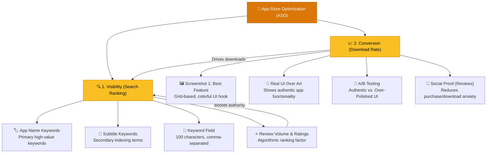

# App Store Optimization (ASO)

> **A great app store listing is the difference between ranking at the top of search results and remaining completely invisible.**

---

## Table of Contents

- [The ASO Framework](#the-aso-framework)
- [The Three Pillars of ASO](#the-three-pillars-of-aso)
- [ASO Case Studies: Good vs. Bad Examples](#aso-case-studies-good-vs-bad-examples)
- [Actionable Guidelines for App Developers](#actionable-guidelines-for-app-developers)

---

## The ASO Framework

For mobile products, **App Store Optimization (ASO)** acts as the primary search engine optimization (SEO) channel. Since the majority of mobile app users discover products directly via search queries in the Apple App Store and Google Play Store, ASO serves as a highly scalable, zero-marginal-cost acquisition funnel.

ASO relies on a continuous feedback loop: search visibility drives traffic, high-quality visual assets convert that traffic into downloads, and reviews/ratings establish the trust and volume metrics that push the app higher in store rankings.

---

## The Three Pillars of ASO

### 1. Metadata and Keyword Optimization
ASO is driven by strategic keyword indexation. Search algorithms analyze the app's metadata fields to determine its relevance for user searches.

* **App Name (Title)**: The most influential indexing factor. The primary search term must be placed directly here.
  * *Indie Strategy*: Call the app `[Keyword] - [Brand Name]` (e.g., *Habit Tracker - Habit Kit*) rather than just the brand name. Only highly popular apps with massive external brand equity (e.g., *Duolingo*) can afford to put the brand name first.
* **Subtitle**: Offers an additional 30 characters for secondary keywords.
  * *Rule of Indexation*: Do not repeat words between the title and subtitle. The algorithm indexes them as a combined string; duplicate keywords waste space.
* **Hidden Keyword Field**: A 100-character backend field (in App Store Connect).
  * *Syntax Rules*: Separate terms with commas; do not use spaces. Use singular terms (plurals are indexed automatically). Never include competitor names, as it can trigger app store rejections.

> [!TIP]
> Brainstorm search terms using LLMs, but validate their popularity and difficulty using search tools like **Astro**. The ideal target is a keyword with high popularity and manageable competition. When launching, it is better to compete for a high-value, highly competitive primary keyword than to rank #1 for a term with no search volume.

### 2. Screenshot and Visual Conversion
While keywords make an app *discoverable*, screenshots determine if a user *downloads* it. You have roughly **3 to 5 seconds** of scroll-time to capture interest.

* **First Screenshot Rule**: Place your most impressive, colorful, and unique feature on the very first screenshot. Never waste this slot on onboarding illustrations or generic welcome screens.
* **Real UI Over Abstract Illustrations**: Avoid lifestyle graphics or abstract illustrations. Show high-fidelity representations of the real app interface so users know exactly what they are getting.
* **Authentic beats Professional**: Fancier is not always better. 

> [!WARNING]
> A/B testing reveals that highly polished, corporate, or designer-crafted screenshots can actually underperform compared to original, simple, and authentic UI showcases. Always A/B test assets using tools like Apple's **Product Page Optimization**.

### 3. Review Loops and Algorithmic Rank
Ratings and review volume act as major algorithmic indicators for search rankings. Higher volumes of positive ratings tell the store that the app is high quality, pushing it up the organic rankings.

* **Moment-of-Triumph Triggers**: Prompt users for reviews at "happy moments" in their lifecycle (e.g., immediately after checking off their first habit, completing a workout, or hitting a milestone). Never prompt during onboarding or immediately after a crash.
* **Support Loop Escalation**: Support emails are excellent touchpoints to gather 5-star reviews. Add a gentle signature ask to support replies once an issue is successfully resolved.
* **Reply to Everything**: Maintain an active developer presence by replying to every review. Providing personal support on 1-star reviews frequently converts them into 5-star ratings once issues are resolved.

---

## ASO Case Studies: Good vs. Bad Examples

| App / Experiment | ASO Strategy / Element | Classification | Impact & Metrics | Why it Works / Fails |
| :--- | :--- | :--- | :--- | :--- |
| **Habit Kit** | App Name Keyword Structure | 🟢 **Good (Search Hook)** | Ranked #2/3 for "habit tracker" in US | Named `Habit Tracker - Habit Kit`, putting the high-volume primary keyword first. |
| **Duolingo** | App Name Brand Leverage | 🟢 **Good (Brand Leader)** | Elite brand recognition | Named `Duolingo - Language Lessons`. Can afford to place brand name first because of massive external search volume. |
| **Habit Kit (Designer Test)** | Over-Polished Screenshots | 🔴 **Bad (Over-Designed)** | Lower conversion rate in A/B test | Beautiful, slick graphics felt less authentic to users. Authentic, real UI screenshots won. |
| **Habit Kit (Review Trigger)** | Accomplishment-Based Prompt | 🟢 **Good (Delight Loop)** | 7,400+ iOS reviews (4.8★), 10,000+ Android reviews (4.6★) | Triggers review prompt immediately after a user logs their first habit completion. |
| **Support Email Signature** | Personal Ask Trick | 🟢 **Good (Relationship-First)** | High volume of 5★ ratings | Asking for a review immediately after resolving a support issue taps into user gratitude. |
| **Typical Indie App** | "Ship and Hope" / Brand-Only Name | 🔴 **Bad (Invisibility)** | 0 organic downloads | Naming an app `MyUniqueName` without including search keywords in the name or subtitle. |

---

## Actionable Guidelines for App Developers

1. **Perform a Metadata Audit**:
   - Ensure the primary search term is in the first position of your App Name.
   - Eliminate spaces and duplicate words from the 100-character keyword field.
2. **Review Screenshot Flow**:
   - Audit Screenshot #1: Does it display the app's single best visual feature?
   - Set up an A/B test comparing designer-styled screens against raw, authentic UI captures.
3. **Map the Prompt Trigger**:
   - Trace the exact user journey. Find the first moment of satisfaction (completion of first action) and trigger the native review modal (`SKStoreReviewController` or Google Play In-App Review API) there.
   - Prevent the modal from showing more than once every 3 to 6 months to respect user experience.

---

## Related Pages

- ← [Go-to-Market](go-to-market.md) — Broader launch and channel acquisition strategy
- → [App Launch Checklist](app-launch-checklist.md) — Setup and systems preparation prior to launching
- → [Success Metrics](../06-metrics/success-metrics.md) — Tracking acquisition, conversion, and retention
- → [Onboarding Patterns](../05-design/onboarding-patterns.md) — Converting app store installs into activated users
- → [Retention Psychology](../06-metrics/retention-psychology.md) — Long-term engagement loops to sustain acquired users

---

## Sources & References

- Full research document: [app_store_optimization_playbook.md](../../docs/research/app_store_optimization_playbook.md)
- Sebastian (Habit Kit) ASO Masterclass (Starter Story Build, 2026)

---

*[← Back to Section Index](index.md) · [← Back to Wiki Home](../index.md)*
