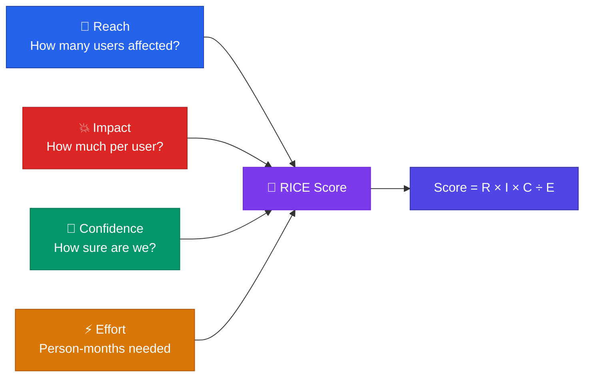
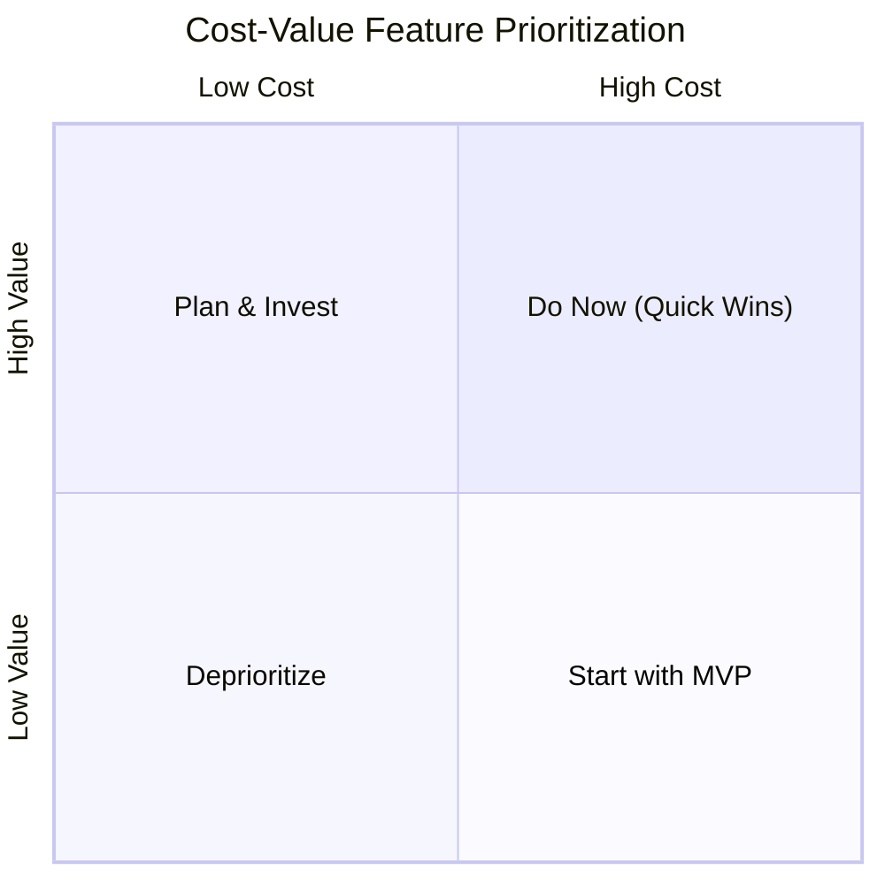
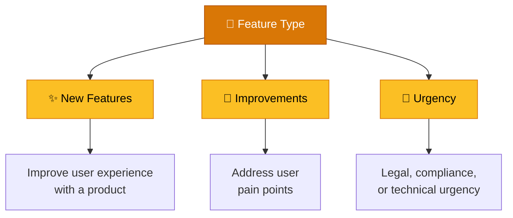

# Feature Prioritization

> **Understand what, why, and when to create a product or feature.**

---

## Table of Contents

- [Decision Matrix](#decision-matrix)
- [RICE Methodology](#rice-methodology)
- [Cost-Value Matrix](#cost-value-matrix)
- [Problem Sense](#problem-sense)
- [Prioritization Risks](#prioritization-risks)

---

## Decision Matrix

A simple weighted scoring model for comparing features:

| Feature | Business Value (1-5) | Development Effort (1-5) | User Impact (1-5) | **Total Score** |
|:--------|:-------------------:|:------------------------:|:-----------------:|:--------------:|
| Feature A | — | — | — | — |
| Feature B | — | — | — | — |
| Feature C | — | — | — | — |

> [!TIP]
> Weight each dimension differently based on your strategic focus. For a growth-stage product, **User Impact** might be weighted 2×. For a mature product, **Business Value** may take priority.

---

## RICE Methodology

### RICE Components

| Component | Definition | Scale |
|:----------|:-----------|:------|
| **Reach** | How many people will this affect over a specific period? | Absolute number (e.g., users/quarter) |
| **Impact** | How much will it change the user experience per user reached? | 0.25 (minimal) → 0.5 → 1.0 → 2.0 → 3.0 (massive) |
| **Confidence** | How sure are you about reach, impact, and effort estimates? | 50% (low) → 80% (medium) → 100% (high) |
| **Effort** | How many person-months will this require? | Person-months |

> **RICE Score** = (Reach × Impact × Confidence) / Effort

---

## Cost-Value Matrix

Define goals for the next 6 months and create a roadmap with high-level goals that create value and impact.

### Value-Based Prioritization Questions

- Will this feature **increase our customers**?
- Is this something **needed by our customers**?
- Does it fit the **company's vision and roadmap**?
- Does the company have the **resources needed**?

> [!TIP]
> If a feature is **high value and high cost**, start with an MVP. Then iterate based on user feedback.

---

## Problem Sense

### Define Feature Type

### How to Identify User Pain Points

| Source | Method |
|:-------|:-------|
| **Product Signals** | Funnel drop-offs, abandonment patterns (e.g., churn during onboarding) |
| **Customer Feedback** | Reviews, support tickets, NPS surveys |
| **User Research** | Interviews, usability tests (see [User Research](../02-discovery/user-research.md)) |
| **Market Research** | Competitor analysis, untapped market segments |

---

## Prioritization Risks

### Why Solve This Problem Now?

- Will we **reduce the churn rate**?
- What will be the **impact on users**, the product, or the business?
- Will this lead to **increased revenue**?

### Risk Assessment Questions

| Risk Area | Question |
|:----------|:---------|
| **Opportunity Cost** | What happens if we deprioritize other features? |
| **Resource Exhaustion** | Will this consume resources needed elsewhere? |
| **Root Cause** | Do we need root cause analysis before acting? |
| **ROI** | Have we calculated the return on investment? |
| **Market Trends** | Are we missing industry trends? |

> [!TIP]
> Perform a **SWOT analysis** or use **Risk Matrices** (see [Risk Management](../07-risk-management/risk-management.md)) to systematically assess prioritization trade-offs.

---

## Related Pages

- ← [Market Analysis](../02-discovery/market-analysis.md) — Market data informing prioritization
- → [Go-to-Market](go-to-market.md) — Launch strategy for prioritized features
- → [Roadmap Planning](roadmap-planning.md) — Sequencing prioritized features
- → [Risk Management](../07-risk-management/risk-management.md) — Formal risk assessment

---

## Sources & References

- Legacy notes: `docs/legacy_notion_files/Product Development and Strategy Wiki` (Features and Prioritization section)
- Legacy notes: `docs/legacy_notion_files/Product Planning & Roadmap` (RICE section)

---

*[← Back to Section Index](index.md) · [← Back to Wiki Home](../index.md)*
