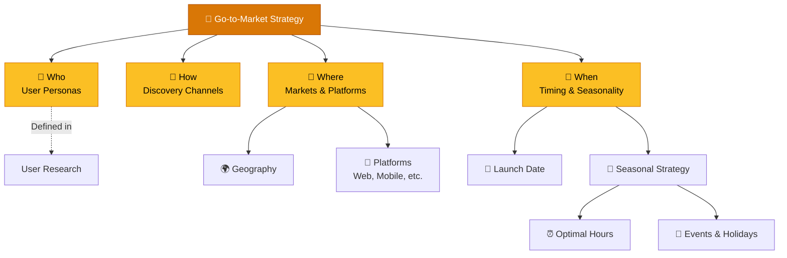
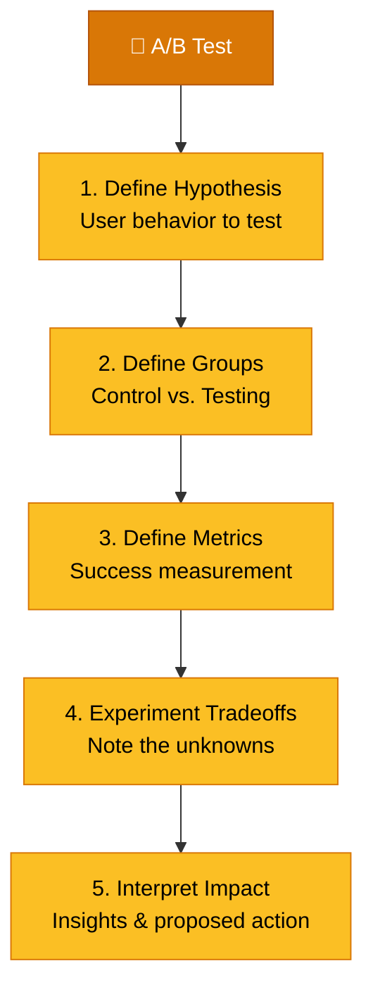

# Go-to-Market Strategy

> **A great product that nobody knows about is not a great product.**

---

## Table of Contents

- [GTM Framework](#gtm-framework)
- [Define the Strategy](#define-the-strategy)
- [A/B Testing Framework](#ab-testing-framework)

---

## GTM Framework

A Go-to-Market strategy defines **who** will use the product, **how** they will discover it, **where** it will launch, and **when** timing is optimal.

---

## Define the Strategy

### Who — User Personas

Define target personas as detailed in [User Research](../02-discovery/user-research.md).

### How — Discovery Channels

How will users know about the product or feature?

> [!TIP]
> Craft the message based on the **Market Segment**:
> - High quality and premium experience
> - User-friendly and accessible
> - Budget-friendly and value-oriented
> - Ease of use and simplicity

### Where — Markets & Platforms

| Dimension | Considerations |
|:----------|:---------------|
| **Geography** | Which regions/countries? Legal restrictions? |
| **Platform** | Web, iOS, Android, desktop? All at once or phased? |
| **Distribution** | App stores, direct download, web app, enterprise sales? |

### When — Timing & Seasonality

| Factor | Questions |
|:-------|:---------|
| **Launch Date** | When is the product/feature shipping? |
| **Seasonal Fit** | Is this product seasonal? What period is most effective? |
| **Time-of-Day** | Which hours yield highest engagement? |
| **Events** | Anniversaries, conventions, public holidays to target? |

---

## A/B Testing Framework

Validate GTM assumptions with structured experimentation.

### A/B Test Checklist

| Step | Action |
|:-----|:-------|
| **Hypothesis** | Define the user behaviour you want to test |
| **Control Group** | Unchanged experience (baseline) |
| **Testing Group** | Modified experience (the variant) |
| **Metrics** | Define measurable success criteria (see [Success Metrics](../06-metrics/success-metrics.md)) |
| **Tradeoffs** | Document unknowns and experiment risks |
| **Impact** | Interpret insights and determine next action |

---

## Related Pages

- ← [Feature Prioritization](feature-prioritization.md) — What to bring to market
- ← [User Research](../02-discovery/user-research.md) — Who the GTM targets
- → [App Store Optimization](app-store-optimization.md) — Mobile organic acquisition channel
- → [App Launch Checklist](app-launch-checklist.md) — Tactical launch preparation checklist
- → [Roadmap Planning](roadmap-planning.md) — When it's scheduled
- → [Success Metrics](../06-metrics/success-metrics.md) — How to measure GTM outcomes
- → [Onboarding Patterns](../05-design/onboarding-patterns.md) — First user experience after launch

---

## Sources & References

- Legacy notes: `docs/legacy_notion_files/Product Development and Strategy Wiki` (GTM section)

---

*[← Back to Section Index](index.md) · [← Back to Wiki Home](../index.md)*
