# 🎯 03 · Strategy

> **Decide what to build, when to build it, and how to bring it to market.**

Product strategy bridges the gap between discovery insights and development execution. This section covers prioritization frameworks, go-to-market planning, and roadmap creation.

---

## Section Overview

```mermaid
graph TD
    S["🎯 Strategy"] --> FP["Feature Prioritization"]
    S --> GTM["Go-to-Market"]
    S --> RP["Roadmap Planning"]
    S --> ASO["App Store Optimization"]
    S --> ALC["App Launch Checklist"]

    FP -->|"Ranked features feed"| RP
    RP -->|"Timeline drives"| GTM
    GTM -->|"Executed via"| ALC
    ASO -->|"Optimizes listing for"| ALC
    ALC -->|"Launch validates"| MET["06 · Metrics"]

    FP -.->|"Uses data from"| DISC["02 · Discovery"]
    RP -.->|"Produces work for"| DEV["04 · Development"]
    ASO -.->|"Acquisition feeds"| ONB["05 · Design"]

    style S fill:#334155,stroke:#1e293b,color:#fff
    style FP fill:#f1f5f9,stroke:#cbd5e1,color:#1e293b
    style GTM fill:#f1f5f9,stroke:#cbd5e1,color:#1e293b
    style RP fill:#f1f5f9,stroke:#cbd5e1,color:#1e293b
    style ASO fill:#f1f5f9,stroke:#cbd5e1,color:#1e293b
    style ALC fill:#f1f5f9,stroke:#cbd5e1,color:#1e293b
    style MET fill:#e2e8f0,stroke:#94a3b8,color:#334155
    style DISC fill:#e2e8f0,stroke:#94a3b8,color:#334155
    style DEV fill:#e2e8f0,stroke:#94a3b8,color:#334155
    style ONB fill:#e2e8f0,stroke:#94a3b8,color:#334155
```

---

## Pages in This Section

| Page | Status | Description |
|:-----|:------:|:------------|
| [Feature Prioritization](feature-prioritization.md) | 🟢 | RICE methodology, decision matrices, cost-value analysis |
| [Go-to-Market](go-to-market.md) | 🟢 | GTM strategy, A/B testing, launch planning |
| [App Store Optimization](app-store-optimization.md) | 🟢 | Keyword strategy, screenshot conversion, review loops |
| [Roadmap Planning](roadmap-planning.md) | 🟢 | Product roadmaps, WBS, task dependencies, Gantt/PERT/CPM charts |
| [App Launch Checklist](app-launch-checklist.md) | 🟢 | Tactical launch checklist: analytics, waitlists, feedback boards, and emails |

---

## Key Concepts at a Glance

- **RICE Scoring**: Reach × Impact × Confidence ÷ Effort
- **Cost-Value Matrix**: Plotting features by development cost vs. business value
- **Go-to-Market**: Who, how, where, and when to launch
- **ASO Pillars**: Keyword optimization, CVR screenshot hooks, and review prompts
- **Launch Telemetry**: Early post-launch analytics (PostHog) to track churn
- **Feedback Boards**: Crowd-sourced request upvoting (Canny) to prioritize roadmaps
- **Work Breakdown Structure**: Hierarchical decomposition of deliverables
- **Critical Path Method**: Identifying the longest dependency chain

---

## Related Sections

- ← [02 · Discovery](../02-discovery/index.md) — Research insights that inform strategy
- → [04 · Development](../04-development/index.md) — Execute the strategic roadmap
- → [06 · Metrics](../06-metrics/index.md) — Measure strategic outcomes

---

*[← Back to Wiki Home](../index.md)*
