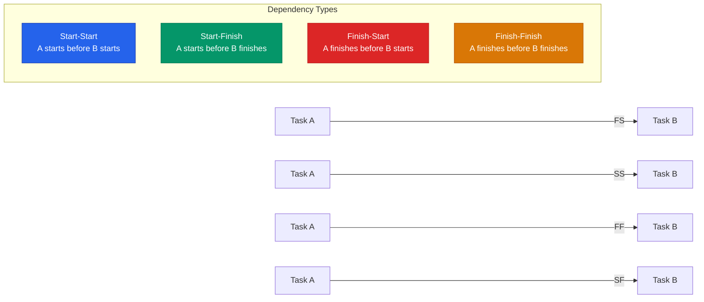
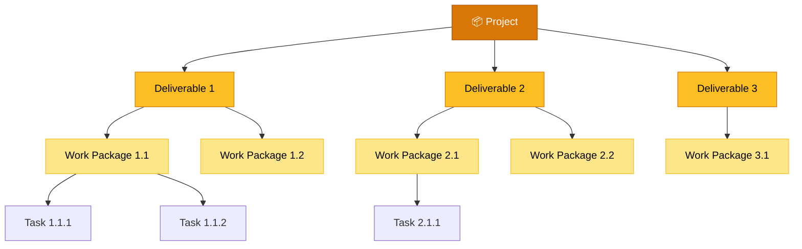
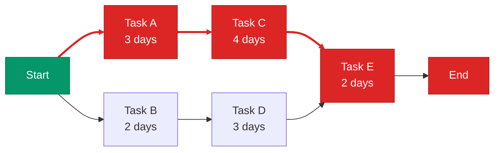
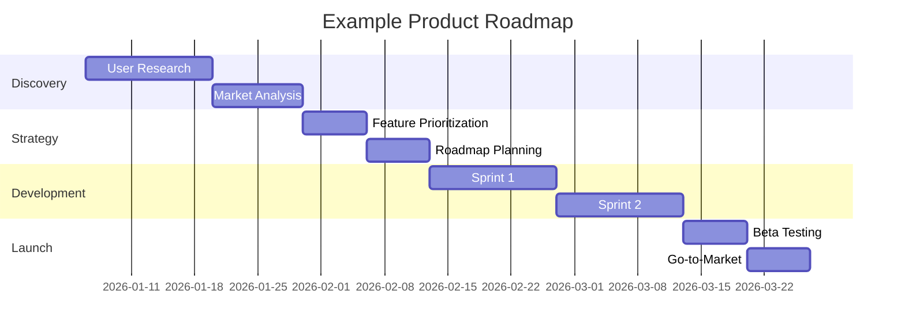

# Roadmap Planning

> **"Give me six hours to chop down a tree and I will spend the first four sharpening the axe."** — Abraham Lincoln

---

## Table of Contents

- [Product Roadmap](#product-roadmap)
- [Task Dependencies](#task-dependencies)
- [Work Breakdown Structure (WBS)](#work-breakdown-structure-wbs)
- [CPM Chart](#cpm-chart)
- [PERT Chart](#pert-chart)
- [Gantt Chart](#gantt-chart)

---

## Product Roadmap

The Product Roadmap is the **key strategic document** that defines the vision for the product and the company.

### Roadmap Best Practices

- Focus on the first 3 months — accuracy decreases further out
- Keep everything visible and communicate frequently
- Stay flexible — change the roadmap based on feedback and data
- Each team has its priorities — listen to key stakeholders

### Stakeholder Alignment

| Method | When |
|:-------|:-----|
| **One-on-one meetings** | During roadmap creation with key stakeholders |
| **Groupthink sessions** | When roadmap is nearly completed for final alignment |

> [!TIP]
> Stick to the goal, keep everything visible, and communicate changes proactively.

---

## Task Dependencies

Dependencies among tasks define their relationships so the project can be planned accordingly.

| Type | Notation | Meaning |
|:-----|:---------|:--------|
| **Start-Start** | SS | Task A must start before Task B can start |
| **Start-Finish** | SF | Task A must start before Task B finishes |
| **Finish-Start** | FS | Task A must finish before Task B can start (most common) |
| **Finish-Finish** | FF | Task A must finish before Task B finishes |

---

## Work Breakdown Structure (WBS)

A **WBS** organizes a project into smaller, manageable tasks or components. It breaks down the project into hierarchical levels.

---

## CPM Chart

### Critical Path Method

The **CPM** identifies the **longest sequence of dependent tasks** and determines the shortest time needed to complete a project. Tasks on the critical path have zero float — any delay directly impacts the project deadline.

> The **critical path** (highlighted in red) is: Start → A → C → E → End = **9 days**

---

## PERT Chart

### Program Evaluation and Review Technique

**PERT** visualizes tasks and dependencies with probabilistic time estimates. Unlike CPM where each task has a fixed estimate, PERT uses three estimates:

| Estimate | Description |
|:---------|:-----------|
| **Optimistic (O)** | Best-case completion time |
| **Most Likely (M)** | Most probable completion time |
| **Pessimistic (P)** | Worst-case completion time |

> **Expected Time** = (O + 4M + P) / 6

### CPM vs. PERT

| Feature | CPM | PERT |
|:--------|:----|:-----|
| **Time Estimates** | Fixed (deterministic) | Probabilistic (O, M, P) |
| **Visual Focus** | Arrows = paths, Nodes = tasks | Nodes = dependencies, Arrows = tasks |
| **Best For** | Repetitive projects with known durations | Novel projects with uncertainty |

---

## Gantt Chart

A **Gantt chart** displays tasks, dates, and dependencies in a single horizontal timeline view.

### Gantt Chart Components

- **Tasks** listed vertically on the left
- **Dates** running horizontally along the top
- **Bars** representing task duration from start to end date
- **Dependencies** shown as relationships between bars

---

## Related Pages

- ← [Feature Prioritization](feature-prioritization.md) — What goes into the roadmap
- ← [Go-to-Market](go-to-market.md) — Launch timeline alignment
- → [Estimations & Velocity](../04-development/estimations-velocity.md) — How to estimate task durations
- → [Risk Management](../07-risk-management/risk-management.md) — Identifying schedule risks

---

## Sources & References

- Software Product Management Specialization — Coursera
- Legacy notes: `docs/legacy_notion_files/Product Planning & Roadmap`

---

*[← Back to Section Index](index.md) · [← Back to Wiki Home](../index.md)*
