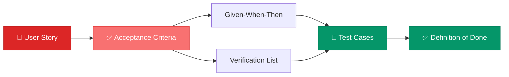
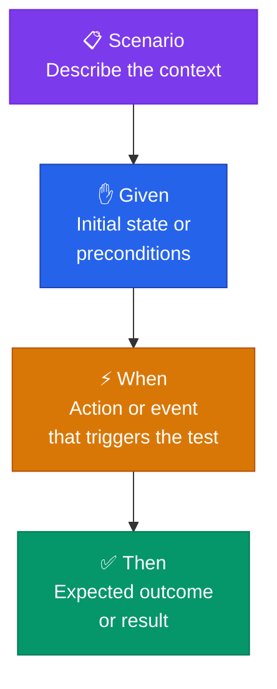

# Acceptance Criteria

> **Write Acceptance Criteria to align the team with the requested result.**

---

## Table of Contents

- [What Are Acceptance Criteria?](#what-are-acceptance-criteria)
- [Given-When-Then Template](#given-when-then-template)
- [Verification Lists](#verification-lists)
- [Choosing the Right Format](#choosing-the-right-format)

---

## What Are Acceptance Criteria?

Acceptance Criteria are a set of **predefined requirements** that a software product must meet to be considered complete and acceptable by stakeholders. They define the specific conditions under which a product is deemed satisfactory and ready for use.



---

## Given-When-Then Template

The **Given-When-Then** format provides a clear, structured way to define acceptance criteria using a scenario-based approach.



| Section | Purpose | Description |
|:--------|:--------|:------------|
| **Scenario** | Context | Describe the scenario being tested |
| **Given** | Preconditions | Initial state before any action is taken |
| **When** | Trigger | The action or event that triggers the test |
| **Then** | Outcome | The expected result after the trigger |

### Example

```markdown
**Acceptance Criterion: Display User Dashboard**

**Given**
- The user is logged into the application

**When**
- The user navigates to the dashboard

**Then**
- The dashboard should display the user's recent activity
- The dashboard should show a welcome message with the user's name
- The dashboard should have a summary of the user's pending tasks
```

---

## Verification Lists

Verification Lists are a more comprehensive, checklist-based approach to acceptance criteria. They are suitable for **complex systems with numerous detailed requirements**.

### Example

```markdown
**Verification List: User Dashboard Features**

1. The user must be able to log into the application successfully.
2. The dashboard must display a welcome message including the user's name.
3. The dashboard must list the user's recent activity.
4. The dashboard must show a summary of pending tasks.
5. The dashboard must have links to Profile, Settings, and Notifications.
6. The data displayed on the dashboard must be updated in real-time.
```

---

## Choosing the Right Format

| Criterion | Given-When-Then | Verification List |
|:----------|:----------------|:-----------------|
| **Best for** | Behavior-driven scenarios | Complex systems with many requirements |
| **Format** | Narrative, scenario-based | Numbered checklist |
| **Readability** | High for single interactions | High for comprehensive coverage |
| **Testing** | Maps directly to BDD tests | Maps to QA checklists |
| **When to use** | User-facing features | System-level or integration testing |

> [!TIP]
> For most user stories, start with **Given-When-Then** for the primary scenario, then add a **Verification List** for edge cases and non-functional requirements.

---

## Related Pages

- ← [Requirements & User Stories](requirements-user-stories.md) — Stories that need acceptance criteria
- ← [Estimations & Velocity](estimations-velocity.md) — Acceptance criteria inform estimates
- → [Risk Management](../07-risk-management/risk-management.md) — Identify risks in criteria gaps
- → [Retrospectives & Feedback](../08-retrospectives/retrospectives-feedback.md) — Review criteria effectiveness

---

## Sources & References

- Software Product Management Specialization — Coursera
- Legacy notes: `docs/legacy_notion_files/Acceptance Criteria`

---

*[← Back to Section Index](index.md) · [← Back to Wiki Home](../index.md)*
