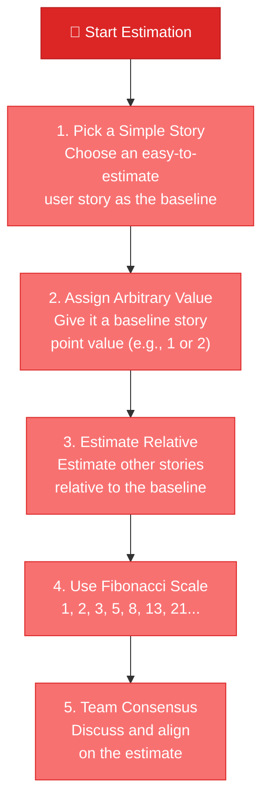
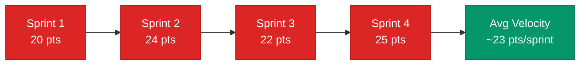

# Estimations, Story Points & Velocity

> **Estimation is not a commitment — it is an informed approximation based on experience.**

---

## Table of Contents

- [Story Points](#story-points)
- [Estimation Process](#estimation-process)
- [Velocity](#velocity)

---

## Story Points

### What Are Story Points?

A **Story Point** is a unit of measure used to estimate the **relative effort or complexity** of a user story or task in agile development. It helps teams assess the amount of work required without focusing on specific time durations.

### Why Use Story Points?

Story points are used so that **estimates won't be taken as commitments**. They reflect a consensus-driven understanding of the work's scope and difficulty, aiding in project planning and resource allocation.

> [!IMPORTANT]
> Story points measure **relative complexity**, not hours. A 5-point story is not "5 hours" — it is roughly 5× the effort of a 1-point story.

---

## Estimation Process

### Fibonacci Sequence for Story Points

| Points | Relative Effort | Typical Use |
|:------:|:---------------|:------------|
| **1** | Trivial | Config change, text update |
| **2** | Simple | Small bug fix, minor UI tweak |
| **3** | Moderate | Standard feature component |
| **5** | Complex | Multi-component feature |
| **8** | Very Complex | Cross-system integration |
| **13** | Epic-level | Should be broken down further |
| **21+** | Too large | Must be decomposed into smaller stories |

> [!TIP]
> If a story scores **13 or higher**, it's likely too large for a single sprint. Break it down into smaller stories that each fall in the 1–8 range.

---

## Velocity

### What Is Velocity?

**Velocity** measures the progress and how "fast" a project is progressing through its backlog.

> **Velocity** = **Work Accomplished** / **Time**

### Why Track Velocity?

Velocity helps create **meaningful estimates** of the amount of work a team can finish throughout the project. It enables:

- **Sprint planning**: Know how many points the team can realistically commit to
- **Release forecasting**: Predict when a set of features will be complete
- **Trend analysis**: Identify improving or declining team capacity

> [!WARNING]
> Velocity is a **planning tool**, not a performance metric. Using velocity to compare teams or pressure developers leads to story point inflation and undermines estimation accuracy.

---

## Related Pages

- ← [Requirements & User Stories](requirements-user-stories.md) — Stories that get estimated
- → [Acceptance Criteria](acceptance-criteria.md) — Defining "done" for estimated work
- → [Roadmap Planning](../03-strategy/roadmap-planning.md) — Using velocity for timeline predictions
- → [Basic Terminology](../01-foundations/basic-terminology.md) — Estimates vs. commitments vs. targets

---

## Sources & References

- Software Product Management Specialization — Coursera
- Legacy notes: `docs/legacy_notion_files/Estimations, Story Points & Velocity`

---

*[← Back to Section Index](index.md) · [← Back to Wiki Home](../index.md)*
