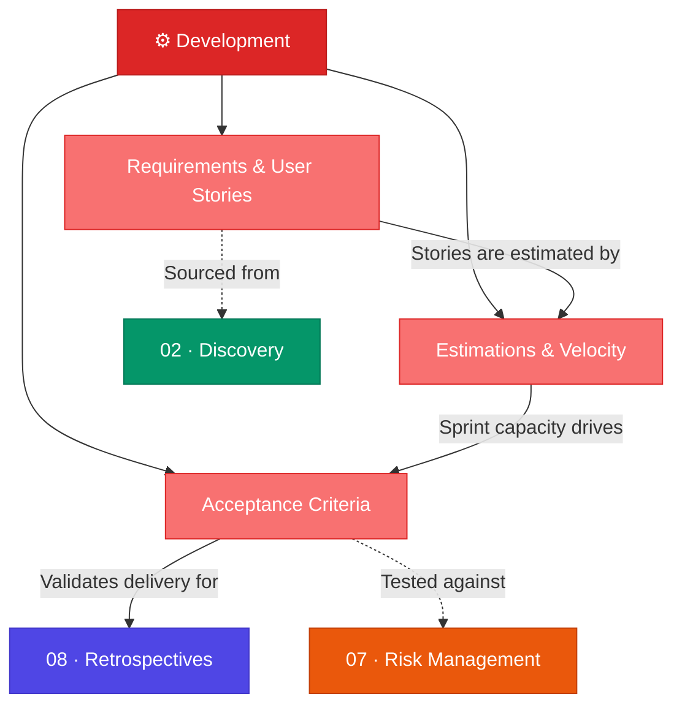

# ⚙️ 04 · Development

> **Translate strategy into actionable, estimable, and testable work.**

This section covers the mechanics of turning product decisions into development work — writing requirements, estimating effort, and defining acceptance criteria that ensure quality delivery.

---

## Section Overview

---

## Pages in This Section

| Page | Status | Description |
|:-----|:------:|:------------|
| [Requirements & User Stories](requirements-user-stories.md) | ⚪ | Business, functional, non-functional requirements; user story format; INVEST criteria |
| [Estimations & Velocity](estimations-velocity.md) | ⚪ | Story points, Fibonacci estimation, velocity tracking |
| [Acceptance Criteria](acceptance-criteria.md) | ⚪ | Given-When-Then templates, verification lists |

---

## Key Concepts at a Glance

- **User Story Format**: *"As a ____, I want ____, so that ____"*
- **INVEST Criteria**: Independent, Negotiable, Valuable, Estimatable, Small, Testable
- **Story Points**: Relative effort estimation using Fibonacci sequence
- **Velocity**: Work Accomplished ÷ Time
- **Given-When-Then**: Structured acceptance criteria template

---

## Related Sections

- ← [03 · Strategy](../03-strategy/index.md) — Roadmap items become development stories
- ← [02 · Discovery](../02-discovery/index.md) — Requirements sourced from discovery
- → [07 · Risk Management](../07-risk-management/index.md) — Identify risks in development
- → [08 · Retrospectives](../08-retrospectives/index.md) — Review delivery quality

---

*[← Back to Wiki Home](../index.md)*
