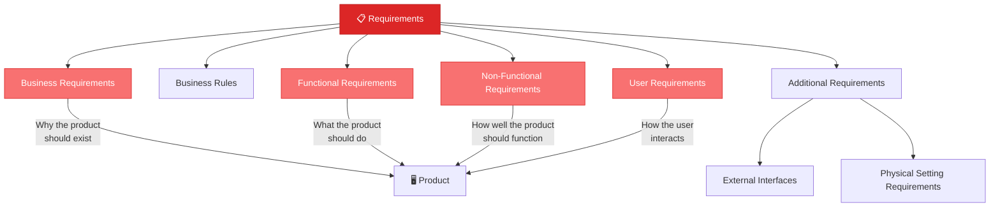
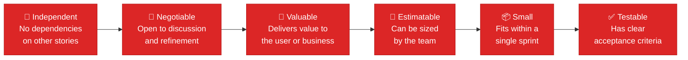

# Requirements & User Stories

> **"People forget facts, but they remember stories."** — Joseph Campbell

---

## Table of Contents

- [Requirement Types](#requirement-types)
- [User Stories](#user-stories)
- [INVEST Criteria](#invest-criteria)

---

## Requirement Types

### Business Requirements
**Why** the product should exist — the product's reason for being.

### Business Rules
**How** the product should work under specific restrictions:
- Budgeting constraints
- Government regulations
- Brand uniformity requirements
- Privacy policies

### User Requirements
**How** the end-user should interact with the product — the expected user experience.

### Functional Requirements
**What** functions the product should do or support:
- Expressed with inputs, outputs, and process behavior
- Information flow diagrams provide the logic of the process

### Non-Functional Requirements
**How well** the product should function — quality attributes:

| Quality Attribute | Description |
|:-----------------|:------------|
| **Accuracy** | Correctness of outputs |
| **Dependability** | Reliability and availability |
| **Security** | Protection of data and access |
| **Usability** | Ease of use and learnability |
| **Efficiency** | Resource usage optimization |
| **Performance** | Response times and throughput |
| **Maintainability** | Ease of modification and updates |

### Additional Requirement Types

- **External Interfaces**: Map where the product sits in relation to external systems (use data flow diagrams)
- **Physical Setting Requirements**: Physical requirements for products in relation to their environment

---

## User Stories

A user story clearly outlines a specific software requirement in the product.

### User Story Format

> **As a** *[type of user]*,  
> **I want** *[an action]*,  
> **so that** *[a benefit/value]*.

### Example

> **As a** *new user*,  
> **I want** *to see a guided tutorial on first login*,  
> **so that** *I can quickly understand how to use the app's core features*.

---

## INVEST Criteria

Every well-written user story should satisfy the **INVEST** criteria:

| Criterion | Meaning | Anti-Pattern |
|:----------|:--------|:-------------|
| **Independent** | Can be developed in any order | Stories that can only work if another is done first |
| **Negotiable** | Details can be discussed and refined | Over-specified stories locked down prematurely |
| **Valuable** | Delivers value to users or business | Technical tasks with no user-visible benefit |
| **Estimatable** | Team can reasonably estimate effort | Vague stories with undefined scope |
| **Small** | Completable within a single sprint | Epics disguised as stories |
| **Testable** | Has clear pass/fail criteria | Stories with ambiguous "done" definitions |

---

## Related Pages

- ← [Requirements Solicitation](../02-discovery/requirements-solicitation.md) — How to gather requirements
- → [Estimations & Velocity](estimations-velocity.md) — Estimating story effort
- → [Acceptance Criteria](acceptance-criteria.md) — Defining testable criteria
- → [Basic Terminology](../01-foundations/basic-terminology.md) — Core term definitions

---

## Sources & References

- Software Product Management Specialization — Coursera
- Legacy notes: `docs/legacy_notion_files/Requirements and User Stories`

---

*[← Back to Section Index](index.md) · [← Back to Wiki Home](../index.md)*
