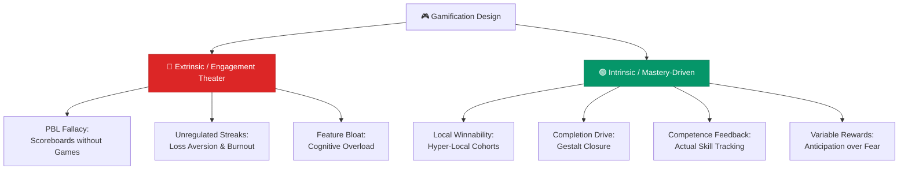

# Gamification Design Patterns

> **Gamification is not a set of features to be layered on — it is the psychology of sustained intrinsic motivation.**

---

## Table of Contents

- [Extrinsic vs. Intrinsic Gamification](#extrinsic-vs-intrinsic-gamification)
- [The 7 Design Patterns](#the-7-design-patterns)
- [Good vs. Bad Examples](#good-vs-bad-examples)
- [Actionable Guidelines](#actionable-guidelines)

---

## Extrinsic vs. Intrinsic Gamification

> [!WARNING]
> When gamification relies purely on extrinsic motivators or creates artificial anxiety (loss aversion), it leads to **cognitive overload, user burnout, and quality degradation**.

---

## The 7 Design Patterns

### 1. The PBL Fallacy vs. Transactional Rewards
Points, Badges, and Leaderboards (PBL) are the **scoreboard** of a game, not the game itself. Use transactional rewards tied to real value instead.

### 2. Winnable Hyper-Local Leaderboards
Engineer competitions to be **highly winnable** through segmented, local, or cohort-based leaderboards.

### 3. The S-Curve of Feature Richness
Gamification follows an S-curve — adding features improves engagement only to a point, after which **more features reverse engagement**.

### 4. The Streak Trap & Progress Bars
Streaks shift from motivational to obligational. Wrap them in **user agency** (goal flexibility, streak freezes).

### 5. Variable Reward Magnitude
Design reward cycles around **anticipation** (what's coming next) rather than predictability or loss aversion.

### 6. Completion Drive (Gestalt Closure)
Leverage the brain's hardwired tendency to **close incomplete patterns** paired with time-bound challenges.

### 7. Competence vs. Badge Theater
Design feedback loops that signal **real mastery** and skill development, not empty app usage metrics.

> [!NOTE]
> This page provides a structural overview. See `docs/research/gamification_design_patterns.md` for the full research document with detailed case studies, metrics, and scientific references.

---

## Good vs. Bad Examples

| App | Mechanic | Verdict | Why |
|:----|:---------|:--------|:----|
| **Strava** | Hyper-Local Segments & Kudos | 🟢 Good | Competitions are local and cohort-specific |
| **Apple Watch** | Activity Rings | 🟢 Good | 49.5% behavior change via completion drive |
| **Peloton** | Real-time Output Metrics | 🟢 Good | Badges tied to actual milestones |
| **Duolingo** | Flexible Streaks + Progress | 🟢 Good | User agency prevents burnout |
| **Starbucks** | Stars & Free Drink Rewards | 🟢 Good | Points tied to real transactions |
| **LinkedIn** | Community Top Voice Badges | 🔴 Bad | Created quantity-over-quality spam |
| **Habitica** | High Feature Richness | 🔴 Bad | Cognitive overload destroyed productivity |
| **Snapchat** | Rigid Streaks | 🔴 Bad | High FOMO, regulatory backlash |

---

## Actionable Guidelines

1. **Winnability Audit**: Never build a single global leaderboard — segment by cohort, skill, or location
2. **S-Curve Check**: Before adding a gamified feature, ask: does it reduce friction or add complexity?
3. **Streak Safeguard**: Add streak freezes, goal flexibility, and transparent pause options
4. **Gestalt Closure**: Use circular/geometric progress visualization, not just numbers
5. **Competence over Badges**: Tie every achievement to a tangible metric of real improvement
6. **Variable Rewards**: Inject surprise bonuses sparingly to maintain anticipation

---

## Related Pages

- ← [Onboarding Patterns](onboarding-patterns.md) — First experience design
- ← [User Interaction & Design](user-interaction-design.md) — Core design principles
- → [Retention Psychology](../06-metrics/retention-psychology.md) — Deep psychology of retention
- → [Success Metrics](../06-metrics/success-metrics.md) — Measuring gamification impact
- → [Anti-Patterns](../07-risk-management/anti-patterns.md) — Engagement theater as an anti-pattern

---

## Sources & References

- Full research document: `docs/research/gamification_design_patterns.md`

---

*[← Back to Section Index](index.md) · [← Back to Wiki Home](../index.md)*
