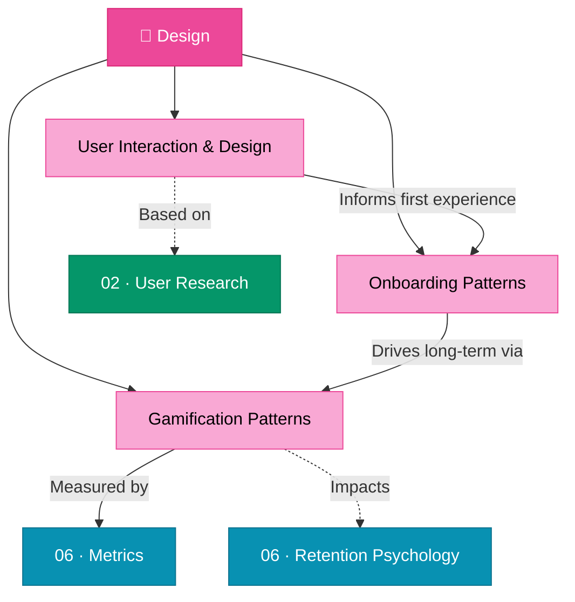

# 🎨 05 · Design

> **Design is the fundamental soul of a man-made creation.** — Steve Jobs

This section covers the full spectrum of product design — from foundational UX principles and wireframing through research-backed onboarding and gamification patterns that drive engagement and retention.

---

## Section Overview

---

## Pages in This Section

| Page | Status | Description |
|:-----|:------:|:------------|
| [User Interaction & Design](user-interaction-design.md) | ⚪ | User considerations, use cases, wireframes, storyboards |
| [Onboarding Patterns](onboarding-patterns.md) | ⚪ | 9 research-backed onboarding UX patterns with case studies |
| [Gamification Patterns](gamification-patterns.md) | ⚪ | 7 gamification design patterns — sustainable retention vs. engagement theater |

---

## Key Concepts at a Glance

- **Use Cases**: Structured scenarios defining user-system interactions
- **Wireframes & Storyboards**: Visual prototyping pipeline
- **Aha Moment**: The precise instant a user experiences core product value
- **Try-Before-Buy**: Delivering value before requiring signup
- **Intrinsic vs. Extrinsic Motivation**: Why badges fail and mastery succeeds

---

## Related Sections

- ← [02 · Discovery](../02-discovery/index.md) — User research informs design decisions
- → [06 · Metrics](../06-metrics/index.md) — Measure design effectiveness with metrics
- → [07 · Risk Management](../07-risk-management/index.md) — Design anti-patterns to avoid

---

*[← Back to Wiki Home](../index.md)*
