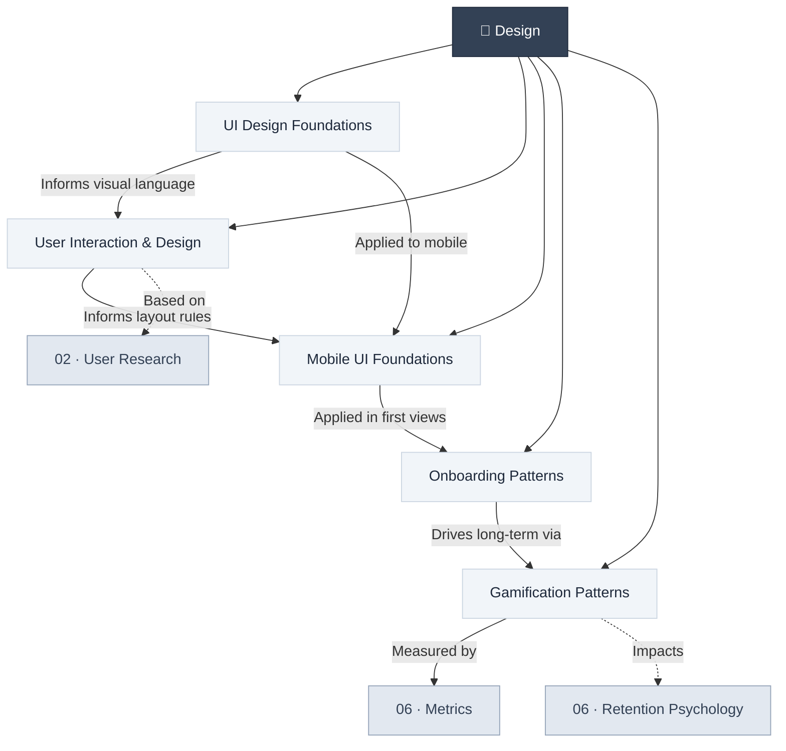

# 🎨 05 · Design

> **Design is the fundamental soul of a man-made creation.** — Steve Jobs

This section covers the full spectrum of product design — from foundational UX principles and wireframing through research-backed onboarding and gamification patterns that drive engagement and retention.

---

## Section Overview

---

## Pages in This Section

| Page | Status | Description |
|:-----|:------:|:------------|
| [UI Design Foundations](ui-design-foundations.md) | 🟢 | Affordances, visual hierarchy, typography, color, shadows, and feedback states |
| [User Interaction & Design](user-interaction-design.md) | 🟢 | User considerations, use cases, wireframes, storyboards |
| [Mobile UI Design Foundations](mobile-ui-design-foundations.md) | 🟢 | Layout constraints, navigation architectures, and gestural interactions |
| [Onboarding Patterns](onboarding-patterns.md) | 🟢 | 9 research-backed onboarding UX patterns with case studies |
| [Gamification Patterns](gamification-patterns.md) | 🟢 | 7 gamification design patterns — sustainable retention vs. engagement theater |

---

## Key Concepts at a Glance

- **Affordances & Signifiers**: Communicating UI behavior without written instructions
- **Visual Hierarchy**: Size, position, and color to direct user attention
- **4-Point Grid**: All spacing as multiples of 4 for system-wide consistency
- **Semantic Colors**: Blue = trust, Red = danger, Yellow = warning, Green = success
- **Use Cases**: Structured scenarios defining user-system interactions
- **Wireframes & Storyboards**: Visual prototyping pipeline
- **Bottom Sheet Context**: Preserving user context for secondary workflows
- **1D Content Flow**: Structuring mobile views in one direction per section
- **Aha Moment**: The precise instant a user experiences core product value
- **Intrinsic vs. Extrinsic Motivation**: Why badges fail and mastery succeeds

---

## Related Sections

- ← [02 · Discovery](../02-discovery/index.md) — User research informs design decisions
- → [06 · Metrics](../06-metrics/index.md) — Measure design effectiveness with metrics
- → [07 · Risk Management](../07-risk-management/index.md) — Design anti-patterns to avoid

---

*[← Back to Wiki Home](../index.md)*
