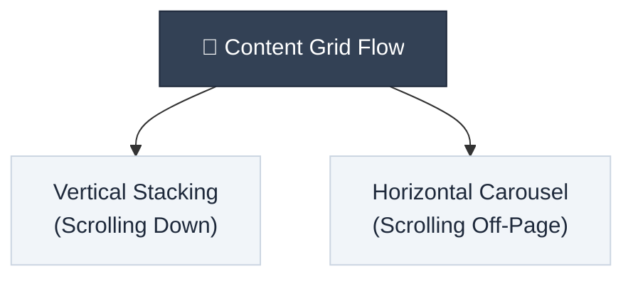
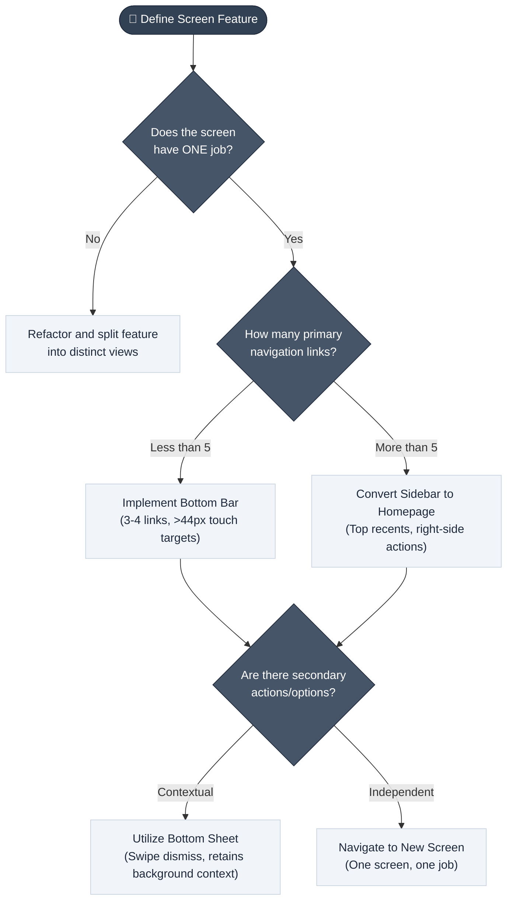

# Mobile UI Design Foundations

> **"Designing for mobile is not about shrinking desktop layouts; it's about focus, context, and designing for human thumbs."**

---

## Table of Contents

- [Mobile vs. Desktop UI: The Core Differences](#mobile-vs-desktop-ui-the-core-differences)
- [Navigation Architectures](#navigation-architectures)
- [Scale, Typography, and Focus](#scale-typography-and-focus)
- [Content Flow and Cards](#content-flow-and-cards)
- [The "One Screen, One Job" Rule](#the-one-screen-one-job-rule)
- [Gestural UX and Motion Design](#gestural-ux-and-motion-design)
- [Dynamic Interface States](#dynamic-interface-states)
- [Empty States Playbook](#empty-states-playbook)
- [Layout and Navigation Decision Flow](#layout-and-navigation-decision-flow)

---

## Mobile vs. Desktop UI: The Core Differences

Designing for mobile requires a fundamental shift in user experience strategy. Porting a desktop layout directly to mobile leads to visual clutter and unusable tap interfaces.

| Attribute | Desktop/Web Paradigm | Mobile Paradigm |
| :--- | :--- | :--- |
| **Canvas Area** | Expansive, horizontal (16:9 or similar) | Space-constrained, vertical (9:16) |
| **Input Method** | High-precision cursor (mouse/trackpad) | Low-precision touch target (finger/thumb) |
| **Grid Direction** | 2-Dimensional grid (columns & rows simultaneously) | 1-Dimensional flow per section (stack OR scroll) |
| **Sizing Rules** | Sized down for desktop density | Scaled up for screen legibility & touch precision |
| **Secondary Flows**| Overlapping windows, tabs, modals | Bottom sheets, full-screen pages, transitions |

---

## Navigation Architectures

Because mobile screens lack sidebars, designers must consolidate navigation options down to the essentials.

### 1. Bottom Navigation Bar
* **The Concept**: Consolidating primary sidebar links into a bottom menu. Typically floating slightly above the screen, with the main action button highlighted.
* **Constraints**: 
  * **3 to 4 links** is ideal; **5 links** is the absolute limit.
  * Maintaining a minimum touch target of **44 × 44 pixels** to prevent accidental inputs.
* **Context**: The buttons in the bottom bar can dynamically change based on the active screen.

### 2. Sidebar-as-Homepage
* **The Concept**: When an app has too many hierarchical structures to fit in 5 bottom bar links, the sidebar is refactored into a dedicated home page.
* **Why it Works**: Clears up the bottom area for a prominent search bar or primary action button (e.g., Notion).
* **Layout Rule**: Balance visual weight by placing recent items at the top and actions or counts on the right side.

---

## Scale, Typography, and Focus

Mobile screens are significantly smaller, but typographic elements must stay the same size or get larger to ensure readability on the move.

* **iOS vs. macOS Sizing**: Apple’s iOS body text base size is **17 pixels**, while Mac OS uses only **13 pixels**. Sizing must scale *up* to meet readability requirements.
* **The "Pick One" Constraint**: On desktop, a screen can simultaneously feature a calendar, a sidebar, task lists, and recent activity. On mobile, you must **pick exactly one** of these features per view to avoid cognitive overload.

---

## Content Flow and Cards

Due to screen width constraints, mobile content can only flow in one direction per section.

* **Cards as Containers**: Cards are the primary building block. They group related text, images, and inputs visually in place of whitespace (which is highly limited on mobile).
* **Double-Nesting Anti-Pattern**: Do not place cards inside other cards. This creates padding-on-padding that restricts margins and cramps layout contents. Group items using whitespace or subtle borders instead of nested containers.

> [!WARNING]
> Double-nesting containers is a common mobile UI failure. It wastes critical horizontal space and forces text to wrap aggressively, degrading the user's reading experience.

---

## The "One Screen, One Job" Rule

Every mobile screen must perform exactly one function (e.g., the notes editor is strictly for editing; the settings screen is strictly for configuration). Do not clutter workspace headers with suggestions, secondary directories, or templates.

### Context Preservation via Bottom Sheets
If a user is editing content and needs to perform a minor task (like applying a template or filter), do not open a new page that breaks their flow. Use a **Bottom Sheet**:
* Slides up from the bottom, occupying partial screen height.
* Retains the user's context by keeping the underlying screen visible.
* Houses search inputs, checklist items, and simple confirmation buttons.
* Easily dismissed by swiping down or clicking outside.

---

## Gestural UX and Motion Design

Gestures replace standard click navigation to make mobile apps feel natural and responsive.

* **Swipe-to-Go-Back**: Swiping right from the left screen edge. To make this feel physical, slide the underlying background screen from left to right with a **35% parallax offset** as the active view moves off-screen.
* **Zoom Transitions**: Zoom out the background view slightly when a bottom sheet expands, and zoom it back to full scale when the sheet is swiped down.
* **Swipe-up to Search**: Dragging up on the content area to reveal search overlays.
* **Long Press (Right-Click Equivalent)**: Pressing and holding an item. Blur the background content, apply a minor zoom to the target element, and reveal contextual menu actions or interactive previews.

---

## Dynamic Interface States

Screen real estate is too limited to display persistent formatting bars or global navigations. Controls should fade or slide in on-demand:
* **Writing Mode**: Hides the bottom navigation bar and slides in formatting buttons above the keyboard.
* **Selection Mode**: Replaces navigation buttons with bulk-edit checkboxes and a simple confirmation check/cancel tray.

---

## Empty States Playbook

Designing empty states is crucial for preventing initial churn.

### 1. First-Time Launch (Onboarding)
Do not present a blank homepage. 
* Replace empty listings with a clean full-screen graphic.
* Point the user directly to the primary action (e.g., a popover tooltip pointing to the "+" bottom button).

### 2. Zero-Results Search
When a user searches and gets no matches:
* Do not show a blank screen.
* State clearly that no records match the criteria.
* Offer alternative suggestions (e.g., checking for typos).
* Provide a clear button to clear the query and exit the empty search view.

---

## Layout and Navigation Decision Flow

Use the following flowchart to select the correct navigation and layout elements for mobile designs:

---

## Related Pages

- ← [User Interaction & Design](user-interaction-design.md) — Core layout and wireframing principles
- ← [UI Design Foundations](ui-design-foundations.md) — Visual design language: hierarchy, color, typography, and states
- → [Onboarding Patterns](onboarding-patterns.md) — First experience design
- → [Gamification Patterns](gamification-patterns.md) — Engagement architecture for mobile/web

---

## Sources & References

* Research Document: [Mobile UI Design Foundations Research](../../docs/research/mobile_ui_design_foundations.md)
* Design Case Studies: Mobin UI Curated Flows (Notion, Slack, Apple iOS)
* Video Source: *How To Design Mobile UI From Scratch* (2026)

---

*[← Back to Section Index](index.md) · [← Back to Wiki Home](../index.md)*
