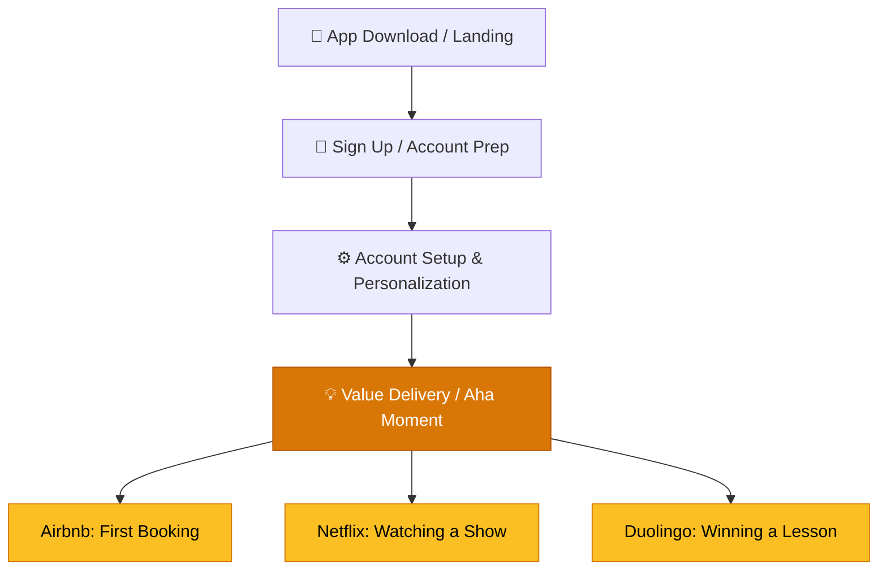

# Onboarding UX Patterns

> **The success of onboarding is not determined by its brevity, but by its ability to guide the user to the "Aha Moment."**

---

## Table of Contents

- [The Onboarding Framework](#the-onboarding-framework)
- [The 9 Onboarding Patterns](#the-9-onboarding-patterns)
- [Long vs. Short Flows](#long-vs-short-flows)
- [Flow Optimizations](#flow-optimizations)
- [Case Study Summary](#case-study-summary)

---

## The Onboarding Framework

Every onboarding journey follows a three-step progression toward the **Aha Moment** — the precise instant a user experiences the core value of the product.

> [!IMPORTANT]
> If the setup phase is dry, long, or confusing, users will churn before reaching the Aha Moment. The patterns below describe how top apps keep setup highly converting, interactive, and rewarding.

---

## The 9 Onboarding Patterns

### 1. Selling the Outcome
Pitch the **final result** the user will achieve, not a list of features. Users are motivated by their own transformation.

### 2. Try-Before-Buy
Allow users to engage with the core product loop **before** asking them to sign up. Reduce friction to zero and let the product speak for itself.

### 3. Contextual Education
Guide users through actions **in real-time**, within the flow of using the app — not through pop-up tours or static banners.

### 4. Multi-Intent Personalization
Allow users to select **multiple goals** in conversational-style flows rather than forcing single-choice selections.

### 5. Visualizing Personalized Outcomes
Present users with a **customized plan or projection** based on their quiz answers before showing the paywall.

### 6. Conversational Paywalls
Align paywalls directly with the user's **stated goals** and personalize the offer to match their profile.

### 7. Interactive Delighters
Incorporate **rich animations**, gamified loading sequences, and engaging characters to keep users entertained through long flows.

### 8. Graduated Gates
Transition users from free to paid through **soft, escalating commitment** stages rather than a sudden binary paywall.

### 9. Zero-Decision Flow
Strip away every unnecessary option to sustain **user momentum**. Every decision is an exit ramp.

> [!NOTE]
> This page provides a structural overview. See `docs/research/onboarding_design_patterns.md` for the full research document with detailed case studies, metrics, and actionable guidelines.

---

## Long vs. Short Flows

| Strategy | Primary Goal | Ideal For | Length | Conversion Driver |
|:---------|:-------------|:----------|:-------|:-----------------|
| **Personalization Path** | Align expectations & build habits | Finance, Health, Education, SaaS | 20-60 screens | Visualized plans & goal commitment |
| **Frictionless Path** | Deliver instant gratification | Media, AI, Entertainment, Utilities | 1-3 screens | Graduated Gates & cliffhanger paywalls |

---

## Flow Optimizations

### Pre-Permission Priming
Show a custom screen explaining **why** a permission is needed before triggering the native system dialog.

### Multi-Page Form Splitting
Break long forms into **single-input screens** to build momentum and reduce cognitive load per step.

### Cultural Considerations

| Market | UX Preference |
|:-------|:-------------|
| **Eastern Markets** | Information-dense, efficiency-focused interfaces |
| **Western Markets** | Clean, minimalist, low-clutter designs |

---

## Case Study Summary

| App | Strategy | Impact |
|:----|:---------|:-------|
| **Duolingo** | Try-before-buy (60+ screens before signup) | High value-first engagement |
| **Mural** | Dashboard checklists replacing pop-ups | 📈 10% increase in 1-week retention |
| **Headspace** | Multi-intent selection | 📈 10% increase in free trial conversion |
| **Grammarly** | Quiz-based tailored pricing | 📈 ~20% increase in premium upgrades |
| **Houzz** | Multi-page form chunking | 📈 15% increase in signups |
| **Dollar Shave Club** | Conversational copy quiz | 📈 5% increase in subscriptions |

---

## Related Pages

- ← [User Interaction & Design](user-interaction-design.md) — Foundational design principles
- → [Gamification Patterns](gamification-patterns.md) — Long-term engagement after onboarding
- → [Retention Psychology](../06-metrics/retention-psychology.md) — Psychological retention architecture
- → [Success Metrics](../06-metrics/success-metrics.md) — Measuring onboarding effectiveness

---

## Sources & References

- Full research document: `docs/research/onboarding_design_patterns.md`

---

*[← Back to Section Index](index.md) · [← Back to Wiki Home](../index.md)*
