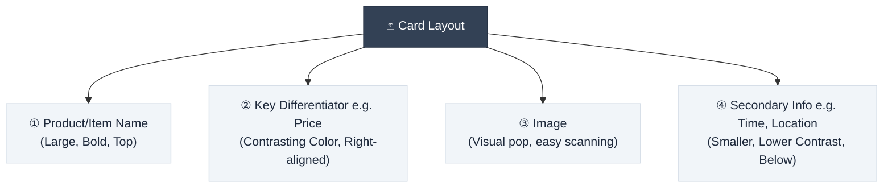
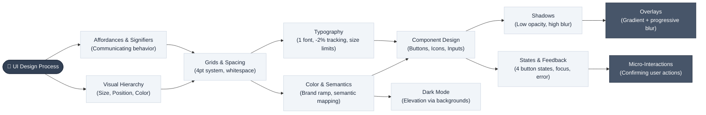

# UI Design Foundations

> **"Good UI should not require instructions — the interface itself tells the user how it works."**

---

## Table of Contents

- [Affordances & Signifiers](#affordances--signifiers)
- [Visual Hierarchy](#visual-hierarchy)
- [Grids, Layouts & Spacing](#grids-layouts--spacing)
- [Typography Rules](#typography-rules)
- [Color Theory & Semantics](#color-theory--semantics)
- [Dark Mode Design Principles](#dark-mode-design-principles)
- [Shadow Mechanics](#shadow-mechanics)
- [Buttons & Icons](#buttons--icons)
- [State Feedback & Micro-Interactions](#state-feedback--micro-interactions)
- [Gradient Overlays](#gradient-overlays)
- [UI Design Pipeline](#ui-design-pipeline)

---

## Affordances & Signifiers

An **affordance** is what a UI element *can do* (e.g., a button can be clicked). A **signifier** is how the UI *communicates* that affordance — visually, without text instructions.

| Signifier Type | Visual Cue | Meaning Conveyed |
| :--- | :--- | :--- |
| **Container / Border** | Grouped elements inside a box | These items are related |
| **Filled container** | Highlighted or filled background | This item is selected / active |
| **Gray / desaturated text** | Dim, low-contrast copy | This element is inactive; clicking does nothing |
| **Hover state** | Background or color change on mouse-over | This element is interactive |
| **Tooltip** | Small label on hover | Explains what the element does |
| **Press / active state** | Slight shrink or darkening on click | Confirms the click is registered |

> [!NOTE]
> A well-designed interface communicates its entire behavior through visual signifiers alone. If users need to read a tooltip or a help page to use a basic UI element, that element needs redesigning.

---

## Visual Hierarchy

Visual hierarchy is the system of visual priority — where the eye looks first, second, and third. Three core tools create hierarchy:

1. **Size**: Larger elements are perceived as more important.
2. **Position**: Top-of-card and top-of-page elements are scanned first.
3. **Color / Contrast**: High contrast and colorful elements attract attention before muted ones.

### Practical Card Hierarchy Guidelines

> [!TIP]
> **Hierarchy is contrast.** The bigger the difference between small and large, colorful and muted — the stronger the visual priority signal. Avoid making all elements the same size; it creates a spreadsheet, not a design.

---

## Grids, Layouts & Spacing

### Responsive Column Guidelines

Grids are **guidelines**, not rigid rules. Custom landing pages often ignore them. However, for structured repeating content (galleries, blogs, dashboards), columns provide a consistent responsive baseline:

| Breakpoint | Columns |
| :--- | :--- |
| **Desktop (Web)** | 12 columns |
| **Tablet** | 8 columns |
| **Mobile** | 4 columns |

### Whitespace

More important than any grid is **whitespace** — letting content breathe. Tight, cramped spacing increases cognitive load. A generous 32px gap between major sections reads as clean and intentional.

### 4-Point Grid System

All spacing values should be multiples of 4 (4, 8, 12, 16, 24, 32, 48px). This is not about aesthetics; it is about **divisibility**. Every value can be halved or doubled cleanly, creating total consistency across the design system.

### Proximity Grouping

Items that belong together get **tighter** spacing than unrelated items. This is an extension of visual hierarchy through space:
- Announcement bar + main heading → closer together
- Heading + subtext → closer together
- Subtext + button → slightly more space

---

## Typography Rules

### Font Choice

One well-chosen **sans-serif font** is sufficient for virtually every design. Recommended options: **Inter**, **Geist**, **Outfit**, **Satoshi**.

> [!WARNING]
> Do not spend time deliberating between fonts. Font choice is among the lowest-ROI decisions in UI design. Pick one quality sans-serif and commit to it.

### Header Tightening

For large display headings, apply these adjustments to instantly elevate the professional feel:

| Property | Adjustment |
| :--- | :--- |
| **Letter Spacing** | `-2%` to `-3%` |
| **Line Height** | `110%` to `120%` |

### Font Size Limits by Context

| Context | Guideline |
| :--- | :--- |
| **Landing pages / Websites** | Up to **6 distinct sizes**, wide range permitted |
| **Dashboards / Tools** | Max ~**24px** for headings (compressed range due to information density) |

---

## Color Theory & Semantics

### Primary Color Strategy

Start with **one brand color**. Then:
- **Lighten** it → subtle backgrounds and tinted surfaces
- **Darken** it → readable text in brand context
- **Build a ramp** → tonal scale for component states, charts, chips

### Semantic Color Mapping

Use color with **purpose**, not decoration. Each color carries inherent meaning users already understand:

| Color | Semantic Meaning | Example Use |
| :--- | :--- | :--- |
| 🔵 **Blue** | Trust, primary action | Primary buttons, links, selected state |
| 🔴 **Red** | Danger, error | Destructive actions, input errors |
| 🟡 **Yellow** | Warning, caution | Optional issues, advisory messages |
| 🟢 **Green** | Success, positive | Confirmation, new/active badges |

> [!IMPORTANT]
> Never use color purely for decoration. Every color in your interface should carry intentional meaning that helps the user understand the system.

---

## Dark Mode Design Principles

Dark mode has unique elevation and contrast mechanics that differ fundamentally from light mode.

| Challenge | Light Mode Solution | Dark Mode Solution |
| :--- | :--- | :--- |
| **Creating depth/elevation** | Drop shadows | Lighter card backgrounds than the page background |
| **Card borders** | Medium-contrast borders | Reduced opacity borders (avoid full white) |
| **Accent / chip colors** | Full saturation, vivid | Dimmed saturation + brightness; inverted text for contrast |
| **Background palette** | White / off-white | Dark gray, navy, deep purple, deep green, or dark red |

> [!NOTE]
> Dark mode is not limited to navy or gray. Deep purples, dark greens, and dark reds are all valid base palette choices that add personality while maintaining readability.

---

## Shadow Mechanics

Shadows simulate elevation and depth. Used poorly, they destroy a design's elegance.

| Use Case | Shadow Strength | Notes |
| :--- | :--- | :--- |
| **Cards** | Low (low opacity, high blur) | Just enough to float above the page |
| **Popovers / Modals** | Strong | Must visually separate from underlying content |
| **Tactile Buttons** | Inner + outer shadow combo | Creates raised, skeuomorphic button feel |

> [!WARNING]
> **The Shadow Rule**: If the shadow is the first thing you notice in a design, it's too strong. Reduce opacity and increase the blur radius.

---

## Buttons & Icons

### Icon Sizing

Match icon dimensions to the **line-height** of accompanying text. For a 24px line-height, use 24px icons. This produces natural optical alignment without manual adjustment.

### Ghost Buttons

Sidebar navigation links are buttons without a background — they gain a background on hover. These are **ghost buttons**. Used alongside a filled primary CTA, they create a natural visual primary/secondary hierarchy.

### Button Padding Rule

> Width padding ≈ **2× the height padding**

This ratio produces naturally proportioned buttons across all sizes without requiring manual dimension management.

---

## State Feedback & Micro-Interactions

### Required Button States (minimum 4)

| State | Visual Cue |
| :--- | :--- |
| **Default** | Standard appearance |
| **Hovered** | Background or color shift |
| **Active / Pressed** | Slight darkening or shrink |
| **Disabled** | Grayed out, non-interactive |
| **Loading** (when async) | Spinner replaces label |

### Required Input States

| State | Visual Cue |
| :--- | :--- |
| **Focus** | Border highlight or ring on click-in |
| **Error** | Red border + error message below |
| **Warning** | Amber/yellow border for non-critical issues |

### Micro-Interactions

Micro-interactions go beyond state changes — they **confirm** that an action was completed.

- **Example**: Clicking "Copy" shows a chip that slides up saying "Copied!" before fading out.
- **Range**: From purely functional (confirmation) to playful (celebration animations on success milestones).

> [!IMPORTANT]
> Every user interaction must receive a system response. No action should feel unacknowledged. Loading spinners, success messages, error states — all are required.

---

## Gradient Overlays

When placing text over imagery, always use an overlay to maintain legibility:

| Method | Quality | When to Use |
| :--- | :--- | :--- |
| **Full screen solid overlay** | ⚠️ Functional | Last resort — wastes the image entirely |
| **Linear gradient overlay** | ✅ Good | Image visible at top; smooth transition to readable background at bottom |
| **Progressive blur + gradient** | ✅✅ Best | Blurred imagery fades into solid background; modern, high-end appearance |

---

## UI Design Pipeline

This diagram shows how the core UI design principles stack and relate to each other in the design process:

---

## Related Pages

- ← [User Interaction & Design](user-interaction-design.md) — Use cases, wireframes, and storyboards
- ← [Mobile UI Design Foundations](mobile-ui-design-foundations.md) — Mobile-specific layout and interaction constraints
- → [Onboarding Patterns](onboarding-patterns.md) — Applying design principles to first-run experiences
- → [Gamification Patterns](gamification-patterns.md) — Engagement-driven design patterns

---

## Sources & References

- Research Document: [UI Design Foundations Research](../../docs/research/ui_design_foundations.md)
- Video Source: *10 UI Design Concepts in 10 Minutes* (2026)

---

*[← Back to Section Index](index.md) · [← Back to Wiki Home](../index.md)*
