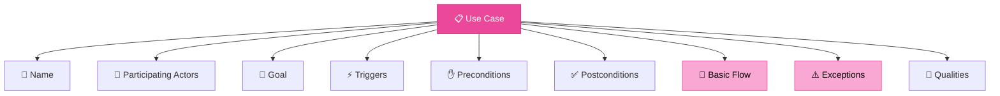
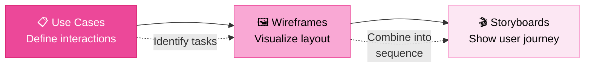

# User Interaction & Design

> **"Design is the fundamental soul of a man-made creation that ends up expressing itself in successive outer layers of the product or service."** — Steve Jobs

---

## Table of Contents

- [User Considerations](#user-considerations)
- [Use Cases](#use-cases)
- [Wireframes](#wireframes)
- [Storyboards](#storyboards)
- [The Design Pipeline](#the-design-pipeline)

---

## User Considerations

Key principles to keep in mind while designing a product:

| Principle | Detail |
|:----------|:-------|
| **Limited Memory** | Users can hold approximately **5 items** in working memory |
| **Stakeholder Awareness** | Identify stakeholders and primary (end) users early |
| **Negativity Bias** | Users more easily express what they **don't** like |
| **Developer ≠ User** | Developers do NOT represent the average person |
| **Diverse Experience** | Design for children, elderly, cognitive/physical limitations, and cultural differences |

> [!WARNING]
> Never assume your development team represents the target user. Validate designs with real users from your target segments (see [User Research](../02-discovery/user-research.md)).

---

## Use Cases

### What is a Use Case?

A **use case** is a way to identify, clarify, and organize the details of a task — a set of possible sequential interactions between users and systems.

### Use Case Essentials

A use case is:
- A set of possible **sequential interactions** between users and systems
- Takes place in a **particular environment** to achieve a **particular goal**

| Component | Description |
|:----------|:-----------|
| **Name** | Descriptive title of the use case |
| **Actors** | Users or systems that participate |
| **Goal** | What the actor wants to achieve |
| **Triggers** | Event that initiates the use case |
| **Preconditions** | What must be true before the use case starts |
| **Postconditions** | What is true after successful completion |
| **Basic Flow** | Step-by-step happy path through the interaction |
| **Exceptions** | Alternative paths when things go wrong |
| **Qualities** | Non-functional requirements (performance, security) |

---

## Wireframes

### What is a Wireframe?

A **wireframe** is a basic visual representation of a product — a low-fidelity sketch that communicates structure and layout without visual design details.

### Wireframe Benefits

Wireframes help to **easily understand**:
- The requirements
- User tasks that are supported
- Where to place fields, buttons, text, and images

### Wireframe Essentials

| Element | Purpose |
|:--------|:--------|
| **Layout Grid** | Defines the overall structure |
| **Basic Shapes** | Represent UI elements (buttons, text boxes) |
| **Text Labels** | Placeholder text for headings and content |
| **Image Placeholders** | Visual spots for logos/illustrations (usually marked with ✕) |
| **Navigation Elements** | Arrows or links for page transitions |
| **Form/Input Fields** | Areas for user input (text fields, dropdowns) |
| **Annotations** | Additional context or explanations |

---

## Storyboards

### What is a Storyboard?

A **storyboard** demonstrates **how a user uses the interface** in more detail — the sequence of interaction between the user and the product.

### The Design Pipeline

### Storyboard Properties

A storyboard:
- Combines **Wireframes** and **Use Cases** into a cohesive narrative
- Shows user transition points between states with arrowed lines
- Each feature can have its own storyboard explaining the user interaction
- Can be used for **marketing material**
- Can be used to create **instruction and training materials**

> [!TIP]
> Storyboards allow product teams to visualize how a user might interact with the product **from beginning to end**. This is particularly helpful in early development stages when ideas are still being refined.

---

## Related Pages

- ← [User Research](../02-discovery/user-research.md) — User insights that inform design decisions
- → [Onboarding Patterns](onboarding-patterns.md) — Designing the first user experience
- → [Gamification Patterns](gamification-patterns.md) — Engagement-driven design patterns
- → [Acceptance Criteria](../04-development/acceptance-criteria.md) — Testing design implementations

---

## Sources & References

- Software Product Management Specialization — Coursera
- Legacy notes: `docs/legacy_notion_files/User Interaction & Design`

---

*[← Back to Section Index](index.md) · [← Back to Wiki Home](../index.md)*
