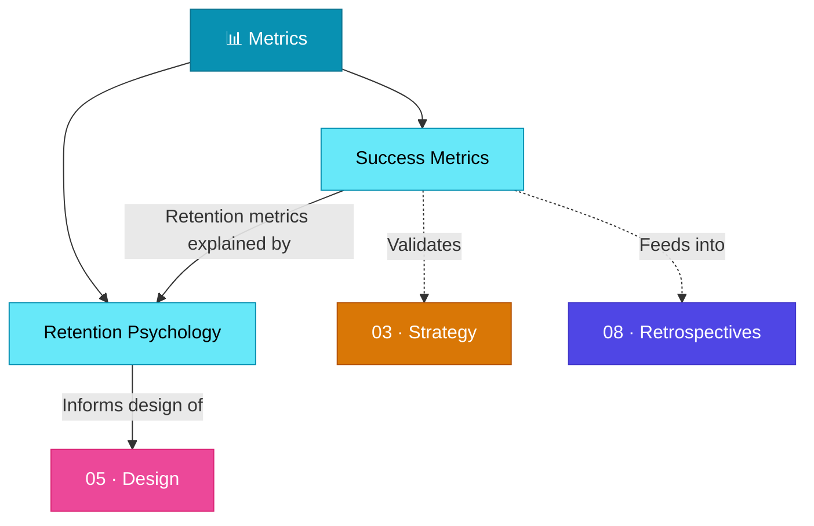

# 📊 06 · Metrics

> **Measure, measure… measure! What went wrong, what, why and what we can improve.**

This section covers how to define, track, and interpret the metrics that determine product success — from acquisition funnels to the deep psychological architecture that drives long-term retention.

---

## Section Overview

---

## Pages in This Section

| Page | Status | Description |
|:-----|:------:|:------------|
| [Success Metrics](success-metrics.md) | ⚪ | AARRR pirate metrics framework, KPIs across the funnel |
| [Retention Psychology](retention-psychology.md) | ⚪ | Three pillars: Craving Machine, Infinite Game, Invisible Scoreboard |

---

## Key Concepts at a Glance

- **AARRR Framework**: Acquisition → Activation → Retention → Referral → Revenue
- **North Star Metric**: The single metric that best captures core product value
- **Variable Ratio Reinforcement**: The psychology behind craving states
- **Loss Aversion**: Users feel losses 2× more than equivalent gains
- **Social Comparison Theory**: Public progress transforms engagement into identity

---

## Related Sections

- ← [03 · Strategy](../03-strategy/index.md) — Metrics validate strategic decisions
- ← [05 · Design](../05-design/index.md) — Design patterns that drive metrics
- → [08 · Retrospectives](../08-retrospectives/index.md) — Use metrics in retrospective analysis

---

*[← Back to Wiki Home](../index.md)*
