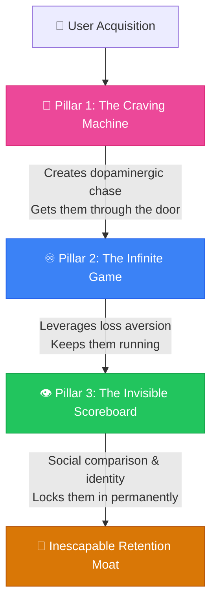

# Retention Architecture & Psychology

> **The three psychological pillars that transform app interaction into a core user identity.**

---

## Table of Contents

- [The Stacking Effect](#the-stacking-effect)
- [Pillar 1: The Craving Machine](#pillar-1-the-craving-machine)
- [Pillar 2: The Infinite Game](#pillar-2-the-infinite-game)
- [Pillar 3: The Invisible Scoreboard](#pillar-3-the-invisible-scoreboard)
- [Retention Architecture Matrix](#retention-architecture-matrix)

---

## The Stacking Effect

The three pillars of retention do not operate in isolation. They form a **psychological funnel** that progressively locks in user behavior.

---

## Pillar 1: The Craving Machine

**Variable Ratio Reinforcement** — Unpredictable rewards produce the most compulsive behaviors.

> [!IMPORTANT]
> Dopamine is released in the **chase** of a reward, not in its consumption. Predictable rewards fail to maintain the chase state.

### Key Principle
Keep 80% of progression predictable and transparent. Make 20% highly variable and unexpected.

### Examples
- **Finch** 🟢 — Random discoveries and evolving bird personality
- **League of Legends** 🟢 — MMR system maintaining ~50% win rate
- **Pokémon Go** 🟢 — Random encounters and mystery boxes

---

## Pillar 2: The Infinite Game

**Loss Aversion** — Humans experience the pain of losing something ~2× as intensely as the pleasure of gaining it.

### Key Principle
Never create terminal "done" states. Build compounding value that makes quitting feel like a loss.

### Design Guidelines
- **Kill the "Done" state**: Ensure milestones always expand
- **Compounding Streaks**: Replace simple counters with tiered progression
- **Soft Resets**: Reset ranks periodically while preserving lifetime achievements
- **Currency Ecosystem**: Build virtual currencies that create economic sunk cost

> [!WARNING]
> **Ethical Currency Abstraction**: Keep exchange ratios clean, provide transparent running totals, and avoid dynamic pricing designed to exploit emotional investment.

### Examples
- **Peloton** 🟢 — No metric caps, 90% annual subscriber retention
- **Roblox** 🟢 — Robux economy creates compounding sunk cost
- **Freecash** 🟢 — Diamond streaks with high-stakes loss

---

## Pillar 3: The Invisible Scoreboard

**Social Comparison Theory** — Humans have an innate drive to evaluate progress by comparing themselves to peers.

### Key Principle
When progress is socially visible, personal goals transform into **status symbols**. Quitting privately is easy; quitting publicly is painful.

### Design Guidelines
- **Elevate metrics into status indicators**: Public profiles, community feeds
- **Cohorts over global leaderboards**: Group by skill level or activity
- **Human element**: Embed cooperative challenges and micro-social validation

### Examples
- **Strava** 🟢 — Segment leaderboards so powerful users cheated (3.9M deleted activities)
- **Peloton** 🟢 — Live instructor callouts create unforgettable events

---

## Retention Architecture Matrix

| App | Craving Machine | Infinite Game | Invisible Scoreboard | Retention |
|:----|:---------------:|:-------------:|:--------------------:|:----------|
| **Peloton** | 🟡 Medium | 🟢 High | 🟢 High | ~90% annual |
| **League of Legends** | 🟢 High | 🟢 High | 🟢 High | 130M+ MAU |
| **Strava** | 🟡 Medium | 🟢 High | 🟢 High | High long-term |
| **Roblox** | 🟡 Medium | 🟢 High | 🟢 High | Elite |
| **Finch** | 🟢 High | 🟡 Medium | 🔴 Low | High D30 |
| **Duolingo** | 🔴 Low | 🟡 Medium | 🟡 Medium | Moderate |

---

## Related Pages

- ← [Success Metrics](success-metrics.md) — Metrics that retention architecture drives
- ← [Gamification Patterns](../05-design/gamification-patterns.md) — Design patterns for engagement
- → [Onboarding Patterns](../05-design/onboarding-patterns.md) — First experience before retention
- → [Anti-Patterns](../07-risk-management/anti-patterns.md) — Dark patterns in retention design

---

## Sources & References

- Full research document: `docs/research/retention_architecture_psychology.md`

---

*[← Back to Section Index](index.md) · [← Back to Wiki Home](../index.md)*
