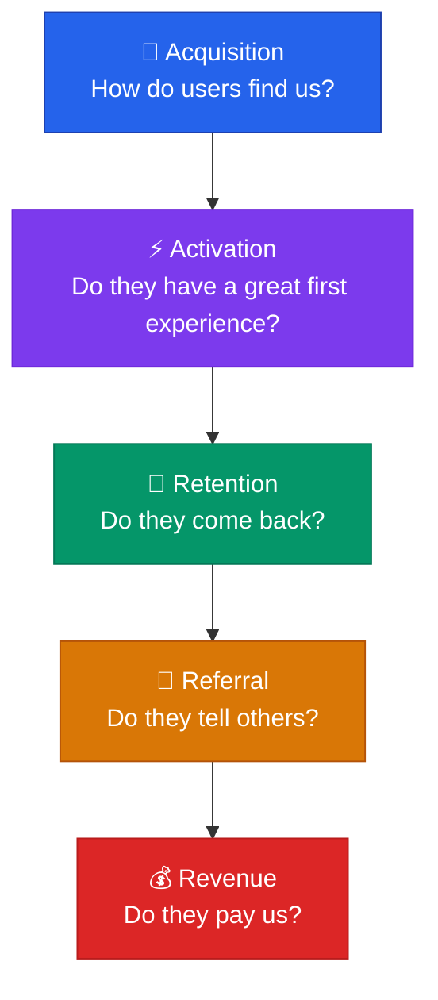

# Success Metrics

> **Measure, measure… measure! What went wrong, what, why and what we can improve.**

---

## Table of Contents

- [Defining Success](#defining-success)
- [The AARRR Framework](#the-aarrr-framework-pirate-metrics)
- [Metric Categories](#metric-categories)

---

## Defining Success

Before tracking any metric, define two things:

1. **Ultimate Metric**: The single metric that best represents success for the product or initiative
2. **Time Horizon**: The period over which the strategy runs before measuring outcomes

> [!IMPORTANT]
> Define the ultimate success metric first, **then** define what supporting metrics are needed to achieve it. Avoid tracking vanity metrics that look impressive but don't measure meaningful progress (see [Anti-Patterns](../07-risk-management/anti-patterns.md)).

---

## The AARRR Framework (Pirate Metrics)

---

## Metric Categories

### 📣 Acquisition

How users discover and arrive at the product.

| Metric | Definition |
|:-------|:-----------|
| **User Growth Rate** | Rate of new user signups over time |
| **Cost per Acquisition (CPA)** | Marketing spend per new user acquired |
| **Conversion Rate** | % of visitors who complete signup |

---

### ⚡ Activation

The percentage of acquired users who complete a key action demonstrating they've received value.

| Metric | Definition |
|:-------|:-----------|
| **Activation Rate** | % of signups who complete core action |
| **Time-to-Activation** | Time from signup to first value moment |
| **Average Revenue per User (ARPU)** | Revenue generated per activated user |

---

### 🔁 Retention

The percentage of users who continue using the product over time.

| Metric | Definition |
|:-------|:-----------|
| **Daily Active Users (DAU)** | Unique users active per day |
| **Churn Rate** | % of users who stop using the product |
| **Average User Lifetime** | Mean duration a user remains active |

> [!TIP]
> For deep analysis of retention psychology and architecture, see [Retention Psychology](retention-psychology.md).

---

### 📱 Engagement

How users interact with the product or service, and how invested they are.

| Metric | Definition |
|:-------|:-----------|
| **Session Length** | Average duration of a user session |
| **Pages/Screens per Session** | Number of pages or screens viewed per session |
| **Feature Adoption Rate** | % of users who actively use a specific feature |

---

### 📢 Referral

The number of users who recommend the product to others.

| Metric | Definition |
|:-------|:-----------|
| **Referral Rate** | % of users who refer others |
| **Referral Conversion Rate** | % of referrals who become users |
| **Viral Coefficient** | Average number of new users each existing user generates |

---

### 💰 Revenue

Income generated by the product or service.

| Metric | Definition |
|:-------|:-----------|
| **Revenue Growth Rate** | Rate of revenue increase over time |
| **Customer Lifetime Value (CLV)** | Total revenue expected from a user over their lifetime |
| **Revenue per User (RPU)** | Average revenue generated per user |

---

## Related Pages

- ← [Go-to-Market](../03-strategy/go-to-market.md) — Metrics to validate GTM strategy
- → [Retention Psychology](retention-psychology.md) — Deep dive into retention mechanisms
- → [Onboarding Patterns](../05-design/onboarding-patterns.md) — Activation through great onboarding
- → [Anti-Patterns](../07-risk-management/anti-patterns.md) — Vanity Metrics anti-pattern

---

## Sources & References

- Legacy notes: `docs/legacy_notion_files/Product Development and Strategy Wiki` (Success Metrics section)

---

*[← Back to Section Index](index.md) · [← Back to Wiki Home](../index.md)*
