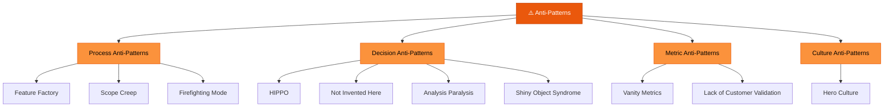

# Anti-Patterns

> **An anti-pattern is a commonly occurring situation in a project that comes with negative consequences.**

---

## Table of Contents

- [What Are Anti-Patterns?](#what-are-anti-patterns)
- [The 10 Common Anti-Patterns](#the-10-common-anti-patterns)
- [Anti-Pattern Detection](#anti-pattern-detection)

---

## What Are Anti-Patterns?

Anti-patterns are **familiar, recurring traps** that product teams fall into. Unlike bugs or errors, anti-patterns often feel productive in the moment but produce negative long-term outcomes.

---

## The 10 Common Anti-Patterns

### 1. 🏭 Feature Factory
**Prioritizing quantity over quality** — focusing solely on pushing out features without considering their true value or impact.

> *Symptom*: Team celebrates shipping velocity but can't point to user outcome improvements.

### 2. ✨ Shiny Object Syndrome
**Constantly chasing new trends or technologies** without a strategic rationale, leading to scattered efforts and lack of focus.

> *Symptom*: Roadmap changes every quarter based on the latest industry buzzword.

### 3. 🦛 HIPPO (Highest Paid Person's Opinion)
**All decisions made based on the most senior person's opinions**, stifling creativity and innovation.

> *Symptom*: Data and user research are gathered but overridden in meetings by executive preference.

### 4. 🚫 Not Invented Here (NIH)
**Dismissing external solutions** in favor of internally developed ones, leading to reinventing the wheel and wasting resources.

> *Symptom*: Building custom tools for problems that have mature open-source or SaaS solutions.

### 5. 🔄 Analysis Paralysis
**Getting stuck in an endless cycle of data analysis** and overthinking without making decisions or taking action.

> *Symptom*: Multiple rounds of research with no shipped outcome.

### 6. 🤷 Lack of Customer Validation
**Building products based on assumptions** rather than actual customer needs or feedback, resulting in products that miss the mark.

> *Symptom*: "We know what our users want" without interview or survey data to back it up.

### 7. 📈 Scope Creep
**Allowing the product scope to continuously expand** beyond the original vision, leading to delays and inefficiencies.

> *Symptom*: Original PRD had 5 features; shipped version has 15 with none fully polished.

### 8. 🦸 Hero Culture
**Relying too heavily on individual heroics** to solve problems rather than building sustainable processes and teams.

> *Symptom*: One developer always saves the sprint at the last minute.

### 9. 📊 Vanity Metrics
**Focusing on metrics that look impressive** but don't measure meaningful progress or impact on business goals.

> *Symptom*: Celebrating "10K downloads" while daily active users remain at 200.

### 10. 🔥 Firefighting Mode
**Constantly reacting to immediate crises**, neglecting long-term strategic planning and product vision.

> *Symptom*: Sprint goals are regularly abandoned to handle urgent bugs or executive requests.

---

## Anti-Pattern Detection

Use this checklist to audit your team for anti-patterns:

| ✅ | Check | Related Anti-Pattern |
|:--:|:------|:-------------------|
| ☐ | Do we validate features with user data before building? | Lack of Customer Validation |
| ☐ | Can anyone on the team push back on executive opinions with data? | HIPPO |
| ☐ | Is our roadmap stable for at least one quarter? | Shiny Object Syndrome |
| ☐ | Do we measure outcomes, not just outputs? | Feature Factory, Vanity Metrics |
| ☐ | Can more than one person handle critical tasks? | Hero Culture |
| ☐ | Do we have clear scope boundaries with a change request process? | Scope Creep |
| ☐ | Can we make decisions within a time-boxed window? | Analysis Paralysis |
| ☐ | Do we evaluate build-vs-buy options fairly? | Not Invented Here |
| ☐ | Do we allocate time for strategic work alongside reactive work? | Firefighting Mode |

---

## Related Pages

- ← [Risk Management](risk-management.md) — Anti-patterns as risk categories
- → [Feature Prioritization](../03-strategy/feature-prioritization.md) — Avoiding prioritization anti-patterns
- → [Success Metrics](../06-metrics/success-metrics.md) — Vanity metrics vs. meaningful metrics
- → [Retrospectives & Feedback](../08-retrospectives/retrospectives-feedback.md) — Catching anti-patterns in retros

---

## Sources & References

- Legacy notes: `docs/legacy_notion_files/Risk Management & Anti-Patterns`
- [Design Patterns and Refactoring — Anti-Patterns](https://sourcemaking.com/antipatterns/software-project-management-antipatterns)

---

*[← Back to Section Index](index.md) · [← Back to Wiki Home](../index.md)*
