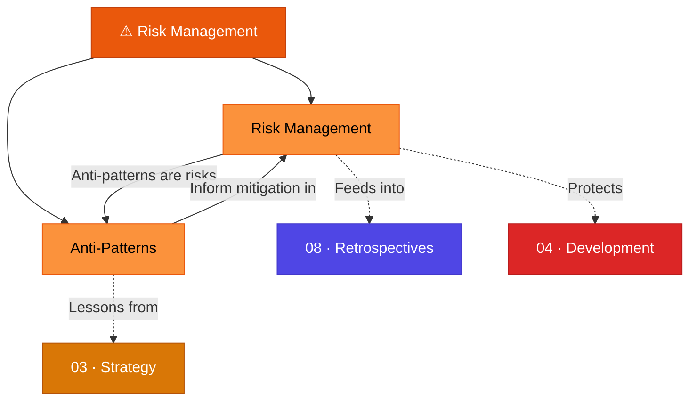

# ⚠️ 07 · Risk Management

> **Risk comes from not knowing what you're doing.** — Warren Buffett

This section covers the frameworks for identifying, assessing, and mitigating project risks, along with a catalog of common anti-patterns that sabotage product teams.

---

## Section Overview

---

## Pages in This Section

| Page | Status | Description |
|:-----|:------:|:------------|
| [Risk Management](risk-management.md) | 🟢 | Risk matrices, likelihood vs. impact, risk management plans |
| [Anti-Patterns](anti-patterns.md) | 🟢 | Feature Factory, HIPPO, Scope Creep, and 7 more anti-patterns |

---

## Key Concepts at a Glance

- **Risk Matrix**: Plotting likelihood × impact to categorize risks
- **Risk Management Plan**: Structured documentation of risks with indicators and action plans
- **Anti-Pattern**: A commonly occurring situation with negative consequences
- **Root Cause Analysis**: Going beyond symptoms to identify underlying problems

---

## Related Sections

- ← [04 · Development](../04-development/index.md) — Development risks and estimation pitfalls
- ← [03 · Strategy](../03-strategy/index.md) — Strategic risks in prioritization
- → [08 · Retrospectives](../08-retrospectives/index.md) — Learn from risks that materialized

---

*[← Back to Wiki Home](../index.md)*
