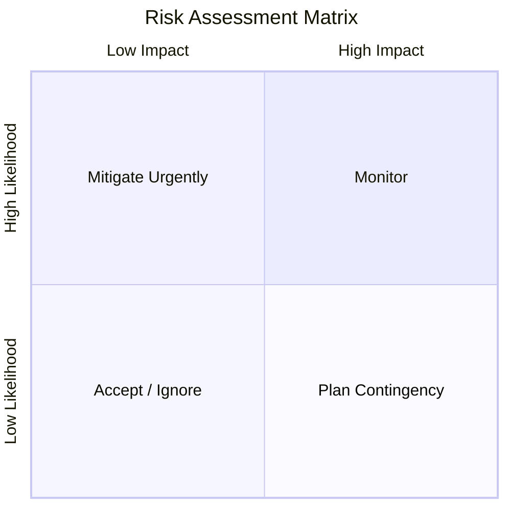
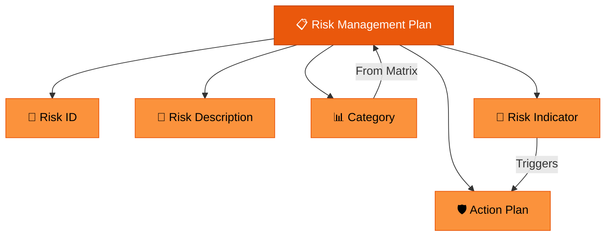

# Risk Management

> **"Risk comes from not knowing what you're doing."** — Warren Buffett

---

## Table of Contents

- [Risk Matrix](#risk-matrix)
- [Risk Management Plan](#risk-management-plan)
- [Risk Mitigation Strategies](#risk-mitigation-strategies)

---

## Risk Matrix

A **risk matrix** assesses risks by plotting **likelihood** against **impact** to determine severity.

| Dimension | Question |
|:----------|:---------|
| **Likelihood** | How possible is this to happen? |
| **Impact** | How disruptive will it be if the risk occurs? |

### Risk Categories

| Level | Likelihood × Impact | Action |
|:------|:-------------------|:-------|
| 🔴 **Critical** | High × High | Immediate mitigation required |
| 🟠 **High** | High × Medium or Medium × High | Active mitigation plan needed |
| 🟡 **Medium** | Medium × Medium | Monitor with contingency ready |
| 🟢 **Low** | Low × any or any × Low | Accept and monitor periodically |

---

## Risk Management Plan

A structured document listing potential project risks, their associated impacts, and planned responses.

### Risk Plan Template

| Field | Description |
|:------|:-----------|
| **Risk ID** | Unique numerical identifier |
| **Risk Description** | Clear description of the risk |
| **Category** | Severity classification from the risk matrix |
| **Risk Indicator** | Signs that the project is at risk — early warning signals |
| **Action Plan** | What should be done if the risk materializes |

### Example Risk Plan Entry

| Field | Value |
|:------|:------|
| **Risk ID** | R-001 |
| **Description** | Key developer leaves the team mid-sprint |
| **Category** | 🟠 High |
| **Indicator** | Developer engagement dropping, missed standups |
| **Action Plan** | Cross-train team members on critical components; document knowledge; maintain succession plan |

---

## Risk Mitigation Strategies

| Strategy | Description | When to Use |
|:---------|:-----------|:-----------|
| **Avoid** | Change the plan to eliminate the risk entirely | When risk impact is catastrophic |
| **Mitigate** | Reduce likelihood or impact of the risk | Most common strategy for medium-high risks |
| **Transfer** | Shift the risk to a third party (insurance, outsourcing) | When specialized expertise is needed |
| **Accept** | Acknowledge the risk and prepare a contingency | When risk is low or cost of mitigation exceeds impact |

---

## Related Pages

- → [Anti-Patterns](anti-patterns.md) — Common patterns that create project risks
- ← [Feature Prioritization](../03-strategy/feature-prioritization.md) — Risk in prioritization decisions
- → [Retrospectives & Feedback](../08-retrospectives/retrospectives-feedback.md) — Learning from risks that materialized
- → [Product Document Essentials](../01-foundations/product-document-essentials.md) — Risks section in PRDs

---

## Sources & References

- Legacy notes: `docs/legacy_notion_files/Risk Management & Anti-Patterns`
- [101 Common Causes of Project Failure](https://calleam.com/WTPF/?page_id=2338)

---

*[← Back to Section Index](index.md) · [← Back to Wiki Home](../index.md)*
