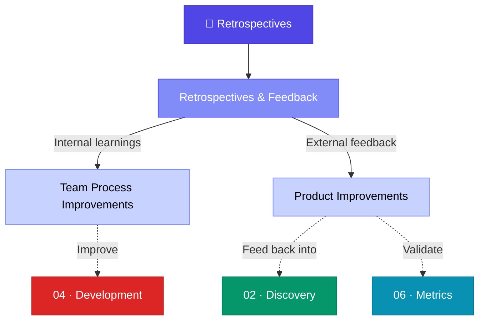
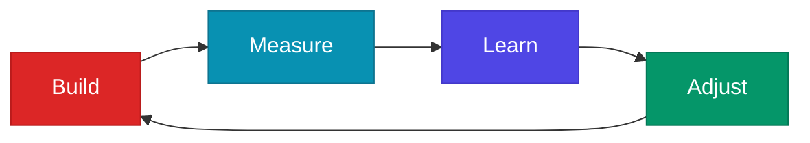

# 🔁 08 · Retrospectives

> **We do not learn from experience. We learn from reflecting on experience.** — John Dewey

This section covers the essential practice of looking back — conducting internal retrospectives to improve team processes, and gathering external feedback to improve the product.

---

## Section Overview

---

## Pages in This Section

| Page | Status | Description |
|:-----|:------:|:------------|
| [Retrospectives & Feedback](retrospectives-feedback.md) | ⚪ | Sprint retrospectives, post-mortems, user feedback collection |

---

## Key Concepts at a Glance

- **Sprint Retrospective**: What went well, what didn't, what to improve
- **Post-Mortem**: Structured analysis after major incidents or launches
- **User Feedback Loops**: Continuous collection and integration of user sentiment
- **Continuous Improvement**: The retrospective cycle feeds back into discovery

---

## The Continuous Improvement Loop

---

## Related Sections

- ← [04 · Development](../04-development/index.md) — Review development process effectiveness
- ← [06 · Metrics](../06-metrics/index.md) — Use metrics data in retrospectives
- → [02 · Discovery](../02-discovery/index.md) — Feed learnings back into the next discovery cycle

---

*[← Back to Wiki Home](../index.md)*
