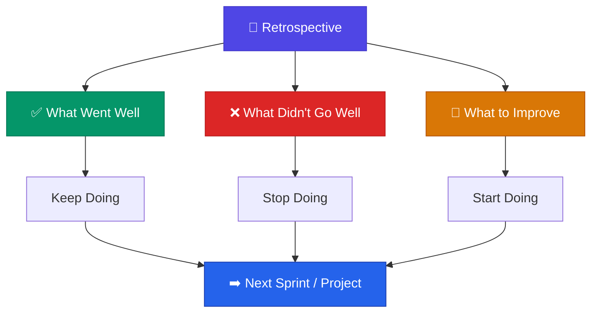
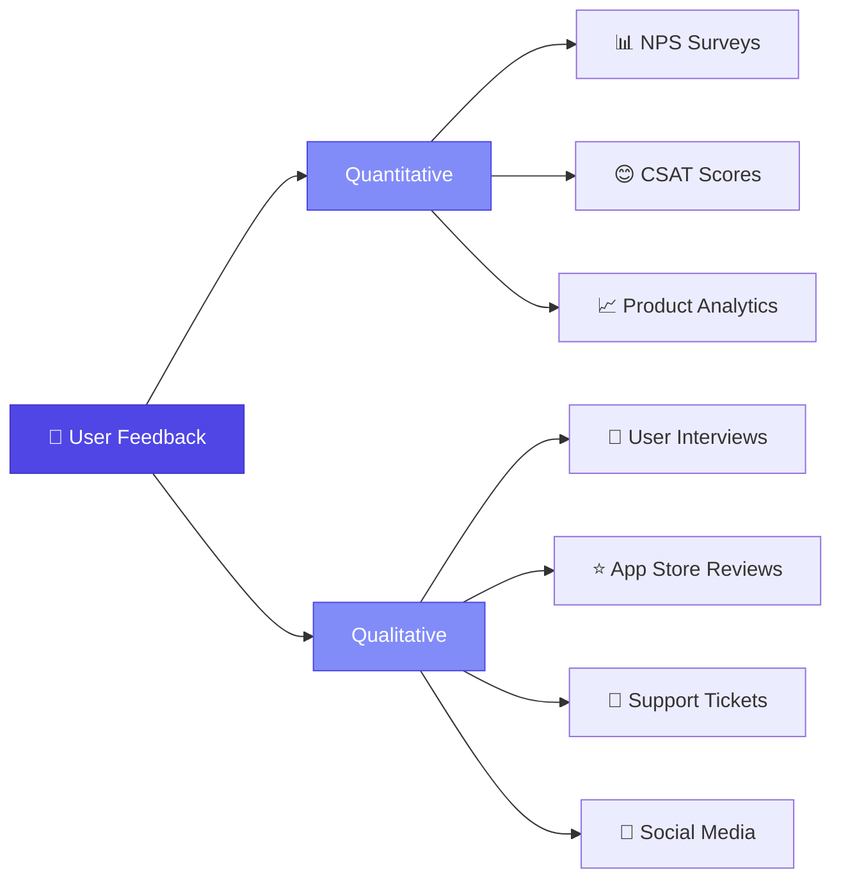
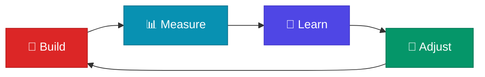

# Retrospectives & Feedback

> **We do not learn from experience. We learn from reflecting on experience.** — John Dewey

---

## Table of Contents

- [Internal Feedback & Project Retrospective](#internal-feedback--project-retrospective)
- [External (User) Feedback](#external-user-feedback)
- [The Continuous Improvement Cycle](#the-continuous-improvement-cycle)

---

## Internal Feedback & Project Retrospective

### What is a Retrospective?

A retrospective is a structured meeting held **after a sprint, project, or major milestone** where the team reflects on what happened, with the goal of continuous improvement.

### Retrospective Formats

| Format | Structure | Best For |
|:-------|:---------|:---------|
| **Start-Stop-Continue** | What to start, stop, and continue doing | Quick, regular sprint retros |
| **4L's** | Liked, Learned, Lacked, Longed For | Comprehensive project retros |
| **Mad-Sad-Glad** | Emotional temperature check | Teams needing psychological safety |
| **Timeline** | Chronological review of events | Post-mortems and milestone reviews |
| **Sailboat** | Wind (helps), anchors (slows), rocks (risks) | Visual and metaphor-driven teams |

### Post-Mortem Analysis

For major incidents or launches, conduct a **blameless post-mortem**:

| Section | Content |
|:--------|:--------|
| **Summary** | What happened and when |
| **Impact** | Users affected, business impact, duration |
| **Root Cause** | The underlying cause (not symptoms) |
| **Contributing Factors** | What else made this possible |
| **Action Items** | Concrete steps to prevent recurrence |
| **Lessons Learned** | What the team will take forward |

---

## External (User) Feedback

### Feedback Collection Methods

### Feedback-to-Action Pipeline

| Stage | Activity |
|:------|:---------|
| **Collect** | Gather feedback from multiple channels |
| **Categorize** | Group by theme, feature area, or user segment |
| **Prioritize** | Rank by frequency, impact, and alignment with goals |
| **Act** | Create actionable items in the backlog |
| **Close the Loop** | Communicate changes back to users who provided feedback |

> [!TIP]
> Always **close the feedback loop**. Users who feel heard become advocates. Users who feel ignored become detractors.

---

## The Continuous Improvement Cycle

Retrospectives feed directly back into the product lifecycle:

- **Internal learnings** → Improve [Development](../04-development/index.md) processes
- **External feedback** → Feed back into [Discovery](../02-discovery/index.md) for the next cycle
- **Metric analysis** → Validate against [Success Metrics](../06-metrics/success-metrics.md)

---

## Related Pages

- ← [Acceptance Criteria](../04-development/acceptance-criteria.md) — Were criteria met?
- ← [Success Metrics](../06-metrics/success-metrics.md) — Data for retrospective analysis
- ← [Risk Management](../07-risk-management/risk-management.md) — Risks that materialized
- → [User Research](../02-discovery/user-research.md) — Feed learnings into next discovery cycle

---

## Sources & References

- Legacy notes: `docs/legacy_notion_files/Retrospective & Feedback`

---

*[← Back to Section Index](index.md) · [← Back to Wiki Home](../index.md)*
