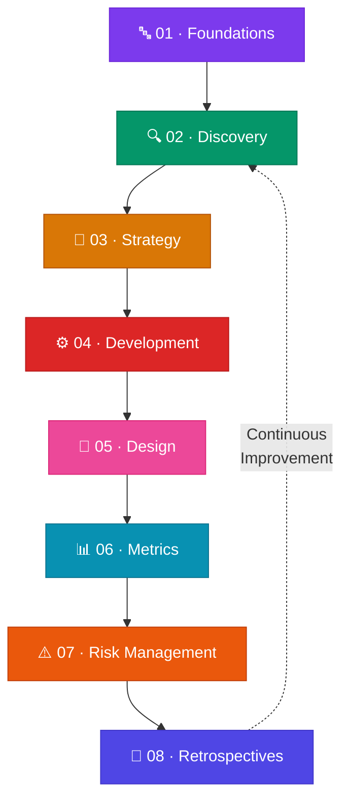
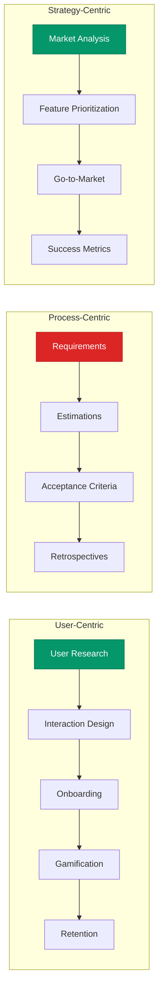

# 📘 Product Management, Development & Strategy Wiki

> **Right Product · Done Right · Managed Right**

Welcome to the Product Management Wiki — a structured knowledge base covering the full product lifecycle from initial discovery through launch, measurement, and continuous improvement.

---

## How to Navigate This Wiki

This wiki is organized into **8 progressive sections** that mirror the product development lifecycle. Each section builds upon the previous, though they can be read independently.

---

## Sections

### 🔤 [01 · Foundations](01-foundations/index.md)
Core terminology, glossary, and PRD document standards. Start here to establish a common language.

| Page | Status | Description |
|:-----|:------:|:------------|
| [Basic Terminology](01-foundations/basic-terminology.md) | 🟢 | Glossary of product management terms |
| [Product Document Essentials](01-foundations/product-document-essentials.md) | 🟢 | PRD structure and cheatsheet |

---

### 🔍 [02 · Discovery](02-discovery/index.md)
Understanding users, markets, and requirements before building anything.

| Page | Status | Description |
|:-----|:------:|:------------|
| [User Research](02-discovery/user-research.md) | 🟢 | Personas, segmentation, and research methods |
| [Market Analysis](02-discovery/market-analysis.md) | 🟢 | TAM/SAM/SOM, competition, and market trends |
| [Requirements Solicitation](02-discovery/requirements-solicitation.md) | 🟢 | Elicitation techniques, backlogs, and storymaps |

---

### 🎯 [03 · Strategy](03-strategy/index.md)
Deciding what to build, when, and how to bring it to market.

| Page | Status | Description |
|:-----|:------:|:------------|
| [Feature Prioritization](03-strategy/feature-prioritization.md) | 🟢 | RICE, decision matrices, cost-value analysis |
| [Go-to-Market](03-strategy/go-to-market.md) | 🟢 | GTM strategy, A/B testing, launch planning |
| [App Store Optimization](03-strategy/app-store-optimization.md) | 🟢 | Keyword metadata, screenshot CVR, review loops |
| [Roadmap Planning](03-strategy/roadmap-planning.md) | 🟢 | Roadmaps, WBS, dependencies, Gantt charts |
| [App Launch Checklist](03-strategy/app-launch-checklist.md) | 🟢 | Tactical launch checklist: analytics, waitlists, feedback boards, and emails |

---

### ⚙️ [04 · Development](04-development/index.md)
Translating strategy into actionable development work.

| Page | Status | Description |
|:-----|:------:|:------------|
| [Requirements & User Stories](04-development/requirements-user-stories.md) | 🟢 | Requirements types, user stories, INVEST |
| [Estimations & Velocity](04-development/estimations-velocity.md) | 🟢 | Story points, velocity, Fibonacci estimation |
| [Acceptance Criteria](04-development/acceptance-criteria.md) | 🟢 | Given-When-Then templates, verification lists |

---

### 🎨 [05 · Design](05-design/index.md)
User experience, interaction design, and product design patterns.

| Page | Status | Description |
|:-----|:------:|:------------|
| [UI Design Foundations](05-design/ui-design-foundations.md) | 🟢 | Affordances, hierarchy, typography, color, shadows, states, and overlays |
| [User Interaction & Design](05-design/user-interaction-design.md) | 🟢 | Use cases, wireframes, storyboards |
| [Mobile UI Design Foundations](05-design/mobile-ui-design-foundations.md) | 🟢 | Layout constraints, navigation architectures, and gestural interactions |
| [Onboarding Patterns](05-design/onboarding-patterns.md) | 🟢 | Onboarding UX strategies and case studies |
| [Gamification Patterns](05-design/gamification-patterns.md) | 🟢 | Sustainable gamification design patterns |

---

### 📊 [06 · Metrics](06-metrics/index.md)
Measuring success and understanding user retention.

| Page | Status | Description |
|:-----|:------:|:------------|
| [Success Metrics](06-metrics/success-metrics.md) | 🟢 | AARRR framework, KPIs, measurement |
| [Retention Psychology](06-metrics/retention-psychology.md) | 🟢 | Three pillars of retention architecture |

---

### ⚠️ [07 · Risk Management](07-risk-management/index.md)
Identifying, assessing, and mitigating project risks.

| Page | Status | Description |
|:-----|:------:|:------------|
| [Risk Management](07-risk-management/risk-management.md) | 🟢 | Risk matrices and risk plans |
| [Anti-Patterns](07-risk-management/anti-patterns.md) | 🟢 | Common PM anti-patterns to avoid |

---

### 🔁 [08 · Retrospectives](08-retrospectives/index.md)
Learning from outcomes and closing the feedback loop.

| Page | Status | Description |
|:-----|:------:|:------------|
| [Retrospectives & Feedback](08-retrospectives/retrospectives-feedback.md) | 🟢 | Internal retrospectives and external feedback |

---

## Cross-Cutting Themes

---

*Navigate to any section above to begin exploring. Each page contains detailed frameworks, examples, mermaid diagrams, and cross-references to related content.*
